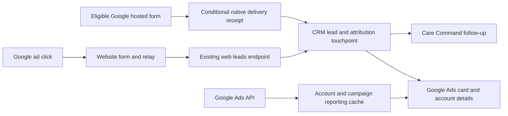

# Google Ads in Channel Center — implementation design

Status: design ready for implementation; no runtime implementation in this change.
Date: 2026-09-15. Repository inspected at `85f61a6500e7009c8c95942bd43670827e555c60`.
Audience: an implementing session, AI model, engineer, reviewer, and deployment operator.
Companion: [execution handover](handovers/google-ads-implementation.md).

## 1. Outcome and a correction to the initial proposal

Add **Google Ads** to the Channel Connection Center. It is an acquisition integration with independently verifiable capabilities:

1. **Website leads**: Google ad → website enquiry → existing CRM capture → Care Command follow-up. This is the primary Viet UC path.
2. **Campaign reporting**: connect an advertising account to read campaign names, spend, clicks, and Google-reported conversions, alongside CRM lead counts.
3. **Google lead forms**: direct form submissions into CRM, available only for eligible advertising uses. Disabled for Viet UC healthcare advertising under the policy checked below.

The earlier conversation correctly identified the technical availability of Google's lead webhook but omitted a material product restriction. Google's [lead form requirements](https://support.google.com/adspolicy/answer/9472930?hl=en), checked 2026-09-15, state: “Advertisements for healthcare-related content are not allowed for lead forms.” Therefore a working endpoint, OAuth connection, or successful test payload must never be interpreted as permission for Viet UC to run that format. Check the current published policy before any future activation. A tenant checkbox cannot override it.

This restriction concerns Google's hosted lead-form format. It does not establish blanket approval or rejection of a particular website ad campaign. The website flow continues to depend on the advertiser's approved ads and destination.

### Scope decisions

| Decision | Required behavior |
| --- | --- |
| Primary release | Google Ads card, website attribution and delivery verification, reporting account connection and campaign summary |
| Lead creation | Only an actual enquiry produces a CRM record; clicks, impressions and conversion aggregates cannot create people |
| Acquisition vs conversation | Google Ads is shown as the source of an enquiry; follow-up happens using existing phone/email/chat capabilities |
| Native lead forms | Detailed conditional extension in §10; not required to activate the primary Viet UC release |
| External ad changes | No automatic campaign creation, budget changes, tracking-setting edits, or advertising publication |
| Conversion uploads | Future separate work; this release reads Google data and receives enquiries only |
| Existing Google email connection | Separate credentials and lifecycle; an email connection does not authorize Ads |
| Website authentication | Preserve `/api/v1/web/leads` and its API-gateway credentials |
| Setup UX | Website capture can work while Ads reporting is disconnected |

## 2. Verified repository starting points

Paths are relative to the repository root. Re-read the latest versions before implementing; this is a design snapshot, not a claim about live deployment.

| File / surface | Relevant fact and consequence |
| --- | --- |
| `addons/health_care_command_channels/models/channel_center.py` | `center_overview()` returns a list of card dictionaries. `CENTER_CHANNELS` derives from conversation channels; `_center_group_ok()` and `_center_get()` protect setup. Add an acquisition-card extension point instead of inserting Ads into every chat switch. |
| `addons/health_care_command_channels/static/src/center/channel_center.{js,xml,scss}` | OWL `ChannelCenter`, existing grid, multi-account presentation, 15-second visible-tab refresh, server-translated labels. Extend these conventions. Inspect manifest asset entries: a `.css` file also exists. |
| `addons/health_care_command/models/care_conversation.py` | `CHANNEL_SELECTION` feeds the dock and conversation routing. Ads is not a reply transport. Do not append a chat channel simply to obtain a Center card. |
| `addons/health_care_command_channels/models/care_channel_connection.py` | Guarded state/credential writes, company ownership, operator groups and derived readiness are patterns to retain. Its lifecycle currently describes messaging authorizations. |
| `addons/health_care_command_channels/models/channel_platform_app.py`, `care_channel_oauth_session.py` | Inspect encrypted secret and OAuth patterns. Reuse compatible helpers, not the Google-email grant or channel-specific assumptions. |
| `addons/health_care_command_channels/services/channel_crypto.py`, `redact.py` | Existing credential encryption/redaction. Use them for Ads secrets and expand redaction tests for Ads headers. |
| `addons/health_web_leads/models/web_leads_connector.py` | Existing website credential setup, city maps, heartbeat and rollback-only pipeline test. Link to this setup instead of issuing parallel website credentials. |
| `addons/health_web_leads/controllers/web_leads.py` | Existing authenticated capture/reconciliation endpoint. Extend accepted optional attribution data without breaking old callers. |
| `addons/health_web_leads/models/web_lead_service.py` | `process_submission`, `_create_lead`, `_merge`, `_touchpoint_vals`, `_upsert_care_conversation`. Existing lead deduplication and routing, but inspect company scoping before any privileged reuse. |
| `addons/health_web_leads/models/crm_lead.py` | `gclid`, `wbraid`, `gbraid`, UTM fields and website consent bridge exist. `_create_lead` in the inspected handler visibly populates `gclid`; presence of braid fields alone does not prove persistence. |
| `addons/health_web_leads/models/lead_touchpoint.py` | `health.lead.touchpoint` has attribution, `source_system`, lead/conversation links and unique event handling. Touchpoint type is now a `health.lookup.value` Many2one, not the obsolete Selection mentioned in older docs. |
| `addons/health_web_leads/models/care_conversation_attribution.py` | Preserve transfer of attribution when a conversation becomes a lead. |
| `docs/strategy/website-crm-integration.md`, web-leads phase handovers | Existing website schema, identity rules, first-touch attribution and deployment history. |
| `docs/strategy/HANDOVER-CONVENTIONS.md`, `docs/SAAS_RUNBOOK.md`, `.agent/workflows/carejiox-deploy.sh` | Deployment source of truth. Master is now `carejiox`; historical `vietuat` commands are not current targets. |

The inspected website creation path uses `type='opportunity'` and resolves catchment before creation because the healthcare contact code depends on it. Preserve that behavior. Website lead creation already enters Care Command through CRM hooks; a second manual conversation creation would risk duplicate work items.

## 3. Architecture and module boundaries



Create `addons/health_google_ads` with dependencies on `health_web_leads` and `health_care_command_channels` plus any directly referenced base modules required by repository conventions. No dependency in the opposite direction. No new Python package is required: use the established HTTP client and cryptography helpers. Manifest version starts `19.0.1.0.0`.

Add a narrow `_center_extra_cards()` hook to `care.channel.connection` in the existing Center module. Default returns `[]`; `center_overview()` appends it after the existing cards. The new module overrides the hook with `super()` and appends a Google Ads acquisition card. Keep the list return type and every existing card contract intact.

The new card carries `kind='acquisition'`, `key='google_ads'`, `channel='google_ads'` as a UI identifier only, `sendable=false`, `mode='external_action'`, and a validated internal action identifier. It must branch to the Ads detail action before any existing `center_begin(channel)` call. Never create a `care.channel.connection(channel='google_ads')`. Validate action identifiers on the server; never execute actions supplied by a website payload.

New model ownership:

- `google.ads.account`: one selected advertising customer per company, setup evidence and reporting authorization.
- `google.ads.campaign`: provider campaign metadata and optional mapping to existing `utm.campaign` / catchment.
- `google.ads.campaign.day`: account-local daily reporting rows.
- `google.ads.oauth.session`: short-lived, single-use OAuth handshakes unless the existing session model can be reused without pretending Ads is a messaging channel.
- `google.ads.platform.config`: operator-only OAuth application configuration and developer token, using existing encryption utilities.
- Conditional §10: `google.ads.form` and `google.ads.lead.receipt`.

Use ORM inheritance for CRM/touchpoint additions. Avoid importing and mutating another module's global lists at runtime. If a shared server helper is needed, introduce a named overridable method with default behavior and regression tests.

## 4. UI specification

### 4.1 Center card

Place Google Ads after Facebook in the rendered grid (insertion ordering in the extra-card hook may use a stable `after_key='fb'`; other cards retain their relative order). Reuse spacing, typography, borders, buttons and responsive behavior. Use a code-native icon or existing icon system, with no new bitmap assets.

Card text:

```text
Google Ads                        Setup needed / Partially connected / Connected
Leads from your advertising campaigns

Website leads        Receiving / Ready for test / Setup needed
Campaign reporting   Connected / Not connected / Action required
Google lead forms    Unavailable for healthcare ads

[account label]       [customer ID]       [reporting status]
Last website lead: [time or No leads received yet]
Reporting updated: [time or Not synced]

[Set up Google Ads] or [Manage]
[View leads]                         [Add another account]
```

Use capability statuses, not a count of messaging sends/receives. Never display “Sent”, “Reply”, or a Google Ads composer. An account without real traffic can be “Ready for test”; do not claim “Receiving” because credentials exist. A successful synthetic test displays “Test passed; awaiting live lead”.

Aggregate status: `Connected` when website delivery has verified evidence and reporting has a successful account read plus initial report sync; `Partially connected` when either capability works; `Setup needed` when neither works. Show a prominent capability-level warning if a previously enabled capability fails. Native-form unavailability does not prevent overall readiness. An Ads OAuth error must not turn off website capture. Quiet campaigns alone do not imply failure.

The Go-Live Studio provider-count banner currently concerns a different catalog. Extend it deliberately with independent acquisition checks or leave Google Ads out of that denominator and state the banner's scope. Do not increment a denominator with an impossible native-form requirement.

### 4.2 Detail action: four sections

1. **Overview:** account rows, capability status, last lead/sync, safe errors, links to filtered CRM leads and reporting.
2. **Website leads:** existing connector link; website domain and form mappings; final-URL suffix instructions; synthetic pipeline check; end-to-end test evidence; last received timestamp. Show which website connector/company is being checked.
3. **Campaign reporting:** Connect Google account → choose advertising account (and manager context if applicable) → validate access → first sync. List customer ID, currency, timezone, campaigns and last successful sync. Actions: Sync now, Reconnect, Disconnect reporting. Explain that Google's authorization scope allows Ads access, while this integration only performs reporting reads.
4. **Google lead forms:** healthcare restriction message and policy link. For an eligible future account, show the §10 setup sequence. No active healthcare bypass switch.

Setup operator roles mirror `CENTER_GROUPS`: system administrator, CRM manager, clinic administrator. Ordinary CRM staff may open lead details they are allowed to see; they do not receive setup credentials or report data for other catchments. English and Vietnamese labels are required. Keyboard navigation, focus return after dialogs, disabled busy buttons and narrow-screen stacking must work.

## 5. Data model contract

New names below are proposed implementation names. Keep stable once implemented. Store provider identifiers as strings: Ads identifiers can exceed JavaScript's safe integer range. API boundaries and UI must never coerce them through `Number`.

### 5.1 `google.ads.account`

| Field | Type / rule |
| --- | --- |
| `name`, `active` | Display label; archive preserves data |
| `company_id` | Required indexed company; explicit ownership on all searches |
| `customer_id` | Normalized ten-digit Google customer ID when supplied; strip display hyphens; optional for website-only draft |
| `login_customer_id` | Optional manager customer ID; validate access path before use |
| `website_connector_id` | Existing `web.leads.connector`; enforce its existing `company_id` matches the account |
| `default_catchment_id` | Optional existing catchment; validated against user's company/area access |
| `currency_id`, `account_timezone`, `provider_name` | Read from provider; not guessed from company settings |
| `reporting_state` | `not_connected`, `authorizing`, `select_account`, `syncing`, `connected`, `action_required`, `paused` |
| `access_token_enc`, `refresh_token_enc`, `token_expires_at` | Private encrypted storage; excluded from ordinary reads, exports, chatter and card payload |
| `authorized_by`, `authorized_at` | Audit metadata; actor cannot supply arbitrary values |
| `last_sync_attempt_at`, `last_sync_success_at`, `last_error_code` | Separate attempts from successful complete sync |
| `website_test_at`, `website_test_kind`, `website_last_lead_at` | Evidence distinguishes local test, deployed round trip and real lead; no manually editable “connected” boolean |
| `native_eligibility` | `healthcare_blocked`, `unverified`, `eligible`; operator-only policy evidence, never derived from test delivery |
| `eligibility_checked_at`, `eligibility_reference` | Policy/account evidence without PII or credentials |

Unique nonempty `(company_id, customer_id)`. Archived accounts still reserve the binding; reconnect the existing record. Do not bind the same advertising customer to multiple companies in one database in this release: reject with an actionable message to avoid duplicated spend and ambiguous ownership. Multiple Google customers per company are supported. Website-only setup is one draft per company until explicitly split by account/domain mapping.

Website connector health is company-wide; account-level last-lead/count evidence uses only touchpoints matched to that account. Display unmatched Google enquiries at company level rather than assigning them to every account sharing the connector. Selecting a customer for the website-only draft upgrades that record in place; if a binding already exists, attach the website connector to that existing record through an idempotent action after access validation.

### 5.2 Campaign and daily metrics

`google.ads.campaign`: required `account_id`, related stored `company_id`, `external_campaign_id`, provider `name`, `status`, `advertising_channel_type`, optional `utm_campaign_id`, optional `catchment_id`, `last_seen_at`. Unique `(account_id, external_campaign_id)`. Provider rename updates the cache, not historical first-touch strings. Missing rows from a partial sync are never deleted.

`google.ads.campaign.day`: `account_id`, `campaign_id` (Google cache relation), `company_id`, `date` in account timezone, `currency_id`, `impressions`, `clicks`, `cost_micros` stored with an exact 64-bit/numeric-safe representation, `google_conversions` as fractional numeric, `synced_at`. Unique `(account_id, campaign_id, date)`. Compute money from micros without float truncation; validate ORM/SQL column size in migration tests. Read API integer fields without JavaScript round trips.

Keep Google conversion totals separate from CRM enquiry counts. No sum of different currencies. No blended catchment cost-per-lead if campaigns do not have an explicit catchment mapping; show “Spend not allocated to an area”.

### 5.3 CRM and touchpoint additions

Reuse existing click IDs and UTM fields. Add these to `health.lead.touchpoint` and first-touch snapshots on `crm.lead` where needed for filtering:

| Field | Meaning |
| --- | --- |
| `google_ads_account_id` | Matched configured account; nullable if unresolved |
| `google_ads_customer_id` | Raw normalized attribution customer ID, not an access grant |
| `google_ads_campaign_id` | Raw provider campaign ID, a Char (not Odoo's `campaign_id`) |
| `google_ads_adgroup_id`, `google_ads_creative_id`, `google_ads_asset_group_id` | Optional raw provider identifiers |
| `google_ads_origin` | `website`, `native_form`; empty for unrelated records |
| `google_ads_match_status` | `matched`, `unmatched`, `conflict`; derived from explicit mapping/evidence |
| `google_ads_time_basis` | Touchpoint only: `provider`, `website`, `received_fallback` |

Existing lead fields describe the first enquiry; later Google touches append evidence and do not change an organic first source into paid. “Google Ads influenced” filters search touchpoints, while “First source Google Ads” uses first-touch fields. Neither filter includes Google organic traffic solely because source contains “Google”.

The conditional native extension adds `google_ads_form_id` as a Char and `google_ads_receipt_ids`. Do not overload `web_form_id` with a Google form ID or `external_submission_id` with a native identifier: those fields participate in website email deduplication and consent bridging.

The inspected touchpoint model has no direct `company_id`. Add a stored computed company derived from its lead or conversation, backfill from those anchors and reject conflicting companies when both links exist. Existing orphan checks remain enforced. Apply company and catchment record rules to Google touchpoints; inspect existing inherited scope rules before adding rules so they cannot broaden access through group-rule OR semantics. Schema constraints must use actual Odoo 19-supported declarations or explicit indexed migrations, not deprecated `_sql_constraints` that the repository warns are ineffective.

## 6. Primary website-lead flow

### 6.1 Capture and classification

Use the website's existing form/relay. Locate its actual source and deployment owner in Phase GA0; the initial repository inspection did not identify a maintained WordPress plugin source. The older website design names Proima as the WordPress team and `pkgdvietuc.com` as the website; verify these are current. Server-side fields alone cannot complete this flow. If source/access is absent, finish the CRM work and document precisely which website change remains blocked.

Supply an example **final URL suffix**, displayed for an Ads administrator to apply after reviewing existing tracking:

```text
utm_source=google&utm_medium=cpc&h19_gads_campaign_id={campaignid}&h19_gads_adgroup_id={adgroupid}&h19_gads_creative_id={creative}
```

Google documents [ValueTrack substitutions](https://support.google.com/google-ads/answer/6305348?hl=en) and [final URL suffixes](https://support.google.com/google-ads/answer/9054021?hl=en). Preserve existing `utm_campaign` naming and tracking templates. Do not invent a `{campaignname}` parameter. A configured per-account suffix may additionally supply literal `h19_gads_customer_id=1234567890`. Never put OAuth tokens or webhook keys in landing URLs. Enable/verify auto-tagging with the advertiser; do not synthesize real Google click IDs.

Website/relay extension to the existing submission JSON:

```json
{
  "submission_id": "existing-relay-generated-uuid",
  "form_id": "existing-website-form-id",
  "utm": {"source": "google", "medium": "cpc", "campaign": "existing-campaign-name"},
  "click_ids": {"gclid": "opaque-if-present", "wbraid": "", "gbraid": ""},
  "google_ads": {
    "customer_id": "1234567890",
    "campaign_id": "12345678901234567",
    "adgroup_id": "23456789012345678",
    "creative_id": "34567890123456789"
  }
}
```

This is an additive fragment, not a complete valid contact submission; the existing name/contact, anti-spam, timestamp, location, and consent contract still applies. Old relays omitting `google_ads` remain valid.

Parse these values server-side as bounded strings. Treat URL attributes as untrusted attribution hints. Source classification uses a present Google click ID or a normalized source/paid-medium combination (`google`/`google ads` + `cpc`/`ppc`/`paidsearch`); a conflicting declared source raises review instead of silently rewriting it. Without a known campaign ID or explicit UTM mapping, source may be Google Ads while campaign remains unresolved. A click ID is opaque, not a campaign identifier or proof of account ownership.

Preserve the website's existing first/latest tracking policy, consent behavior and form submission UUID on retries. Explicitly verify the redirect → subsequent page → form path and braid-only submissions. If changing website tracking policy is necessary, specify the old/new precedence in the implementation report; do not silently introduce a persistent marketing cookie policy.

### 6.2 CRM integration

Extend `_create_lead` and `_touchpoint_vals` through module hooks/overrides to carry optional Google data and all three click-ID fields. `_merge` must append the new touchpoint attribution without overwriting first touch. Add no new public bypass endpoint for website capture.

Account resolution order: explicit validated customer ID within the company; otherwise unique configured campaign mapping within the company; otherwise leave unmatched. Never choose the first of several accounts. Account mapping cannot change the authenticated website request's company.

Catchment remains the existing website derivation: form location/form map/page map as implemented. Account/campaign defaults may fill a missing location only through an explicit mapping, not infer a person's city from an ad's broad audience target. A disagreement preserves the lead's city and raises review. Cross-company form/team/catchment IDs are rejected before create.

Preserve the existing name/contact matching, open-enquiry window, shared-family-phone review and no automatic patient linking. Explicitly check company scoping of all lead/client searches, service users and `sudo()` paths. A service account with broad groups is not an acceptable substitute for tenant scoping.

### 6.3 Evidence and test mode

The existing rollback-only pipeline test proves server handling. Separately verify the deployed website relay reaches the correct tenant and preserves attribution. Implement short-lived operator-created website test sessions if no equivalent exists: a random test token bound to company, connector, expiry (30 minutes) and one submission; the relay transmits it only in an authenticated capture request. Test mode must not be selectable by an unauthenticated visitor with `is_test=true`.

Run the normal handler in a savepoint, inspect created/merged lead and touchpoint values, then roll back the synthetic records and persist only a sanitized test result outside that savepoint. Ensure retries return the same test outcome. Do not emit emails, outbound provider calls or nontransactional notifications from this dry run. Real leads alone update `website_last_lead_at` and live lead counts.

## 7. Campaign reporting authorization and synchronization

### 7.1 Authorization contract

Use Google OAuth authorization-code flow, validated single-use state, exact registered HTTPS callback, server-side token exchange and offline refresh. Follow current Google OAuth documentation when selecting PKCE support. Bind the handshake to initiating user, company, approved callback and account draft, expiring after 10 minutes. Never use client-supplied company/database names to route a callback. Use existing trusted host/database routing and persisted sessions.

Reporting API authentication normally requires OAuth with `https://www.googleapis.com/auth/adwords` and a developer token; [official headers reference](https://developers.google.com/google-ads/api/rest/auth). The scope is not read-only: enforce the product's read-only behavior in the client wrapper by exposing account listing and fixed reporting queries only. Do not expose arbitrary GAQL or mutate services over RPC.

`google.ads.platform.config` is operator-managed and unavailable to tenant reads. Store client secret and developer token encrypted. Customer tokens live on the account; account drafts should transfer credentials only after verified account selection and duplicate-binding checks. Never put these in `extra_json`, logs, browser storage or chatter. Restrict token network calls to fixed Google hosts, with timeouts, TLS verification and redacted error handling.

Account discovery: list directly accessible customers, inspect manager accounts and enumerate authorized descendants using documented customer hierarchy reads; the initial accessible list is not guaranteed to contain every managed child. Select a non-manager advertiser and validate it with its actual manager context. Verify `customer.id`, name, currency and timezone before marking access valid. Account IDs typed into the UI do not establish access.

Serialize refresh per account to avoid concurrent token replacement. Preserve an existing refresh token if a successful response omits a new one. `invalid_grant` or lost customer access produces `action_required`; website intake remains active. Disconnect reporting pauses its jobs and clears local account tokens while retaining cached metrics; do not revoke a shared Google grant and accidentally disconnect other accounts/email integrations. Do not copy production credentials into the golden template.

### 7.2 API client and jobs

Pin a supported API version at implementation and record its sunset date/source. Recheck Google's current version documentation then; avoid copying a version from this design or an old example. Version, timeouts and retry constants belong in the client service, not in website payloads.

Client methods: `list_accessible_customers`, `list_customer_children`, `get_customer`, `list_campaigns`, `fetch_campaign_days`. All accept validated stored account context. Page all queries; no silent first-page success. Use bounded query dates and field lists, never user-authored GAQL. Server-side 64-bit IDs remain strings at serialization boundaries.

Initial sync: last 30 account-local calendar days including today. Scheduled sync: daily, re-fetch rolling last 30 days to replace revised Google totals. Manual Sync now: same window, one concurrent run per account. Historical backfill: optional operator job, chunks of 30 days, bounded total requested range. Do not present 30 days of data as lifetime totals.

Metadata query selects customer/campaign identifiers, name, status and campaign type. Metrics query selects campaign ID, `segments.date`, impressions, clicks, `metrics.cost_micros`, `metrics.conversions`. Validate field compatibility against the pinned version before coding. Treat conversion values as fractional. Do not segment the primary metrics table by conversion action and accidentally multiply spend.

Fetch each complete window into a staging result/run. Publish replacements and zero/remove stale daily rows within that same successfully fetched window atomically, including campaigns with no returned metric row; preserve older data and all data on a failed/partial fetch. Record attempt/error independently from `last_sync_success_at`. Retry network, rate-limit and transient server failures with capped exponential backoff and provider hints; authorization errors require reconnect. Three attempts per run, then next scheduled run; no blocking sleeps in request handlers. Keep jobs disabled on templates according to the SaaS runbook.

## 8. Reporting definitions

Provide a campaign table under the Google Ads detail action: campaign, account, date range, currency, spend, clicks, Google conversions, new CRM enquiries, form submissions, cost per new enquiry, and unresolved attribution count. Reuse the existing Lead Analysis surface through filtered actions where practical.

- **Spend/clicks/Google conversions** come from the daily cache, by account-local date.
- **New CRM enquiries** count distinct newly created CRM records whose first Google acquisition touch falls within the selected date range and campaign. A submission merged into an older lead is not a new enquiry.
- **Form submissions** count unique non-test accepted Google-attributed touchpoints, including those merged into an existing lead. Native receipt duplicates do not add a second touchpoint.
- **Cost per new enquiry** is spend divided by new CRM enquiries, with a dash for zero denominator. Label this a CRM metric. Google conversions can use different attribution windows and need not equal enquiries.
- Campaign joining uses customer + campaign IDs, or an explicit administrator-approved mapping; never campaign name alone across accounts.
- Date filters convert CRM UTC timestamps into the selected account's timezone. Require a single account or explicitly display account-local aggregation when comparing accounts.
- Data freshness and partial/unmapped status remain visible. An empty successful report is zero; a failed/missing report is unknown.

For area-restricted staff, apply lead access rules before aggregation. Campaign spend is visible only to account-level reporting operators or for explicitly area-mapped campaigns. Do not reveal whole-account spend in the tooltip of a filtered table. No report queries may use unrestricted `sudo()` then filter only their final rows.

## 9. Internal application API and security

Proposed model methods on `google.ads.account`:

| Method | Contract |
| --- | --- |
| `center_overview()` | Safe capability/account metadata for current allowed company only |
| `action_open_setup()` | Valid internal action; no caller-supplied URL |
| `action_start_reporting_oauth()` | Create expiring handshake, return Google authorization URL |
| `action_list_reporting_accounts(session_id)` | Only session owner/operator in bound company; safe customer summaries |
| `action_select_reporting_account(session_id, customer_id, manager_id)` | Revalidate provider access and company binding, then enqueue initial sync |
| `action_sync_reporting()` | Enqueue deduplicated bounded job; no long API loop in browser RPC |
| `action_disconnect_reporting()` | Pause/reporting token cleanup; archive neither leads nor website connector |
| `action_test_website()` | Existing connector server test with independently stored evidence |
| `action_start_website_roundtrip_test()` | Issue the §6.3 short-lived test session |
| `action_view_leads()` | Return company/area-safe CRM domain with stated first-touch or influenced semantics |

Every public method performs explicit role and company checks before any elevation. Protect `create/write/unlink` as well as action methods: tokens, evidence, provider IDs and state are internal-write-only. Related records enforce matching companies with constraints and record rules. Use `check_company` where applicable but do not assume it replaces domains and access checks.

Logs and sync errors retain safe error code, request ID, account record ID and retry status. Never log request/response bodies containing contact details or credentials. Account/date counts are derived in the user's authorized scope. Existing raw website payload retention continues to apply; don't create a second permanent copy of the payload for this integration.

## 10. Conditional native Google lead-form extension

Implement only as an explicitly enabled phase for an eligible use. For Viet UC healthcare, ship the explanation and disabled capability. The following contract is detailed so future work does not require a fresh architecture.

### 10.1 Setup and bindings

Native delivery can use a webhook without reporting OAuth. [Google's webhook setup](https://support.google.com/google-ads/answer/16729613?hl=en) describes configuring a URL and validation key; a separate [API retrieval path](https://support.google.com/google-ads/answer/12080108?hl=en) exists but is outside this first native extension. Do not claim webhook setup imports past leads.

`google.ads.form`: account/company, provider form ID as string, label, active/paused flag, optional campaign binding, required catchment or explicit Unrouted handling, optional routing team, unguessable public route token, hashed validation key, pending rotated key/hash with expiry, test evidence, last real delivery timestamp. Unique `(account_id, external_form_id)`. Route tokens use at least 128 bits of randomness; generated validation keys use at least 256 bits. Display a new key once to an authorized setup operator; retain a SHA-256 hash for constant-time comparison, since it need not be recovered for sending. Rotation accepts old and new keys for a documented 24-hour grace period; emergency rotation revokes old immediately.

URL: `POST https://<bound-tenant-host>/care_channels/google_ads/leads/<route_token>`. No database name or company ID selected by request JSON. Resolve only inside the correctly routed database. Form ID and expected account routing are configured before activation. Google payload does not itself provide a trustworthy customer/account authorization.

Stepper: eligibility evidence → account/form/catchment → copy URL/key → enter in Google → Google's Send test data → confirm parsed test receipt → await real lead. A test confirms delivery configuration; it is not proof of form eligibility or a live enquiry. Unsaved-form test data may contain dummy IDs: show “Test received for unsaved form; save and test again”, and do not bind a production form automatically.

### 10.2 Receipt model and delivery algorithm

`google.ads.lead.receipt`: company/account/form, provider `lead_id`, `is_test`, `received_at`, optional `submitted_at`, time-basis, normalized allowlisted contact/attribution data, state (`pending`, `processed`, `review`, `failed`, `test`), attempt count, next-attempt timestamp, safe error code, CRM lead/touchpoint links. Unique `(company_id, account_id, lead_id, is_test)` to tolerate retries and reconnects without conflating synthetic and real IDs. No raw `google_key` is persisted.

Controller is a plain JSON HTTP route, POST only, CSRF disabled for provider delivery; do not use Odoo's JSON-RPC envelope. Request maximum 64 KiB before parsing. Validate route, enabled policy/form, JSON object, correct key, required lead ID, expected form ID, scalar types and bounded field values. Recognized contact fields are normalized by identifier, not display label; unknown optional fields are ignored. Invalid or missing optional timestamp becomes received-time fallback with visible provenance. Invalid mandatory identifier or malformed body returns a safe 4xx.

After authentication, insert/retrieve a durable receipt in the request transaction. A successful response is HTTP 200 with `{}` only after normal Odoo request commit succeeds; transaction failure must produce a retryable failure, not an acknowledgement. Test delivery stores safe test evidence without CRM creation. Duplicate delivery returns success for the same persisted receipt. Concurrent duplicates are arbitrated by the SQL constraint with a savepoint and re-read; handle only the expected constraint, never all IntegrityErrors as duplicates.

Process non-test receipts asynchronously in a one-minute cron. Claim bounded batches (100), lock rows using the established queue convention or `FOR UPDATE SKIP LOCKED`, and atomically create/update CRM lead, touchpoint and receipt links. Business failure rolls back processing changes without losing the already committed receipt. Retry temporary errors after 1, 5, 30, 120 and 360 minutes; exhausted receipts remain visible with an operator Retry action. Invalid identity and unresolved routing go to review with retained sanitized data and no fabricated contact. Claiming a receipt twice must not create two enquiries.

Google documents retryable server errors and duplicate delivery in its [webhook implementation contract](https://developers.google.com/google-ads/webhook/docs/implementation). Do not assume unlimited provider retries. Once Health19 accepts a durable receipt, internal recovery owns its processing.

Status contract: malformed JSON/schema → 400/422; wrong key → 403; unknown route → 404; body too large → 413; temporarily unavailable storage/service → 503; durable accepted/duplicate/test → 200. Pausing intake must visibly explain that new deliveries will be refused and may not be recoverable through the webhook; stop accepting with 503 during short maintenance, use an explicitly deactivated route for permanent disconnect. Never acknowledge and silently discard new real leads. For transient overload prefer 503 because Google's documented 4xx category is non-retryable.

### 10.3 Normalization and CRM effects

Map provider contact fields into a bounded normalized contact object; preserve opaque click identifiers and raw campaign/form identifiers as strings. Store provider submit time when valid, otherwise first receipt time, never the worker's later processing time. See the live schema link above for exact field spellings; the webhook click field is `gcl_id`, distinct from CRM `gclid`.

Add `source_system='google_ads'` via `selection_add` and a governed touchpoint lookup code `google_ads_lead_form`. Native lead classification needs dedicated `contact_source`/`healthcare_lead_source` selection additions if those remain selections at implementation; inspect their current field definitions first. Name the enquiry “Google Ads: <submitter>”. Use the normal `type='opportunity'` and catchment-before-create hook.

Do not call `web.lead.service.process_submission()` with a forged WordPress payload. Extract/refactor a tested provider-neutral identity/dedup helper if needed, preserving website outputs; keep native source, receipt identity and consent separate. Reuse lead-to-lead matching semantics: normalized phone/email plus corroborating name/email, fresh open enquiry; no automatic patient/partner linking. Every search is company scoped. Serialize candidate selection for concurrent enquiries from the same identity or document/test the chosen locking strategy. Unknown or conflicting location goes to review, never another tenant's default.

A new native enquiry enters Care Command via the CRM hook; a merged one updates existing work-item unread status using the established helper. Add an acquisition event label “Google Ads form” to its timeline. Do not create a Google chat identity, enable a reply composer, or infer a Zalo/WhatsApp identity from the submitted number. Triage exposure for an unresolved receipt requires an explicit action into its restricted review queue, not a fake webchat message.

A submitted enquiry is not recorded as marketing consent. Leave website consent fields and the website consent bridge untouched for native leads. Retain only allowlisted business/contact answers needed for follow-up; do not collect clinical free text into ad reporting. Receipt PII cleanup: after successful processing remove duplicate contact values after 30 days by default, configurable by operator policy; retain minimal event identity/link for deduplication. Pending/review receipts are not silently pruned. CRM/touchpoint deletion follows existing lifecycle policy.

## 11. Files and implementation impact

Suggested new module layout:

```text
addons/health_google_ads/
  __init__.py, __manifest__.py
  models/{__init__,google_ads_account,google_ads_platform_config,
          google_ads_oauth_session,google_ads_campaign,google_ads_campaign_day,
          channel_center,crm_lead,lead_touchpoint,web_lead_service}.py
  services/{__init__,google_ads_client,attribution}.py
  controllers/{__init__,oauth}.py
  security/{ir.model.access.csv,google_ads_security.xml}
  data/{ir_cron.xml,google_ads_lookup.xml}
  views/{google_ads_account_views,google_ads_reporting_views}.xml
  static/src/{google_ads_center.js,google_ads_center.xml,google_ads_center.scss}
  i18n/vi.po
  tests/{__init__,test_attribution,test_center,test_security,
         test_oauth,test_reporting,test_web_roundtrip}.py
```

Conditional native phase adds form/receipt models, native controller, normalizer, queue cron, review views and tests. Do not ship dormant public native routes just to make a card appear.

Existing files likely requiring changes: Center extra-card/action dispatch and QWeb slots; website service extension hooks and braid persistence if missing; lead/touchpoint views and Lead Hub source detail rendering; source/catchment access rules; existing provider-count tests. Determine XML inheritance IDs and asset paths from current manifests rather than copying obsolete IDs. New lookup rows must use `health.lookup.value` conventions and stable XML IDs. No parallel sidebar entry is necessary unless reporting cannot be reached through the account detail action.

## 12. Acceptance test matrix

Tests are outcomes, not tests that merely echo field names. Add or extend transaction tests, HTTP tests, OWL coverage where appropriate and deployed Chrome checks.

| ID | Scenario | Required result |
| --- | --- | --- |
| GA-T01 | Center without Ads module | Existing cards, buttons and provider counts unchanged |
| GA-T02 | Installed, no Google credentials | Google card visible; website setup usable; reporting says not configured |
| GA-T03 | Healthcare account | Native setup disabled; no tenant RPC bypass; website and reporting still usable |
| GA-T04 | Website paid click → form → CRM | One enquiry/touchpoint; IDs and source preserved; correct catchment; Care Command visible |
| GA-T05 | `wbraid` only / `gbraid` only | Identifiers persist through relay, handler and first-touch/touchpoint views |
| GA-T06 | Existing organic enquiry gets paid follow-up | First source unchanged; new Google touchpoint; influenced filter finds it |
| GA-T07 | Same submission twice/concurrently | One submission effect; no duplicated lead, touchpoint or unread increment |
| GA-T08 | Shared family phone / conflicting identity | Existing patient not linked; ambiguous enquiry goes to review |
| GA-T09 | Same contact/account-shaped IDs in another company | No cross-company matching, record visibility, credential access or report count leak |
| GA-T10 | Large provider IDs, malformed/unknown optional values | Exact string IDs retained; bounded safe validation; no precision loss |
| GA-T11 | Synthetic website round trip and replay | Production data/counts unchanged; safe evidence; expired/foreign token refused |
| GA-T12 | OAuth stale state, replay, wrong user/company, canceled consent | No unauthorized credential binding; safe actionable result |
| GA-T13 | Manager with child advertiser | Correct customer context validated; manager not used as advertising data row |
| GA-T14 | Token refresh race / invalid grant | One valid refresh lifecycle; reconnect prompt; website delivery unaffected |
| GA-T15 | Reporting multiple pages, partial failure and revised totals | Complete sync atomically replaces window; failed run retains prior totals |
| GA-T16 | No rows vs failed query | Zero versus unknown displayed distinctly |
| GA-T17 | Timezone midnight, fractional conversion, multiple currencies | Correct dates/precision; no mixed-currency total |
| GA-T18 | Disconnect/reconnect/archive | Historical leads/metrics preserved; no second account or accidental email disconnect |
| GA-T19 | Ordinary staff/direct RPC/export attempts | No secrets, settings writes or unauthorized aggregate information |
| GA-T20 | EN/VI, keyboard, mobile, account switching | Clear layout and accessible actions; no wrong-company stale UI |
| GA-T21 | Upgrade existing DB and install empty/template DB | Idempotent schema/seeds; no active template sync/credentials |
| GA-T22 | Report new leads vs merged touches | Counts and cost-per-enquiry match §8 definitions |
| GA-N01 | Conditional native valid/test/duplicate/concurrent delivery | Durable receipt; tests create no leads; real submission processed once |
| GA-N02 | Wrong key/form/route, oversized body, unknown field | Status contract enforced; no body/secret logging |
| GA-N03 | Database failure before receipt commit | No false 200 acknowledgement |
| GA-N04 | Worker failure after lead creation, restart/retry | Transaction rolls back; receipt retry creates exactly one final effect |
| GA-N05 | Rotation, pause, unresolved routing, exhausted retries | Honest state and recoverable receipt queue; no silent loss |
| GA-N06 | Native submitter and consent | Correct source/time, no website consent bridge or fabricated messaging identity |

Deployed Chrome sequence for the primary release: log in as setup operator → open Center → inspect card → website test → real relay dry-run → connect reporting with authorized credentials → choose customer → initial sync → inspect report and linked leads → switch company/role → verify access → disconnect reporting and confirm website capability remains intact. Provider-authentication steps require actual approved credentials; mocked tests cannot satisfy live connection acceptance. Never spend ad budget merely to generate a test click.

## 13. Deployment and completion

This document change does not deploy code or change any database. Implementation must follow the user's completion policy and the then-current runbook.

Before deployment, re-read the branch/diff and preserve concurrent work; commit only relevant implementation changes. Deploy the latest combined repository state to every environment/database in scope using the supported deployment wrapper. Discover the current database inventory: `carejiox`, `carejiox_template`, and active tenants are the known architecture, not a frozen complete list. Shared addons mean installing/upgrading only the master is insufficient if other databases load changed modules.

Back up before schema changes. Additive columns/tables preserve existing leads. Install module on the intended template/tenants; upgrade changed dependencies everywhere they are installed. Keep template crons disabled and secrets absent. Verify new-tenant provisioning explicitly. Website relay deployment is a separate target and must be reported independently.

Use real executed HTTP test counts, deployed Chrome UI evidence and fresh report/lead evidence. Report commit, combined deployment revision/state, all databases/domains/modules, tests executed and results, account capabilities actually verified, and external blockers. If credentials, website ownership or target inventory are missing, ask for those specifics; do not silently call deployment complete.

Rollback: pause Ads sync/intake, retain receipts and CRM data, and deploy a compatible prior build using the runbook. Do not uninstall modules or drop columns/tables to roll back UI. Verify existing website capture and messaging after rollback. Native webhook downtime needs an explicit recovery/backfill plan; webhook history is not guaranteed.

All PNGs/screenshots created by implementation testing must be tracked by exact path and removed before completion, including temporary Chrome captures. Keep textual test evidence. Never remove pre-existing product images, user screenshots or historical evidence PNGs.

## 14. Inputs still requiring live discovery

These do not prevent writing code or tests against the specified contracts. They prevent claiming a live connection is complete until resolved.

- Actual Google Ads customer/manager IDs, authorized account holder, OAuth application and developer-token access level; current API version.
- Website domain(s), WordPress/relay source, deployment access, form IDs and which catchment each form serves.
- Current tenant/database inventory and whether account reporting should be enabled for each company.
- Existing campaign tracking/UTM convention and campaign-to-catchment mappings.
- Whether the current website relay preserves braid IDs and optional campaign identifiers end to end.
- Current healthcare native-form restriction remains the default. Future eligible uses need explicit evidence and a separately requested native activation phase.

## 15. Official references

Checked 2026-09-15; implementation must revalidate changing platform details.

- [Lead form policy and healthcare restriction](https://support.google.com/adspolicy/answer/9472930?hl=en)
- [Google webhook setup](https://support.google.com/google-ads/answer/16729613?hl=en)
- [Webhook schema and response handling](https://developers.google.com/google-ads/webhook/docs/implementation)
- [Google webhook testing](https://developers.google.com/google-ads/webhook/docs/testing)
- [Lead retrieval through Google Ads API](https://support.google.com/google-ads/answer/12080108?hl=en)
- [Ads OAuth overview](https://developers.google.com/google-ads/api/docs/oauth/overview)
- [API authentication and headers](https://developers.google.com/google-ads/api/rest/auth)
- [Accessible accounts](https://developers.google.com/google-ads/api/docs/account-management/listing-accounts)
- [ValueTrack](https://support.google.com/google-ads/answer/6305348?hl=en)
- [Final URL suffix](https://support.google.com/google-ads/answer/9054021?hl=en)
