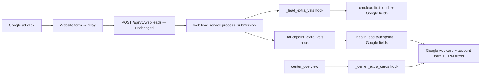

# GA1 — Google Ads: acquisition card + website-lead attribution

**Read with:** `docs/strategy/HANDOVER-CONVENTIONS.md` (binding — §1 multi-database box,
§2 deploy/test, §4 sanctioned edits + vi.po rules, §5 ledger esp. §5.1 `_sql_constraints`
inert, §5.4 persona-real tests, §5.32 no HttpCase in the channels module, §5.55 savepoint
around caught IntegrityError, §5.62 forced fixture edits, §5.69 CMS sidebar sibling leaf,
§5.93 `match_action_xmlids`, §5.95 archive-never-delete fixtures, H32 `--db-filter`) and
`docs/strategy/google-ads-channel-design.md` (the design this phase implements; §1–§6, §9,
§11–§13 apply here — §7/§8 are GA2/GA3, §10 is NOT built).
`docs/SAAS_RUNBOOK.md` §4 for the three-database release ritual.

**Modules:**

| Module | Role | Ships to | Version |
|---|---|---|---|
| `health_google_ads` (NEW) | the Google Ads acquisition module | every database (`health_` prefix ⇒ in the computed customer set) | 19.0.1.0.0 |
| `health_care_command_channels` (EDIT) | one extra-cards hook + card dispatch, §6 | every database | 19.0.12.1.16 → **19.0.12.2.0** |
| `health_web_leads` (EDIT) | braid persistence fix, two extension hooks, touchpoint company, §6 | every database | 19.0.4.2.0 → **19.0.5.0.0** |

**White-label rule (binding, user-visible strings only):** the word "Odoo" never appears
in a label, help, placeholder, notification, view, `.po` msgstr or report. Technical
identifiers (`from odoo import`, xmlids, log lines, comments) keep the real name.

---

## 1. Why this phase exists (plain words first)

The clinic advertises on Google. Today a visitor who clicks a Google ad and fills in the
website contact form becomes a CRM enquiry that looks exactly like an organic one: the click
id is stored only when it is the `gclid` kind, the two cookie-less kinds (`wbraid`, `gbraid`)
are silently dropped, and nothing records which advertising account, campaign or ad the
enquiry came from. The Channel Connection Center has no Google Ads card at all.

GA1 delivers:

1. **A Google Ads card in the Channel Connection Center**, placed after Facebook, that
   tells the truth about three capabilities — *Website leads*, *Campaign reporting* (GA2/GA3
   make it real; GA1 shows "Not connected"), and *Google lead forms* ("Unavailable for
   healthcare ads" — Google's lead-form policy forbids healthcare advertisers; a checkbox
   cannot override it). Its button opens the Google Ads setup screen.
2. **Attribution that survives**: every Google-attributed website enquiry keeps all three
   click ids, the customer/campaign/ad-group/creative ids the ad's final-URL suffix carried,
   which configured advertising account it matched (or "unmatched"), and whether Google Ads
   was the FIRST source of the enquiry or only a later touch.
3. **A server-side proof**: a "Test the website pipeline" button on the account that runs one
   synthetic Google-attributed submission through the real handler, inspects the result,
   rolls it back, and records the evidence with a timestamp — without creating a lead.
4. Company-safe account matching, first-touch immutability, CRM filters ("First source
   Google Ads" / "Google Ads influenced"), English + Vietnamese.

Scope in one line: **the card exists and is honest, and a Google ad click that becomes a
website enquiry keeps every identifier the ad carried.**

## 2. Binding non-goals

- **No Google API call of any kind in GA1.** No OAuth, no developer token, no reporting
  fetch. `reporting_state` exists on the account model (GA2 drives it) and stays
  `not_connected`. No `requests` import in this phase.
- **No Google-hosted lead-form ingestion** (design §10). No public route for it, no form/
  receipt models, no bypass switch. The card and the account form explain the restriction.
- **No new `care.channel.connection` row, no new CHANNEL_SELECTION key, no reply transport,
  no composer.** Google Ads is an acquisition card, never a chat channel. `sendable=False`.
- **No website/relay code.** The WordPress relay has never been installed (0 touchpoints on
  every database, §3.1); the deployed round-trip test session of design §6.3 (operator token
  the relay transmits) is DEFERRED to the phase in which the relay exists. GA1 ships the
  server-side synthetic proof only and says so on screen.
- **No change to the website credential model** (`web.leads.connector`, OAuth client 122,
  service user `svc_web_leads`): the account LINKS to the existing connector.
- **No edit** to `health_crm`, `health_care_command`, `health_landing`, `health_cms_sidebar`,
  `health_api_gateway`, `health_channel_relay`, `biz_*`, nginx, or the deploy wrapper.
- **No Go-Live Studio change**: the operator provider-count banner keeps its current
  denominator; Google Ads is not a provider app in GA1.
- **No campaign auto-create**: `utm.campaign` stays find-only (W1 policy).
- **No IP geolocation, no city inference from an ad's audience**: city derivation is the
  existing `_derive_city` ladder untouched.

## 3. Verified plumbing — DO NOT RE-DERIVE

### 3.1 Live facts (checked 2026-09-15 on VietUcUAT)

- Databases on the box: `carejiox` (master), `carejiox_template`, `hhh` (live clinic), plus
  two practice clones `vietuat` and `codex_fb_center_reply` belonging to other sessions —
  **do not touch, upgrade or test against the clones.**
- `health_care_command_channels` 19.0.12.1.16, `health_web_leads` 19.0.4.2.0,
  `health_crm` 19.0.1.10.1, `health_api_gateway` 19.0.1.0.0, `google_gmail` 19.0.1.2 installed
  on all three. `health_google_ads` exists nowhere (fresh install everywhere, `-i`).
- `health_lead_touchpoint`: **0 rows** on all three databases. `crm_lead` rows carrying any
  Google click id: **0** on all three. The touchpoint `company_id` back-fill therefore
  touches nothing live.
- `web_leads_connector`: master has id 23 "Website connector", company 1 (VIET UC); template
  and `hhh` have none. Companies on master: 1 VIET UC, 2 VN Company, 3 My Company (Chicago).
- `channel_platform_app` on master: google (archived), meta (active), microsoft (archived),
  zalo (active). `hhh`: meta (active). Template: none. Not used by GA1.
- `ir_cron` active: master 87, template **0** (must stay 0), hhh 71.
- Server `channel_center.py` md5 `de852059…` == repo HEAD `551c9c22` — server is in step.

### 3.2 The Center catalogue (`health_care_command_channels`)

- `models/channel_center.py:619-706` `center_overview()` — group gate at `:626` via
  `_center_group_ok()` (`care_channel_connection.py:568-571`, groups = `CENTER_GROUPS`
  `:150-154` = `base.group_system`, `health_crm.group_health_crm_manager`,
  `health_access.group_clinic_admin`); loops `CENTER_CHANNELS` (`:57`, the 8 conversation
  channels) and appends one dict per channel with the keys listed at `:662-697`; per-channel
  extras at `:698-705`; `return cards` at `:706`. The class is `_inherit =
  'care.channel.connection'` (`:140`).
- `_center_primary_action` `:783-801` maps state → (`action`, translated label).
- `_center_state_chips()` `:165` — chip labels per state (used for tone parity only).
- JS `static/src/center/channel_center.js`: `MODEL` `:33`; `CHANNEL_STYLE` `:48-58`
  (icon class + accent var per channel key, fallback `{ic:"ic-chat", cv:"var(--mut)"}` at
  `:327-329`); `STATE_TONE` `:61-69` (unknown state → `"info"` at `:331-333`); `load()`
  `:210-233` calls `center_overview` every 15 s while visible (`REFRESH_MS` `:34`);
  `onPrimary(card)` `:395-427` — `unavailable` returns, `resume`, then **`open` →
  `openManage(card)` at `:401-403`**, else `center_begin(card.channel)` at `:405`;
  `this.action = useService("action")` already exists (`:78`).
- XML `static/src/center/channel_center.xml:44-161` renders each card: head `:50-57`
  (`style(card.channel)`, `card.label`, `card.state_chip`), `card.resource_line` `:63-67`,
  accounts `:69-82`, availability lines `:83-88`, `card.notice` `:93`, traffic `:95-102`,
  approvals `:106-113`, checks `:115-123` (only if `card.checks.length`), actions `:125-138`
  ("Manage account" ghost button only when `card.accounts.length === 1 and primary_action
  !== 'open'`; "Add another account" only when `card.can_add_account`), sub-cards `:141-158`.
- **Tests that pin the card count/order (forced edits, §5.62):**
  `tests/test_center.py:92-95` (T97 asserts the exact 8-key list),
  `tests/test_call_center.py:492-493` (`list(CENTER_CHANNELS)` + `len == 8`),
  `tests/test_platform_go_live.py:490` (`len(cards) == 8`). `test_multi_account.py:49`
  asserts `len(CENTER_CHANNELS) == 8` — unaffected (GA1 does not touch CENTER_CHANNELS).
- Test fixture base: `tests/common.py` `ChannelHubCase` — archives live connections and
  platform apps in `setUpClass`, `_mk_user(login, groups, company=)`, grants the runner
  `group_health_crm_manager` + `group_system`. TransactionCase only (§5.32).

### 3.3 The website lead pipeline (`health_web_leads`)

- `models/web_lead_service.py` — AbstractModel `web.lead.service` (`:214`).
  `process_submission` `:401-558`: idempotency `:419-427`, spam gate `:432-453`, identity
  `:456-462`, city `:468-475`, dedup `:478-508`, merge `:510-522`, create `:524-543`.
  `_merge` `:563-581` creates a touchpoint via `_touchpoint_vals` and never rewrites lead
  attribution. `_create_lead` `:583-633` builds lead vals — **`gclid` at `:621`, `fbclid`
  `:622`, `fbc/fbp` `:623-624`; `wbraid`/`gbraid` are NOT written** although the fields exist
  (`crm_lead.py:73-74`). `_touchpoint_vals` `:674-697` — same gap: `gclid` `:691`, `fbclid`
  `:692`, no braids (fields exist at `lead_touchpoint.py:149-150`). Helpers: `_sub` `:208`,
  `_clean(value, cap)` `:141`, `_sanitize_utm` `:163`, `_utm_ids` `:314-339` (campaign
  find-only), `_result` `:709`.
- `models/crm_lead.py`: click-id fields `:68-78`, `web_touchpoint_ids` `:121-122`,
  `init()` `:404-426` (chain-safe pattern for an inherited model — clone it).
- `models/lead_touchpoint.py`: `lead_id`/`conversation_id` optional pair `:98-104`,
  `_check_attached` `:181-192`, `SOURCE_SYSTEM_SELECTION` `:48-51`, `init()` `:318-326`
  (partial unique index). **No `company_id` on the model.**
- `models/web_leads_connector.py`: `action_test_pipeline` `:487-592` is the rollback-only
  synthetic-run precedent (`_PipelineTestRollback` `:86`, savepoint + raise `:533-541`,
  `invalidate_all` `:551`, `_notify` `:673`, `_check_operator` `:636`). Runner user =
  `self.oauth_client_id.sudo().user_id` `:511`.
- `models/care_conversation_attribution.py:30-34` `_LEAD_ATTRIBUTION_FIELDS` copies
  first-touch from a chat touchpoint onto a lead created from a conversation — extend this
  tuple with the new Google fields (sanctioned) so a conversation-born lead keeps them too.
- Views: `views/crm_lead_views.xml` inherits — opportunity form `:17-20`
  (`health_crm.view_healthcare_opportunity_form`), Lead-Hub source modal `:149-152`
  (`health_landing.view_lead_source_modal`), CMS contact form `:185-188`
  (`health_crm.view_crm_contact_form_crm_center`), opportunity search `:253-256`
  (`crm.view_crm_case_opportunities_filter`), CMS contact search `:279-282`
  (`health_crm.view_crm_contact_search_crm_center`). §5.91: **all three primary forms and
  both primary searches** must get the same additions. Touchpoint views:
  `views/lead_touchpoint_views.xml` (action `action_health_lead_touchpoint` `:142`).
- Security precedents: `security/ir.model.access.csv` (group ladder per model),
  `security/catchment_rules.xml` (scoped rule + Owner twin — the twin is mandatory because
  Odoo ORs group rules).
- CMS sidebar precedent: `data/cms_sidebar_items_web_leads.xml` (sibling leaf, no
  `parent_id`, `match_action_xmlids` + `match_models`, `noupdate="0"`).
- `health.lookup.value._default_for(category, code)` (`health_base/models/
  health_lookup_value.py:164`) — how `touchpoint_type` `form_submit` is resolved. Google
  website enquiries KEEP `form_submit` + `source_system='wordpress'`; no new lookup code in GA1.
- Test precedent: `tests/test_web_lead_service.py` — `_free_phones()` `:63-78` claims
  identities that match no live lead/partner; `_payload()` `:88`. Tag
  `@tagged('post_install', '-at_install')`.

### 3.4 Groups and xmlids that exist (verified)

`base.group_system`, `health_crm.group_health_crm_manager`, `health_crm.group_health_crm_user`,
`health_access.group_clinic_admin`, `health_base.group_healthcare_{receptionist,sales,
operations_manager,manager,admin,owner}`, `health_cms_sidebar.section_crm`,
`health_cms_sidebar.section_admin`, `health_base.model_health_catchment_province`,
`health_web_leads.model_web_leads_connector`, `utm.model_utm_campaign`.

## 4. Architecture



### 4.1 New module `health_google_ads`

```text
addons/health_google_ads/
  __init__.py, __manifest__.py           depends: health_web_leads, health_care_command_channels
  models/__init__.py
  models/google_ads_account.py           google.ads.account
  models/google_ads_campaign.py          google.ads.campaign (manual mapping rows in GA1)
  models/channel_center.py               _inherit care.channel.connection — _center_extra_cards override
  models/web_lead_service.py             _inherit web.lead.service — hook overrides
  models/crm_lead.py                     _inherit crm.lead — fields + filters helpers
  models/lead_touchpoint.py              _inherit health.lead.touchpoint — fields + constraint
  models/care_conversation_attribution.py  (only if needed — see §6, prefer the tuple edit)
  services/__init__.py, services/attribution.py   pure helpers (no ORM)
  security/ir.model.access.csv, security/google_ads_security.xml
  data/cms_sidebar_items_google_ads.xml
  views/google_ads_account_views.xml, views/crm_lead_views.xml, views/lead_touchpoint_views.xml
  static/src/center/google_ads_center.scss   (accent var only)
  i18n/vi.po
  tests/__init__.py, tests/common.py, tests/test_attribution.py, tests/test_center.py,
  tests/test_security.py, tests/test_website_test.py
```

Manifest: `'application': False`, `'installable': True`, `'auto_install': False`, assets:
`'web.assets_backend': ['health_google_ads/static/src/center/google_ads_center.scss']`.
Category `'Sales/CRM'`. Summary "Google Ads acquisition: attribution and reporting".

### 4.2 `google.ads.account` (`_inherit = ['mail.thread', 'mail.activity.mixin']`)

| Field | Definition |
|---|---|
| `name` | Char, required, default "Google Ads" |
| `active` | Boolean default True |
| `company_id` | Many2one res.company, required, index, default `self.env.company` |
| `customer_id` | Char(10), index; normalised: strip everything but digits, must be exactly 10 digits when set (`_check_customer_id` constraint). Optional (website-only draft). |
| `login_customer_id` | Char(10), same normalisation; GA2 uses it; editable in GA1 for future use, help text says "manager account, optional" |
| `website_connector_id` | Many2one `web.leads.connector`, `check_company=True`; constraint: connector company == account company |
| `default_catchment_id` | Many2one `health.catchment.province` (help: "Only used by an explicit campaign mapping — never inferred from an ad") |
| `reporting_state` | Selection `[('not_connected','Not connected'),('authorizing','Signing in'),('select_account','Choose account'),('syncing','Syncing'),('connected','Connected'),('action_required','Action required'),('paused','Paused')]`, default `not_connected`, readonly in the view, tracking |
| `currency_id`, `account_timezone`, `provider_name` | Many2one res.currency / Char / Char — readonly, filled by GA2 |
| `last_sync_attempt_at`, `last_sync_success_at`, `last_error_code` | Datetime/Datetime/Char readonly — GA3 |
| `website_test_at` | Datetime readonly |
| `website_test_kind` | Selection `[('server','Server pipeline check'),('roundtrip','Deployed round trip'),('live','Real lead')]` readonly |
| `website_test_summary` | Char readonly (redacted one-liner) |
| `website_last_lead_at` | Datetime, **non-stored compute**: newest `occurred_at` over `health.lead.touchpoint` with `google_ads_account_id = self` and `google_ads_origin != False` (same reason as W2.5 D1: touchpoints are written in transactions the account has no depends path to) |
| `website_lead_count` | Integer non-stored compute, same domain |
| `unmatched_lead_count` | Integer non-stored compute: touchpoints in this COMPANY with `google_ads_origin != False` and `google_ads_match_status = 'unmatched'` (company-level, shown once, not per account) |
| `native_eligibility` | Selection `[('healthcare_blocked','Unavailable for healthcare ads'),('unverified','Not verified'),('eligible','Eligible (operator-verified)')]`, default `healthcare_blocked`, `groups="base.group_system"` for write (readonly for everyone else in the view; the write guard in `write()` also refuses non-system users) |
| `eligibility_checked_at`, `eligibility_reference` | Datetime / Char (no PII) |
| `website_status` | Selection compute non-stored: `setup_needed` (no connector), `ready_for_test` (connector, no evidence), `test_passed` (evidence kind server/roundtrip, no live lead), `receiving` (a real lead exists) |
| `overall_status` | Selection compute non-stored: `connected` if website_status=='receiving' AND reporting_state=='connected'; `partial` if either website in (test_passed, receiving) or reporting_state=='connected'; else `setup_needed` |
| `campaign_ids` | One2many google.ads.campaign |

Constraints/indexes in `init()`:
`CREATE UNIQUE INDEX IF NOT EXISTS google_ads_account_customer_uidx ON google_ads_account
(customer_id) WHERE customer_id IS NOT NULL AND customer_id <> ''` — **database-wide**, not per
company (design §5.1: one advertising customer must not be bound to two companies). Archived
rows keep the binding. A second website-only draft per company is refused in `create()` when
another active account of that company has no `customer_id` (one draft per company).

Guarded writes: `create/write/unlink` refuse for anyone outside `CENTER_GROUPS` +
`health_base.group_healthcare_owner`/`group_healthcare_admin` (method-level check —
`_check_operator()` raising `AccessError`; clone `web_leads_connector._check_operator`
`:636`). Evidence fields (`website_test_*`, `reporting_state`, `last_sync_*`,
`currency_id`, `account_timezone`, `provider_name`, `native_eligibility`) are
**internal-write-only**: `write()` strips them unless `self.env.context.get(INTERNAL_CTX)`
(define `INTERNAL_CTX = 'google_ads_internal'` in the model; the server paths pass it via
`self.with_context(**{INTERNAL_CTX: True})`; `su` alone is NOT enough — clone the
`care_channel_connection` posture: flag AND (su or group_system)).

Methods (all `ensure_one`, all gate FIRST, then act):

- `action_test_website()` — §5.3.
- `action_view_leads()` — returns the `health_web_leads.action_web_leads_funnel`-style
  window action on `crm.lead` (`type='ir.actions.act_window'`, `res_model='crm.lead'`,
  domain `[('google_ads_origin','!=',False), ('google_ads_account_id','=',self.id)]`,
  context `{'search_default_google_ads_first': 1}`), name "Google Ads leads". The user's
  own record rules apply (no sudo).
- `action_view_touchpoints()` — window on `health.lead.touchpoint`, domain
  `[('google_ads_account_id','=',self.id)]`.
- `action_open_setup()` `@api.model` — returns the `health_google_ads.action_google_ads_accounts`
  window action (used by the Center card); if the company has exactly one active account,
  return the form action for it instead (`res_id`).
- `_center_card_payload()` `@api.model` — builds the card dict (§5.1) for `self.env.company`.
- `final_url_suffix` — Char compute non-stored:
  `utm_source=google&utm_medium=cpc&h19_gads_campaign_id={campaignid}&h19_gads_adgroup_id={adgroupid}&h19_gads_creative_id={creative}`
  plus `&h19_gads_customer_id=<customer_id>` when the account has one. Rendered with
  `widget="CopyClipboardChar"`. Never contains a secret.

### 4.3 `google.ads.campaign` (GA1 = manual mapping rows; GA3 fills from the provider)

| Field | Definition |
|---|---|
| `account_id` | Many2one google.ads.account, required, ondelete cascade, index |
| `company_id` | related `account_id.company_id`, store=True, index |
| `external_campaign_id` | Char, required, digits only (constraint), **string never int** |
| `name` | Char required |
| `status`, `advertising_channel_type` | Char readonly (GA3) |
| `utm_campaign_id` | Many2one utm.campaign (find-only mapping; never created here) |
| `catchment_id` | Many2one health.catchment.province |
| `source` | Selection `[('manual','Entered by hand'),('provider','From Google')]` default manual |
| `last_seen_at` | Datetime readonly |

`init()`: `CREATE UNIQUE INDEX IF NOT EXISTS google_ads_campaign_account_ext_uidx ON
google_ads_campaign (account_id, external_campaign_id)`. Write gate = same operator check.

### 4.4 Attribution fields (in `health_google_ads`, via `_inherit`)

On BOTH `crm.lead` (first-touch snapshot) and `health.lead.touchpoint`:

| Field | Type |
|---|---|
| `google_ads_account_id` | Many2one google.ads.account, index, ondelete `set null`, `check_company=True` on the lead |
| `google_ads_customer_id` | Char(10) |
| `google_ads_campaign_id` | Char (raw provider id; NOT Odoo's `campaign_id`) |
| `google_ads_adgroup_id`, `google_ads_creative_id`, `google_ads_asset_group_id` | Char |
| `google_ads_origin` | Selection `[('website','Website'),('native_form','Google lead form')]` — empty for unrelated records |
| `google_ads_match_status` | Selection `[('matched','Matched'),('unmatched','Unmatched'),('conflict','Conflict')]` |

Touchpoint only: `google_ads_time_basis` Selection `[('provider','Provider'),('website',
'Website'),('received_fallback','Received time')]` — GA1 always writes `website`.
Lead only: `google_ads_influenced` Boolean **non-stored search-only compute** with a
`search='_search_google_ads_influenced'` returning `[('web_touchpoint_ids.google_ads_origin',
'!=', False)]` — this is what the "Google Ads influenced" filter uses.

Constraint on the touchpoint (`@api.constrains('google_ads_account_id','company_id')`): if
both set, `google_ads_account_id.company_id == company_id` else ValidationError.

Tests dump `crm.lead.fields_get()` — every new field needs a plain-English `string=` and
`help=` (white-label).

### 4.5 `health.lead.touchpoint.company_id` (in `health_web_leads`, sanctioned)

`company_id = fields.Many2one('res.company', compute='_compute_company_id', store=True,
index=True)` with `@api.depends('lead_id.company_id', 'conversation_id.company_id')`:
lead's company if lead, else conversation's company, else False. `_check_attached`
additionally refuses when both anchors exist and their companies differ. Installing the
upgrade computes the column for existing rows (0 rows live, §3.1). Add ONE company rule
on the touchpoint in `health_web_leads/security/catchment_rules.xml`. It must be a
**global** rule (no `groups` field, `global` eval True): the existing catchment rules are
group rules and OR together, while a global rule ANDs with all of them — which is the
semantics wanted here. Domain:
`['|', ('company_id','=',False), ('company_id','in',company_ids)]`. The `False` branch keeps
any legacy row without an anchor visible rather than vanishing it.

### 4.6 Pure attribution helpers — `services/attribution.py` (kernel — use as-is)

```python
# -*- coding: utf-8 -*-
"""Pure Google Ads attribution helpers — no ORM, unit-testable.

Every input is UNTRUSTED (it came from a URL). Values are bounded strings;
provider ids are digits kept as STRINGS (they exceed 2**53 — never int()).
"""
import re

GOOGLE_SOURCES = ('google', 'google ads', 'googleads', 'adwords')
PAID_MEDIUMS = ('cpc', 'ppc', 'paidsearch', 'paid_search', 'paid-search', 'paid')
_DIGITS_RE = re.compile(r'^\d{1,32}$')
_ID_CAP = 32


def norm_customer_id(value):
    """'123-456-7890' -> '1234567890'; anything not exactly 10 digits -> False."""
    if value in (None, False, ''):
        return False
    digits = re.sub(r'\D', '', str(value))
    return digits if len(digits) == 10 else False


def norm_provider_id(value):
    """A campaign / ad-group / creative id: 1-32 digits, as a STRING, else False."""
    if value in (None, False, ''):
        return False
    text = str(value).strip()
    return text if _DIGITS_RE.match(text) else False


def _lower(value):
    return ' '.join(str(value or '').strip().lower().split())


def classify(utm, clicks):
    """Return (is_google_ads, match_hint) for one submission.

    is_google_ads: a Google click id is present, OR the declared source is a
    Google alias AND the medium is a paid alias.
    match_hint: 'click_id' | 'utm' | 'conflict' | ''.
      'conflict' = a Google click id is present but the declared source names
      something else — the touch is still Google Ads (the click id is the
      stronger evidence) and the lead is flagged for review; the declared UTM
      strings are NEVER rewritten.
    """
    utm = utm if isinstance(utm, dict) else {}
    clicks = clicks if isinstance(clicks, dict) else {}
    has_click = any(str(clicks.get(k) or '').strip()
                    for k in ('gclid', 'wbraid', 'gbraid'))
    source = _lower(utm.get('source'))
    medium = _lower(utm.get('medium'))
    utm_says_google = source in GOOGLE_SOURCES and medium in PAID_MEDIUMS
    if has_click:
        if source and source not in GOOGLE_SOURCES:
            return True, 'conflict'
        return True, 'click_id'
    if utm_says_google:
        return True, 'utm'
    return False, ''


def extract_ids(payload):
    """The optional `google_ads` block plus the h19_gads_* query keys some relays
    flatten into the top level. Bounded, digit-only, strings."""
    block = payload.get('google_ads') if isinstance(payload, dict) else None
    block = block if isinstance(block, dict) else {}
    def pick(key):
        return (block.get(key)
                if block.get(key) not in (None, '', False)
                else payload.get('h19_gads_%s' % key))
    return {
        'customer_id': norm_customer_id(pick('customer_id')),
        'campaign_id': norm_provider_id(pick('campaign_id')),
        'adgroup_id': norm_provider_id(pick('adgroup_id')),
        'creative_id': norm_provider_id(pick('creative_id')),
        'asset_group_id': norm_provider_id(pick('asset_group_id')),
    }
```

### 4.7 Hooks in `web.lead.service` (in `health_web_leads`, sanctioned)

Add two overridable methods with EMPTY defaults and call them from the two value builders:

```python
    def _lead_extra_vals(self, payload, catchment, city_source):
        """Extension seam: extra crm.lead vals for a NEW lead. Default {}."""
        return {}

    def _touchpoint_extra_vals(self, lead, payload, catchment, city_source):
        """Extension seam: extra touchpoint vals for EVERY touch. Default {}."""
        return {}
```

- `_create_lead` (`:583-633`): add `'wbraid': _clean(clicks.get('wbraid'))`,
  `'gbraid': _clean(clicks.get('gbraid'))` next to `gclid` (`:621`), then
  `vals.update(self._lead_extra_vals(payload, catchment, city_source))` **before**
  `vals.update(self._utm_ids(utm))` and the create.
- `_touchpoint_vals` (`:674-697`): add `wbraid`/`gbraid` next to `gclid` (`:691`), and merge
  `self._touchpoint_extra_vals(lead, payload, catchment, city_source)` into the dict before
  returning. `_merge` (`:563-581`) then carries Google data on repeat touches for free.
- Fix the stale comment at `web_lead_service.py:93-96` ("170 touchpoints") while there
  (W3 review LOW).

### 4.8 The override in `health_google_ads/models/web_lead_service.py`

```python
class WebLeadServiceGoogleAds(models.AbstractModel):
    _inherit = 'web.lead.service'

    def _google_ads_vals(self, payload):
        """Shared by both hooks. Returns {} when the touch is not Google Ads."""
        utm, clicks = _sub(payload, 'utm'), _sub(payload, 'click_ids')
        is_ads, hint = attribution.classify(utm, clicks)
        if not is_ads:
            return {}
        ids = attribution.extract_ids(payload)
        account, status = self._google_ads_resolve_account(ids)
        if hint == 'conflict':
            status = 'conflict'
        return {
            'google_ads_origin': 'website',
            'google_ads_match_status': status,
            'google_ads_account_id': account.id if account else False,
            'google_ads_customer_id': ids['customer_id'] or False,
            'google_ads_campaign_id': ids['campaign_id'] or False,
            'google_ads_adgroup_id': ids['adgroup_id'] or False,
            'google_ads_creative_id': ids['creative_id'] or False,
            'google_ads_asset_group_id': ids['asset_group_id'] or False,
        }

    def _google_ads_resolve_account(self, ids):
        """Design §6.2 order. COMPANY-SCOPED: the authenticated request's
        company (self.env.company) — payload ids never choose a company."""
        Account = self.env['google.ads.account'].sudo()
        company = self.env.company
        if ids['customer_id']:
            acc = Account.search([('company_id', '=', company.id),
                                  ('customer_id', '=', ids['customer_id'])], limit=1)
            if acc:
                return acc, 'matched'
        if ids['campaign_id']:
            rows = self.env['google.ads.campaign'].sudo().search(
                [('company_id', '=', company.id),
                 ('external_campaign_id', '=', ids['campaign_id'])], limit=2)
            if len(rows) == 1:
                return rows.account_id, 'matched'
        return Account.browse(), 'unmatched'
```

`_lead_extra_vals` returns `_google_ads_vals(payload)` plus `'web_needs_review': True`
merged ONLY when status is `conflict` (never clear an existing True — the base builder sets
it first, so use `vals['web_needs_review'] = base_needs or True`: implement by returning the
key only when conflict, and in `_create_lead` merge with `vals.update(...)` — because the
base dict already computed `web_needs_review`, the override must OR: return
`{'web_needs_review': True}` only for conflict; otherwise omit the key).
`_touchpoint_extra_vals` returns `_google_ads_vals(payload)` + `'google_ads_time_basis':
'website'` when non-empty. In `_merge` the lead's own Google fields are **never** written
(first touch immutable) — the hook only feeds the touchpoint.

Why `sudo()` on the account/campaign search: the service user has no ACL on these models
and needs none; the search is pinned to `self.env.company`, which the gateway set from the
credential (`request.update_env(user=user.id)` at `controllers/web_leads.py:111`). Add a
test that a payload naming another company's customer id resolves `unmatched`.

Also extend `_LEAD_ATTRIBUTION_FIELDS` in `health_web_leads/models/
care_conversation_attribution.py:30-34` with the seven `google_ads_*` copy fields (not
`google_ads_influenced`), guarded by the existing `field in lead._fields` check.

## 5. Behaviour

### 5.1 The Center card (`health_google_ads/models/channel_center.py`)

Seam in `health_care_command_channels/models/channel_center.py` (sanctioned):

```python
    @api.model
    def _center_extra_cards(self):
        """Acquisition cards contributed by other modules. Default: none.
        Each dict must carry every key `center_overview` emits for a
        conversation card plus `kind`, `mode`, `action_xmlid`; an optional
        `after_key` names the conversation card to insert after."""
        return []
```

and in `center_overview()` replace `return cards` (`:706`) with:

```python
        for extra in self._center_extra_cards():
            after = extra.pop('after_key', None)
            keys = [c['channel'] for c in cards]
            if after in keys:
                cards.insert(keys.index(after) + 1, extra)
            else:
                cards.append(extra)
        return cards
```

The override in `health_google_ads`:

```python
class CareChannelConnectionGoogleAds(models.Model):
    _inherit = 'care.channel.connection'

    @api.model
    def _center_extra_cards(self):
        cards = super()._center_extra_cards()
        cards.append(self.env['google.ads.account']._center_card_payload())
        return cards
```

`_center_card_payload()` (no group check of its own — `center_overview` already gated at
`:626`; but it must read ONLY `self.env.company` accounts, via `sudo()` + explicit company
domain, and must carry no token/secret field — there are none in GA1, keep it that way):

```python
{
  'channel': 'google_ads', 'kind': 'acquisition', 'after_key': 'fb',
  'label': _('Google Ads'),
  'tagline': _('Leads from your advertising campaigns'),
  'state': <'not_connected' | 'partial' | 'ready'>,        # tone only
  'state_chip': <_('Setup needed') | _('Partially connected') | _('Connected')>,
  'paused': False, 'connection_id': False,
  'resource_line': <account name — customer id, or ''>,
  'last_inbound_at': '', 'last_outbound_at': '', 'health_status': '',
  'primary_action': <'connect' if no account else 'open'>,
  'primary_label': <_('Set up Google Ads') | _('Manage')>,
  'mode': 'external_action',
  'action_xmlid': 'health_google_ads.action_google_ads_accounts',
  'available': True, 'implemented': True, 'sendable': False,
  'checks': [], 'checks_done': 0, 'checks_total': 0,
  'parent_channel': '', 'guide_steps': [],
  'accounts': [], 'multi_account': False, 'can_add_account': False,
  'capabilities': [
     {'key': 'website',   'label': _('Website leads'),
      'status': <'receiving'|'test_passed'|'ready_for_test'|'setup_needed'>,
      'status_label': <_('Receiving') | _('Test passed; awaiting live lead') | _('Ready for test') | _('Setup needed')>,
      'tone': <'ok'|'info'|'off'>},
     {'key': 'reporting', 'label': _('Campaign reporting'),
      'status': <reporting_state>, 'status_label': <_('Connected') | _('Not connected') | _('Action required')>, 'tone': ...},
     {'key': 'native',    'label': _('Google lead forms'),
      'status': 'unavailable', 'status_label': _('Unavailable for healthcare ads'), 'tone': 'off'},
  ],
  'lines': [
     _('Last website lead: %s') % (<time> or _('No leads received yet')),
     _('Reporting updated: %s') % (<time> or _('Not synced')),
  ],
  'notice': '',
  'view_leads_action': 'health_google_ads.action_google_ads_leads',
}
```

Rules: with several accounts in the company, `state`/chip come from the BEST account
(`overall_status` ranking connected > partial > setup_needed) and `resource_line` says
"%d accounts"; `lines[0]` uses the newest lead across the company's accounts; the
"Reporting updated" line uses the newest `last_sync_success_at` (empty in GA1). Never
"Sent", never "Reply".

JS (sanctioned, `channel_center.js:395-427`): insert at the TOP of `onPrimary` after the
`unavailable` return:

```js
        if (card.mode === "external_action" && card.action_xmlid) {
            return this.action.doAction(card.action_xmlid);
        }
```

Add to `CHANNEL_STYLE` (`:48-58`): `google_ads: { ic: "ic-globe", cv: "var(--ch-google-ads, var(--mut))" }`.
The accent var `--ch-google-ads` is declared in `health_google_ads`'s scss (flat mono colour,
e.g. `#1a73e8`; no gradient).

XML (sanctioned, `channel_center.xml`): inside the card, after `card.notice` (`:93`), add

```xml
          <p class="cc-res muted" t-if="card.tagline" t-esc="card.tagline"/>
          <ul class="cc-caps" t-if="card.capabilities" data-a="ch-caps">
            <li t-foreach="card.capabilities" t-as="cap" t-key="cap.key" class="cc-cap">
              <span class="cc-cap-name" t-esc="cap.label"/>
              <span class="cc-chip small" t-att-class="'tone-' + cap.tone" t-esc="cap.status_label"/>
            </li>
          </ul>
          <p class="cc-sub-line" t-foreach="card.lines || []" t-as="line" t-key="line_index" t-esc="line"/>
```

and in the actions block (`:125-138`) add, after the primary button:

```xml
            <button class="cc-btn ghost" t-if="card.view_leads_action"
                    t-att-disabled="state.busy"
                    t-on-click="() => this.action.doAction(card.view_leads_action)">View leads</button>
```

Styles for `.cc-caps/.cc-cap` go in the NEW module's scss (`.cc-card .cc-caps { list-style:
none; margin: 6px 0 0; padding: 0; } .cc-cap { display:flex; justify-content:space-between;
gap:8px; padding:3px 0; font-size:13px; }`) — no edit to the channels scss. Do not write
`min(px, %)` (§5.68). The "Manage account" ghost button stays hidden (accounts is empty).
Existing cards are byte-identical in the payload except for the appended card.

`health_google_ads.action_google_ads_leads` = window action on `crm.lead`, domain
`[('google_ads_origin','!=',False)]`, context `{'search_default_google_ads_first': 1}`,
views list/form using the CMS contact list/form the sidebar uses (bind the SAME views
`health_web_leads.action_web_leads_funnel` binds — read that action `crm_lead_views.xml:370`
and clone its `view_ids`/context posture).

### 5.2 Account form (the "detail action", design §4.2 — GA1 subset)

`views/google_ads_account_views.xml`: list (name, company, customer_id, website_status,
reporting_state, website_last_lead_at), search (company, active), form with header buttons
**Test the website pipeline** (`action_test_website`), **View leads**, **View touchpoints**,
and a `reporting_state` statusbar (readonly). Notebook pages:

1. **Overview** — status fields, `website_last_lead_at`, `website_lead_count`,
   `unmatched_lead_count` (label "Google enquiries not matched to any account (this
   company)"), last test evidence.
2. **Website leads** — `website_connector_id` (with a button "Open website connector" →
   the connector form), `final_url_suffix` (CopyClipboardChar) with a paragraph explaining
   it goes in the campaign's *Final URL suffix* in Google Ads after reviewing existing
   tracking, and that auto-tagging must stay on; a paragraph stating that this test checks
   the server only, and that a deployed round-trip test becomes available once the website
   relay is installed.
3. **Campaign reporting** — GA1: `reporting_state` + a paragraph "Campaign reporting is
   set up in a later step: connect a Google account, choose the advertising account, and
   this system reads campaign names, spend, clicks and conversions. Nothing is changed in
   Google Ads." + the `campaign_ids` list (manual mapping rows: external id, name,
   utm campaign, catchment).
4. **Google lead forms** — `native_eligibility` (readonly unless system), the policy text:
   "Google does not allow healthcare advertisers to use Google-hosted lead forms. Website
   leads and campaign reporting work without them." with the policy link
   `https://support.google.com/adspolicy/answer/9472930` as an `<a target="_blank">`.

Chatter at the bottom, full width. All strings EN + VI. `groups` on the action: none
(ACLs govern); form `create="1"` only for operators via ACL.

CMS sidebar leaf (`data/cms_sidebar_items_google_ads.xml`, `noupdate="0"`): name "Google
Ads", `section_id = health_cms_sidebar.section_crm`, `sequence` 22, `icon` `fa fa-google`
(the sidebar icon field IS font-awesome — memory exception), `action_xmlid =
health_google_ads.action_google_ads_accounts`, `match_action_xmlids =
health_google_ads.action_google_ads_accounts,health_google_ads.action_google_ads_leads`,
`match_models = google.ads.account`, `parent_id` `eval="False"`, no `role_ids`. This is
what keeps the Center's `doAction` inside the CMS chrome (§5.93).

### 5.3 `action_test_website()` — the server-side proof

Clone `web_leads_connector.action_test_pipeline` (`:487-592`) with these differences:

- Gate: `_check_operator()`. Requires `website_connector_id` (else `UserError` "Link the
  website connector first").
- Runner = the connector's service user when present (`self.website_connector_id
  .oauth_client_id.sudo().user_id`), else `sudo()`, **and** `with_company(self.company_id)`.
- Payload: `submission_id = 'gads-test-%s' % uuid4().hex`, `form_id` from the connector's
  form map (same trick), name "Kiểm tra Google Ads", a free phone (reuse
  `'0900000000'` as the connector does), `utm = {'source':'google','medium':'cpc',
  'campaign':'gads-test'}`, `click_ids = {'gclid': 'TEST-' + hex}`, `google_ads =
  {'customer_id': self.customer_id or '', 'campaign_id': <first mapping row's id or ''>}`,
  `anti_spam` ok.
- Inside the savepoint, after `process_submission`, **inspect before rolling back**: browse
  the created lead (`outcome['_lead_id']`) and its newest touchpoint; assert
  `google_ads_origin == 'website'`, `gclid` present, and `google_ads_account_id == self`
  when `customer_id` is set (else `unmatched`). Build the summary from those facts, then
  raise the rollback exception. If the outcome was `merged`/`duplicate`, report it
  honestly ("an open lead already matches the test number") and still count it as a pass
  of the pipeline.
- Persist evidence OUTSIDE the savepoint via the internal context:
  `website_test_at = now`, `website_test_kind = 'server'`, `website_test_summary =
  redact(summary)[:200]` (import `redact` from
  `odoo.addons.health_care_command_channels.services.redact`). A failure writes
  `website_test_summary` = "FAILED: <redacted reason>" and leaves `website_test_at`
  unchanged (evidence is of a PASS).
- `message_post` the result; return `_notify(...)` with `params.next` reload (W2.5 D4).
- Never sends mail, never calls a provider, and real leads alone move `website_last_lead_at`
  (it is a compute over real touchpoints; the synthetic rows are rolled back).

### 5.4 CRM surfaces

- All three primary lead forms (§3.3 view ids): a "Google Ads" group inside the existing
  Web Attribution tab (inherit the `health_web_leads` inherit views by xmlid, `position=
  "inside"` on their attribution group) showing `google_ads_origin`,
  `google_ads_match_status`, `google_ads_account_id`, `google_ads_customer_id`,
  `google_ads_campaign_id`, `google_ads_adgroup_id`, `google_ads_creative_id`, plus `wbraid`
  and `gbraid` if the base tab does not already show them (check — add if absent).
- Both primary search views: filters `google_ads_first` ("First source Google Ads":
  `[('google_ads_origin','!=',False)]`) and `google_ads_influenced` ("Google Ads
  influenced": `[('google_ads_influenced','=',True)]`), plus a group-by on
  `google_ads_account_id`. Neither filter may match a lead solely because `source_id.name`
  contains "google".
- Touchpoint list/form/search: the same fields; filter "Google Ads" and "Unmatched Google
  Ads" (`google_ads_match_status = unmatched`).
- Lead-Hub source modal (`health_landing.view_lead_source_modal` inherit): one readonly
  line "Google Ads: <campaign id> · <matched/unmatched>" when `google_ads_origin` is set.

## 6. Sanctioned edits (exhaustive)

`health_care_command_channels` (→ 19.0.12.2.0):
1. `models/channel_center.py` — add `_center_extra_cards()` (default `[]`) and the insertion
   loop before `return cards` in `center_overview()`. Nothing else.
2. `static/src/center/channel_center.js` — the `external_action` branch at the top of
   `onPrimary`; the `google_ads` entry in `CHANNEL_STYLE`. Nothing else.
3. `static/src/center/channel_center.xml` — the tagline/capabilities/lines block and the
   "View leads" button as written in §5.1. Nothing else.
4. `tests/test_center.py:92-95`, `tests/test_call_center.py:492-493`,
   `tests/test_platform_go_live.py:490` — FORCED (§5.62): filter the asserted list to
   conversation cards: `[c['channel'] for c in cards if c.get('kind', 'conversation') !=
   'acquisition']`, and `len(...)` on that filtered list. Record as deviation-by-sanction.
5. `__manifest__.py` version. `i18n/vi.po` for the new "View leads" string.

`health_web_leads` (→ 19.0.5.0.0):
6. `models/web_lead_service.py` — `wbraid`/`gbraid` in `_create_lead` and `_touchpoint_vals`;
   the two hook methods and their call sites; the stale comment at `:93-96`.
7. `models/lead_touchpoint.py` — stored computed `company_id` + the `_check_attached`
   company-mismatch refusal.
8. `models/care_conversation_attribution.py:30-34` — extend `_LEAD_ATTRIBUTION_FIELDS`.
9. `security/catchment_rules.xml` — the global company rule of §4.5.
10. `tests/` — a new test file `test_web_leads_ga1.py` for braid persistence, hooks and
    touchpoint company (do not rewrite existing tests; if one asserts an exact key set of
    `_touchpoint_vals`, extend it and record the forced edit).
11. `__manifest__.py` version; `i18n/vi.po` only if a user-visible string changed.

Everything else in those two modules and every other module is READ-ONLY.

## 7. Safety rails

- R1 **Company never comes from the payload.** Account/campaign resolution is domained on
  `self.env.company`; `customer_id` in a payload is an attribution hint, never a grant.
- R2 **First touch is immutable.** `_merge` never writes `google_ads_*` on the lead; only
  `_create_lead` does, once.
- R3 **Ids are strings.** No `int()` on any provider id anywhere; tests use a 19-digit
  campaign id (`'12345678901234567890'[:19]`) and assert byte equality.
- R4 **Never choose the first of several accounts.** Two active accounts in the company
  and a payload with no customer id and an ambiguous/absent campaign id ⇒ `unmatched`.
- R5 **Evidence is internal-write-only** (INTERNAL_CTX + su/group_system), never a manual
  "connected" checkbox. `native_eligibility` cannot leave `healthcare_blocked` except by a
  `base.group_system` user, and no UI offers it to tenants.
- R6 **The synthetic test creates nothing** — savepoint + rollback + `invalidate_all()`;
  T-checks below prove `crm_lead`/`health_lead_touchpoint` counts are unchanged in a fresh
  read after the button.
- R7 **No secret material in the card payload** (T97-style JSON dump assertion) — GA1
  stores none, and the test guards GA2 from regressing it.
- R8 **The classification never rewrites UTM strings**; a conflict flags review.
- R9 **`sudo()` only where named** (account/campaign lookup in the service hook, the card
  payload's company-pinned reads). Every action method gates BEFORE sudo.
- R10 **All existing suites stay green**: `health_care_command_channels` (§3.2 forced
  edits only), `health_web_leads`, `health_care_command`.

## 8. Tests (numbered; TransactionCase, `post_install`; fixtures via `_free_phones` style)

`health_google_ads/tests` (fixture base `GoogleAdsCase(TransactionCase)`: creates
`company2`, an operator user in `group_health_crm_manager`, a plain `group_health_crm_user`,
a `web.leads.connector` for the test company when none exists (adopt if present), account
A1 (customer `1111111111`), account A2 (customer `2222222222`, same company), account B1
(company2, customer `3333333333`), and campaign mapping rows).

| ID | Design ref | Scenario → required result |
|---|---|---|
| GA1-T01 | T02 | `center_overview()` as operator: the 9th card `channel='google_ads'`, `kind='acquisition'`, sits immediately after `fb`; the other 8 cards are byte-identical to a run with the hook patched to `[]` (compare `json.dumps` of the 8). |
| GA1-T02 | T02/T19 | Card with no account: chip "Setup needed", primary `connect`/"Set up Google Ads", capabilities website=`setup_needed`, reporting=`not_connected`, native=`unavailable`; `sendable` False; `checks_total` 0. Card JSON contains none of: `token`, `secret`, `chs$1$`. |
| GA1-T03 | T02 | Card as a user in company2 sees company2's accounts only (A1/A2 absent, B1 present); a plain CRM user gets the same `UserError` `center_overview` already raises. |
| GA1-T04 | T04 | Payload with `gclid` + `utm google/cpc` + `google_ads{customer_id:'111-111-1111', campaign_id:'12345678901234567'}` → `created`; lead `google_ads_origin='website'`, `match_status='matched'`, `account=A1`, campaign id equals the exact string; touchpoint mirrors it with `time_basis='website'`; `gclid` on both. |
| GA1-T05 | T05 | `wbraid` only → persists on lead AND touchpoint; `gbraid` only → same; no `gclid` written. Source classification true via click id alone (no utm). |
| GA1-T06 | T06 | An organic lead (no utm/click) created first; a second submission from the same person (same name+phone, within 60 days) carrying Google data → `merged`; lead's `google_ads_origin` stays empty, `source_id` unchanged; new touchpoint carries Google fields; `google_ads_influenced` search finds the lead; `google_ads_first` filter does not. |
| GA1-T07 | T07 | Same Google submission twice → second returns `duplicate`; one lead, one touchpoint. |
| GA1-T08 | T09 | Payload naming B1's customer id, processed in company 1 → `unmatched`, account False; no B1 reference anywhere on the rows. |
| GA1-T09 | §6.2 | Two accounts (A1, A2) in company, payload with campaign id mapped on BOTH → `unmatched` (ambiguous); mapped on exactly one → matched to that one; unmapped → unmatched. |
| GA1-T10 | §6.1 | `gclid` present but `utm.source='facebook'` → origin website, `match_status='conflict'`, `web_needs_review=True`, `utm_source` on the touchpoint still `'facebook'`. |
| GA1-T11 | T10 | Oversize/garbage ids: `campaign_id='12'*40`, `'abc'`, `None`, `12345` (int) → non-digit/over-cap → False; the int is accepted as `'12345'`; `customer_id='123'` → False. Pure-helper unit tests (no ORM). |
| GA1-T12 | T11 | `action_test_website` as the operator: counts of `crm_lead` and `health_lead_touchpoint` identical before/after (fresh `search_count` after `invalidate_all`); `website_test_at` set, `website_test_kind='server'`, summary mentions "matched" when A1 has a customer id; chatter has one message; a second press updates the timestamp. As the plain CRM user → `AccessError`. Without a connector → `UserError`, no evidence written. |
| GA1-T13 | T19 | Direct `write` of `website_test_at`/`reporting_state`/`native_eligibility` by the operator WITHOUT the internal context is stripped (values unchanged); with the context + `su` it lands. `native_eligibility='eligible'` by the operator (non-system) → refused even with the context. |
| GA1-T14 | §5.1 | Unique customer binding: creating an account in company2 with A1's customer id raises (IntegrityError inside a savepoint, or the pre-check `UserError` — implement the pre-check in `create/write` so the message is actionable, and keep the index as backstop). Archiving A1 then trying again still refuses. |
| GA1-T15 | §5.1 | Second website-only draft (no customer id) in the same company → refused; setting a customer id on the draft upgrades it in place. |
| GA1-T16 | §4.5 | Touchpoint `company_id` follows its lead; a touchpoint with a lead in company 1 and `google_ads_account_id=B1` → ValidationError; `_check_attached` refuses lead+conversation of different companies. |
| GA1-T17 | T19 | ACL: `group_health_crm_user` can read accounts of their company only (record rule), cannot create/write/unlink; operator can create/write; nobody but system can unlink (ACL `perm_unlink` = system only). |
| GA1-T18 | §5.4 | `fields_get` labels/help of every new field contain no "Odoo"; `action_view_leads()` domain names the account and origin; `action_open_setup()` returns the form action when exactly one account exists. |
| GA1-T19 | §5.1 | `final_url_suffix` equals the documented string, with the `h19_gads_customer_id` suffix only when a customer id is set; contains no `{campaignname}`. |
| GA1-T20 | §4.8 | A lead created from a `care.conversation` whose first touchpoint carries Google fields receives them (through `_LEAD_ATTRIBUTION_FIELDS`); the touchpoint is re-pointed to the lead. (Skip with a clear message if `care.conversation` fixtures are impractical — but try: `health_web_leads` tests already build conversations.) |

`health_web_leads/tests/test_web_leads_ga1.py`: braid persistence on both rows (create +
merge paths), hooks default to `{}` and are called with the documented signature (patch
them with a plain function, never `autospec` — §5.76), touchpoint `company_id` compute and
back-fill on an existing row (create a touchpoint, then `_compute_company_id` after
changing the lead's company via `with_context(active_test=False)` write).

`health_care_command_channels`: the three forced edits + one new assertion in T97 that a
card with `kind='acquisition'` is present when `health_google_ads` is installed
(`if 'google.ads.account' in self.env`).

## 9. Deploy + verify (conventions §2, runbook §4 — ONE sitting)

```bash
cd addons && for m in health_google_ads health_care_command_channels health_web_leads; do ssh VietUcUAT "rm -rf /tmp/$m"; scp -qr $m VietUcUAT:/tmp/; done
ssh VietUcUAT 'carejiox-deploy -d -i health_google_ads -m health_care_command_channels,health_web_leads'
ssh VietUcUAT 'carejiox-deploy -D carejiox_template -i health_google_ads -m health_care_command_channels,health_web_leads'
ssh VietUcUAT 'carejiox-deploy -D hhh -i health_google_ads -m health_care_command_channels,health_web_leads'
ssh VietUcUAT 'sudo -u postgres psql -d carejiox_template -Atc "select count(*) from ir_cron where active"'   # must print 0
ssh VietUcUAT 'sudo grep -a "some depends are not loaded\|Some modules are not loaded" /var/log/odoo/odoo-server.log | tail -3'
```

Tests — **run on the master with the wrapper** (`-t` stops the service for the run; do it
once, with all three tags, off-hours is not required but do not repeat needlessly):

```bash
ssh VietUcUAT 'carejiox-deploy -m health_google_ads,health_care_command_channels,health_web_leads -t /health_google_ads,/health_web_leads,/health_care_command_channels,/health_care_command'
ssh VietUcUAT 'sudo grep -a "odoo.tests.result\|0 failed\|failed, " /var/log/odoo/odoo-server.log | tail -5'
ssh VietUcUAT 'sudo grep -ac "Starting Test.*\.test_" /var/log/odoo/odoo-server.log'   # executed-METHOD count (§5.83); compare with your expectation
```

GA1 ships no HttpCase, so `--workers=0` matters only for the co-run channels suite (the
wrapper adds it). If the run's log is empty on stdout, read the server log scoped to the
run's PID (§5.92). Afterwards `curl -s -o /dev/null -w '%{http_code}' -H 'Host: carejiox.com' http://localhost:8069/web/login` → 200, and the same with `Host: hhh.carejiox.com`.

Browser evidence pack (DoD 5) at `docs/strategy/reports/google-ads-phaseGA1-evidence/`
on **https://carejiox.com** (chrome-devtools MCP; launch Chrome yourself with
`--remote-debugging-port=9222 --user-data-dir=<scratch>`; login: use the `crm` tenant
persona if its password is available in the session, otherwise the admin — say which):
CMS sidebar → CRM → Channel Center → the Google Ads card (state, capabilities, both
buttons) → "Set up Google Ads" opens the account list INSIDE the CMS chrome → create an
account → link the website connector → press "Test the website pipeline" → evidence
fields + chatter → "View leads" (empty list, filter chip visible) → back to the Center: chip
now "Partially connected"? (NO — a server test alone keeps website `test_passed`, so the
chip is still "Setup needed" unless reporting is connected; assert the honest chip) → delete
the QA account (archive is not enough for the unique index — unlink as admin) and verify
`google_ads_account` count is back to 0 on a fresh cursor. Full console log per screen,
pre-existing errors flagged (the T-002 chatter AccessError dialog is known for the `crm`
persona — cite `docs/strategy/open-tickets.md`, do not fix). Delete every PNG you created
outside the evidence folder.

## 10. Report-back (in `docs/strategy/reports/google-ads-phaseGA1-report.md`)

1. Start/final commits; the three databases' module versions after the ritual; the
   template's active-cron count; the "not loaded" grep result on each database.
2. File list; every deviation with reasoning (the three forced test edits are pre-approved
   — still list them).
3. Verbatim test result lines + executed-method counts per module.
4. Capability table for the Center card as it reads live on the master right now:
   website / reporting / native, and the honest reason for each.
5. Any new gotcha (ledger candidates) — e.g. whether `doAction` from the Center stayed
   inside the CMS shell without the sidebar leaf (say what you observed).
6. Confirm: 0 new rows left in `google_ads_account`, `crm_lead`, `health_lead_touchpoint`
   on all three databases after QA (fresh-cursor counts).
7. Open question for the owner, stated in plain words: which website form(s) and which
   Google Ads customer id(s) belong to VIET UC, so the first real account can be created.
