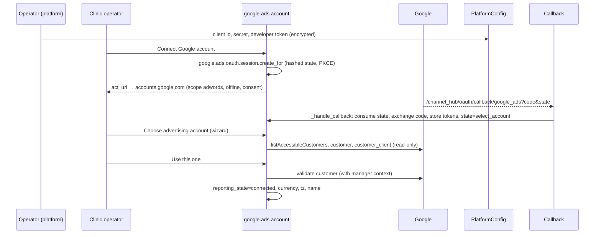

# GA2 — Google Ads: reporting sign-in, encrypted credentials, read-only client, account discovery

**Read with:** `docs/strategy/HANDOVER-CONVENTIONS.md` (binding — §2 deploy/test, §4
sanctioned edits + vi.po, §5 ledger esp. §5.1, §5.4, §5.9 flush-before-raw-SQL, §5.32 no
HttpCase in the channels module, §5.55, §5.63 REPEATABLE READ + fresh cursors, §5.74
advisory lock not row lock, §5.76 never `autospec` a second patch, §5.95, §5.181/§5.182
fresh-cursor commit + "stored credentials do not prove a completed callback", H32),
`docs/strategy/google-ads-channel-design.md` §7.1, §9, §12 (GA-T09, T12–T14, T18, T19)
and `docs/strategy/handovers/google-ads-phaseGA1.md` + its report
`docs/strategy/reports/google-ads-phaseGA1-report.md` (the module you are extending — read
the report's deviations first; they are now the truth).
`docs/strategy/handovers/channel-center-architecture.md` §5.3/§7 (OAuth posture) for the
reasoning behind the kernel you clone.

**Modules:**

| Module | Role | Ships to | Version |
|---|---|---|---|
| `health_google_ads` (EDIT) | platform config, OAuth session, client, discovery, reconnect/disconnect | every database (`-m` on all three) | 19.0.1.0.0 → **19.0.2.0.0** |
| `health_care_command_channels` (EDIT) | NONE in code — the callback route is reused through ORM inheritance of `_handle_callback` (§4.4). Version unchanged. | — | — |

**White-label rule** as GA1. **Plain words** in every user-visible string.

---

## 1. Why this phase exists (plain words first)

After GA1 the Google Ads card shows "Campaign reporting: Not connected" and nothing can
change that. GA2 lets a clinic operator press **Connect Google account**, sign in with the
Google account that manages their advertising, choose the advertising account (including
one that sits under a manager account), and have this system verify it can read that
account. Nothing is read yet beyond the account's own name, currency and time zone —
campaigns and spend arrive in GA3. Nothing is ever written to Google Ads.

Two credential planes, like the messaging channels:

- **Platform** (operator only, one per database): the Google Cloud OAuth client id + secret
  and the Google Ads **developer token**. Encrypted at rest with the same recipe the channel
  secrets use; never readable by a clinic user.
- **Account** (per clinic advertising account): the refresh/access tokens Google issued to
  that clinic's sign-in. Encrypted, never in the card payload, never in chatter.

Scope in one line: **a clinic can prove "this system may read my advertising account", and
can undo it, without an operator pasting anything twice.**

## 2. Binding non-goals

- **No campaign or metrics fetch, no `google.ads.campaign.day`, no sync cron** — GA3. GA2
  ends at `reporting_state = 'connected'` with `provider_name`, `currency_id`,
  `account_timezone` filled and `last_sync_success_at` empty. The client module ships
  `list_campaigns`/`fetch_campaign_days` **signatures only** raising `NotImplementedError`
  (GA3 fills them) so the read-only surface is declared once.
- **No mutate service, no arbitrary GAQL.** The client exposes named methods over
  module-constant queries; no method accepts a query string.
- **No conversion upload, no ad changes, no budget reads beyond the fixed metrics later.**
- **No Google Ads platform-relay through the hub** (`biz_platform_channel_relay` bounces
  `meta` only). Each database's redirect address is its own `web.base.url` +
  `/channel_hub/oauth/callback/google_ads`, and the operator registers each one in the
  Google Cloud console (Google accepts many exact addresses). The platform config form
  shows the exact address for the database it is opened in.
- **No revoke call to Google on disconnect** (design §7.1: a shared Google grant may also
  back the clinic's mailbox; we drop OUR copy of the tokens only).
- **No reuse of Odoo's Gmail OAuth client rows** (`google_gmail_client_id` parameters). An
  operator MAY paste the same client id/secret if that Google Cloud project has the Ads API
  enabled; storage and lifecycle stay separate.
- **No new `care.channel.connection`, no `channel.platform.app` row** (its `PROVIDERS`
  Selection is not extended; `google` there means Gmail).
- **No edit** to `health_care_command_channels` code (only its `_handle_callback` is
  overridden from our module), `health_web_leads`, `biz_*`, nginx, the wrapper.
- **No live Google credentials are invented or seeded.** If the owner has not supplied a
  developer token / OAuth client, the phase ships software-complete and honestly dark
  (card: "Not connected"; platform form: checklist rows "todo"). The report says exactly
  which inputs are missing. Never seed a placeholder credential (the Z9 lesson).

## 3. Verified plumbing — DO NOT RE-DERIVE

### 3.1 Live facts (2026-09-15)

- `web.base.url`: master `https://carejiox.com` (`web.base.url.freeze=True`), `hhh`
  `https://hhh.carejiox.com` (`biz_tenancy.slug=hhh`). Redirect addresses therefore:
  `https://carejiox.com/channel_hub/oauth/callback/google_ads` and
  `https://hhh.carejiox.com/channel_hub/oauth/callback/google_ads`.
- Server python: `requests` 2.25.1 (already imported by `adapters.py:37`); `cryptography`
  present (channel_crypto uses it). **Install nothing.**
- `ir.cron._trigger()` exists on the server (`/odoo/odoo-server/odoo/addons/base/models/
  ir_cron.py:666`) — GA3 will use it; GA2 does not need it.
- Google Ads API: **pin `API_VERSION = 'v25'`** (released 2026-07-22; `v25.1` released
  2026-08-19 uses the same REST path family — pin the major). Before coding, open
  `https://developers.google.com/google-ads/api/docs/sunset-dates` and record v25's sunset
  date in the client module docstring and in your report; if v25 is already marked
  deprecated there, pin the newest non-deprecated major and say so.
- REST shapes (checked 2026-09-15 at `developers.google.com/google-ads/api/rest/auth`):
  host `https://googleads.googleapis.com`; headers `Authorization: Bearer <access>`,
  `developer-token: <token>`, `login-customer-id: <10 digits>` (only when acting through a
  manager); `GET /v25/customers:listAccessibleCustomers` → `{"resourceNames":
  ["customers/1234567890", …]}`; `POST /v25/customers/{cid}/googleAds:search` with JSON
  `{"query": "...", "pageToken": "..."}` → `{"results": [...], "nextPageToken": "...",
  "fieldMask": "..."}` (page size is fixed server-side; loop on `nextPageToken`). Error
  bodies: `{"error": {"code": 401|403|429|500|503, "status": "...", "details": [{"errors":
  [{"errorCode": {"authenticationError": "NOT_ADS_USER" | "OAUTH_TOKEN_INVALID" | ...,
  "authorizationError": "USER_PERMISSION_DENIED" | "DEVELOPER_TOKEN_NOT_APPROVED" |
  "CUSTOMER_NOT_ENABLED" ...}, "message": "..."}]}]}}`; the `request-id` response header
  identifies a call. OAuth: authorization `https://accounts.google.com/o/oauth2/v2/auth`,
  token `https://oauth2.googleapis.com/token` (form-encoded POST), scope
  `https://www.googleapis.com/auth/adwords`; a refresh token is only returned when
  `access_type=offline` AND (`prompt=consent` or first consent) — always send both.

### 3.2 Kernels to clone from `health_care_command_channels`

- **OAuth session**: `models/care_channel_oauth_session.py` — hashed single-use state
  (`create_for` `:152-193`, `_mint_state` `:139-149`, `_consume` `:196-236` with the atomic
  `UPDATE … WHERE used_at IS NULL AND expires_at > now() RETURNING id` and the flush/
  invalidate pair per §5.9), PKCE `_s256` `:68-71`, `_allowed_redirect` `:105-133`, purge
  cron `_cron_purge_oauth_sessions` `:319-326`, unique index in `init()` `:93-99`. Its
  `_handle_callback(provider, params)` `:247-313` is what the public controller calls.
- **Callback controller**: `controllers/oauth.py:46-71` — route
  `/channel_hub/oauth/callback/<string:provider>`, rate-limited, calls
  `request.env['care.channel.oauth.session'].sudo()._handle_callback(provider, params)`,
  renders `oauth_success` / `oauth_denied` / `oauth_duplicate` / `oauth_generic`
  (`views/oauth_templates.xml:60-190`; the pages are hard-coded bilingual and do not use
  `channel` except to pass it to the bridge script — inspect `oauth_bridge` `:35-58` to
  see what the opener receives via `postMessage`, and reuse it: the account form does not
  need it, but a popup opener may).
- **Relay hub** `biz_platform_channel_relay/controllers/oauth_relay.py:61-95` overrides the
  same route and bounces only when `provider == 'meta'`; every other provider string falls
  through to `super().oauth_callback` → our override is reached on every database.
- **Secrets**: `services/channel_crypto.py` `encrypt(env, text)` / `decrypt(env, token)`
  (raises `ValueError` on a corrupt token; per-database key when `HEALTH_PHI_KEY` is unset —
  it IS unset, §5.172: a token encrypted on the master cannot be decrypted on `hhh`; GA2
  never copies tokens across databases). `services/redact.py` `redact(text, max_len=300)`.
- **Platform secret wizard**: `models/channel_platform_app.py:522-566` `action_set_secret`
  (group_system gate → encrypt → hint `'••••' + last4 only when len ≥ 8` → audit) and
  `:568-590` `ChannelPlatformAppSecretWizard` (TransientModel, `app_id` + `secret` Char
  `password="True"` in `views/platform_app_views.xml:6-36`). Clone both, twice (client
  secret, developer token).
- **Advisory lock, not row lock**: `models/care_channel_connection.py:860-890`
  `_with_refresh_lock` (`pg_try_advisory_xact_lock(REFRESH_LOCK_CLASS, id)`, returns
  `'locked'`), `:892-930` `_committed_secret` (fresh-cursor read of the committed value —
  **needed only for single-use refresh tokens; Google refresh tokens are reusable, so GA2
  does NOT clone the fresh-cursor persist and writes the rotated access token on the SAME
  cursor**), `REFRESH_LOCK_CLASS` `:157`.
- **HTTP plumbing**: `services/adapters.py:546-600` `_get/_post/_form_post` — `timeout=
  HTTP_TIMEOUT`, `requests.RequestException` → typed error, `resp.text[:300]` into the
  error (caller redacts). Clone the shape into the new client as module-level functions
  (`_http_get`, `_http_post_json`, `_http_post_form`) so tests can patch them with a plain
  function (§5.76).
- **Card**: `_center_card_payload()` in `health_google_ads/models/google_ads_account.py`
  (GA1) — the `reporting` capability row and the "Reporting updated" line read
  `reporting_state` / `last_sync_success_at`; GA2 changes only the status→label map.
- **Internal-write-only fields**: GA1's `INTERNAL_CTX` on `google.ads.account.write()` —
  every token/state write in GA2 goes through `self.with_context(**{INTERNAL_CTX: True})`
  on a sudo'd recordset (`_internal()` helper — add it if GA1 did not: `return
  self.sudo().with_context(**{INTERNAL_CTX: True})`).

### 3.3 Groups/xmlids that exist

`base.group_system`, GA1's operator gate `_check_operator()` (CENTER_GROUPS + owner/admin),
`health_cms_sidebar.section_admin`, `health_care_command.menu_care_command_config`
(backend parent of the channels' operator menus, `views/menus.xml`), `gateway.rate.counter`
(used by the callback controller already).

## 4. Architecture



### 4.1 `google.ads.platform.config` (`models/google_ads_platform_config.py`)

| Field | Definition |
|---|---|
| `name` | Char default "Google Ads application" |
| `active` | Boolean default True; partial unique index `WHERE active` (one active config per database) — check in `create/write` with an actionable `UserError` like `channel_platform_app._check_provider_unique` (`:193-202`) |
| `client_id` | Char |
| `client_secret_enc` | Text, `groups='base.group_system'` |
| `client_secret_hint`, `has_client_secret` | Char / Boolean compute |
| `developer_token_enc` | Text, `groups='base.group_system'` |
| `developer_token_hint`, `has_developer_token` | Char / Boolean compute |
| `access_level` | Selection `[('unknown','Not stated'),('test','Test accounts only'),('basic','Basic access'),('standard','Standard access')]` default unknown — informational (Google's API Center decides); help: "With test-account access, only Google Ads test accounts can be read." |
| `redirect_uri` | Char compute: `web.base.url` (sudo param) + `/channel_hub/oauth/callback/google_ads`, `CopyClipboardChar` |
| `environment_note` | Char |
| `checklist` | Html compute: rows client id / client secret / developer token / redirect address registered (this last one is a `wait` row we cannot verify — say so: "Confirmed on the first successful sign-in") |

Methods: `action_set_client_secret(secret)`, `action_set_developer_token(token)` (both:
`base.group_system` gate → strip → encrypt → hint → `message_post` a status-only line; the
model inherits `mail.thread` for that), `_get_client_secret()`, `_get_developer_token()`
(leading underscore, decrypt, raise `UserError` "The Google Ads application is not
configured" when missing), `_ready()` → bool, `@api.model _active()` → the active row or
empty. Two TransientModel wizards `google.ads.platform.secret.wizard` (`config_id`, `kind`
Selection client_secret|developer_token, `secret` Char password) cloned from
`ChannelPlatformAppSecretWizard`.

ACL: `base.group_system` only, all four perms; wizards `base.group_system`. Views: list +
form (statusbar-free; two "Set …" buttons opening the wizard with `context={'default_kind':
…}`; the checklist; the redirect address with a paragraph "Register this exact address in
the Google Cloud console under the OAuth client's authorised redirect URIs. Do it once for
each system address you run."). Backend menu `menu_google_ads_platform_config` under
`health_care_command.menu_care_command_config`, `groups="base.group_system"`, sequence 55.
CMS sidebar leaf under `health_cms_sidebar.section_admin`, sequence 94, name "Google Ads
application", icon `fa fa-google`, `match_action_xmlids` + `match_models`, no `role_ids`
(the ACL is what hides it; confirm in the browser that a non-system user does NOT see the
leaf — if the sidebar shows leaves regardless of ACL, add the leaf's `role_ids` per
`docs/strategy/…cms sidebar coverage` memory: role gating lives in the DB — report what you
observed instead of guessing).

### 4.2 `google.ads.oauth.session` (`models/google_ads_oauth_session.py`)

Clone `care.channel.oauth.session` with: `account_id` (Many2one google.ads.account,
required, ondelete cascade) replacing `connection_id`; `company_id`, `user_id`,
`state_hash` (unique index in `init()`), `pkce_verifier_enc` (groups system),
`redirect_target`, `expires_at` (10 min), `used_at`, `outcome` Selection
`pending|ok|denied|expired|error`, `detail_redacted`. `SESSION_TTL_MINUTES = 10`,
`PURGE_AFTER_HOURS = 24`, daily purge cron `ir_cron_google_ads_purge_oauth_sessions`
(`noupdate="1"`, active; it is harmless — the template ritual disables it anyway).

`create_for(account)` → `{'session_id','state','code_verifier'…}` — return the raw state
ONCE; `_mint_state` = `secrets.token_urlsafe(32)`; `_consume(state)` = the atomic
UPDATE…RETURNING kernel **verbatim** (table name changed); `_get_pkce_verifier()`.

`_handle_callback(params)` `@api.model` (the logic; the HTTP shell is the existing
controller):

1. `session = self._consume(params.get('state'))`; none → `{'outcome':'generic','ok':False,
   'channel':'google_ads'}`.
2. `error`/`error_description` in params → session `denied`, account
   `reporting_state='not_connected'` (unless it was `connected` — a cancelled RE-connect
   must not disconnect a working account), return `denied`.
3. Exchange: `POST TOKEN_URL` form `{grant_type:'authorization_code', code, client_id,
   client_secret, redirect_uri (the SAME computed address), code_verifier}` in a savepoint;
   any failure → session `error` with `redact(exc)`, account `reporting_state` back to
   `not_connected` (or unchanged if it was `connected`), `last_error_code='oauth_exchange'`,
   return `error`.
4. Success: require `access_token`, `expires_in`; `refresh_token` may be absent on a
   re-consent — **keep the existing refresh token when the response omits one**; if there is
   neither a new nor an existing refresh token → treat as error `no_refresh_token` with the
   user-facing hint "Google did not return a long-lived permission. Remove this system from
   the Google account's third-party access list and sign in again." Verify the granted
   `scope` contains `adwords`; otherwise error `scope_missing`. Store via `_internal()`:
   `access_token_enc`, `refresh_token_enc` (if new), `token_expires_at = now + expires_in -
   60s`, `authorized_by = session.user_id`, `authorized_at = now`, `reporting_state =
   'select_account'` if the account has no `customer_id` yet, else `'connected'` only
   after `_validate_reporting_access()` (§4.5) passes — if validation fails, `action_required`
   with its code. Return `{'outcome':'ok','ok':True,'channel':'google_ads'}`.
5. Never render or log `code`, `state`, tokens. Audit trail = `message_post` on the account
   (status only: "Google sign-in completed by <user>").

### 4.3 Account additions (`google.ads.account`)

Fields (all readonly in views; tokens `groups='base.group_system'`): `access_token_enc`
Text, `refresh_token_enc` Text, `token_expires_at` Datetime, `token_scope` Char,
`authorized_by` Many2one res.users, `authorized_at` Datetime, `has_reporting_grant` Boolean
compute (`bool(refresh_token_enc)`), `reporting_error_redacted` Char, `login_customer_id`
(GA1 field) now filled by the selection step. All are in the internal-write-only set.

Methods (all `ensure_one`; every public one gates with `_check_operator()` FIRST and checks
`self.company_id in self.env.user.company_ids`):

- `action_start_reporting_oauth()` — requires an active `_ready()` platform config (else
  `UserError` "The Google Ads application has not been set up by the platform operator
  yet."); requires https `web.base.url` (clone `_center_require_https` semantics); creates a
  session; sets `reporting_state='authorizing'` (unless `connected` → keep, it is a
  reconnect); returns `{'type':'ir.actions.act_url','url': <AUTH_URL with client_id,
  redirect_uri, response_type=code, scope, access_type=offline, prompt=consent,
  include_granted_scopes=false, state, code_challenge, code_challenge_method=S256>,
  'target':'self'}`.
- `action_list_reporting_accounts()` — requires `has_reporting_grant`; opens the wizard
  `google.ads.account.select` (§4.6) after populating candidates (§4.5). Errors →
  `UserError` with the plain-words message and `last_error_code` set; `invalid_grant` /
  `OAUTH_TOKEN_INVALID` → `reporting_state='action_required'`.
- `action_select_reporting_account(customer_id, login_customer_id=None)` — `@api.model`-less
  instance method called by the wizard: normalise ids (GA1 helpers), **refuse a manager
  customer as the data row**, refuse a customer id bound to ANOTHER company (GA1 pre-check;
  message never names the other company), validate with `_validate_reporting_access(cid,
  login)`, then `_internal().write({'customer_id', 'login_customer_id', 'provider_name',
  'currency_id' (search res.currency by ISO code, create nothing — unknown code → leave
  empty and note it), 'account_timezone', 'reporting_state':'connected',
  'reporting_error_redacted': False, 'last_error_code': False})`; `message_post` "Advertising
  account <name> (<id>) connected for reporting"; return the reload notification.
- `action_reconnect_reporting()` — alias of `action_start_reporting_oauth` (kept for the
  card/reporting UX wording).
- `action_disconnect_reporting()` — clears `access_token_enc`, `refresh_token_enc`,
  `token_expires_at`, `token_scope`; `reporting_state='not_connected'`; keeps
  `customer_id`, `login_customer_id`, `provider_name`, currency/tz and every cached row;
  `message_post`. Never archives leads or the website connector. No Google call.
- `_reporting_access_token()` — §4.4.
- `_validate_reporting_access(customer_id, login_customer_id)` — §4.5.
- `_google_client()` — returns `GoogleAdsClient(self.env, self)`.

### 4.4 Token refresh under an advisory lock — kernel (use as-is)

```python
REPORTING_LOCK_CLASS = 0x67616473  # "gads" — distinct from the channels' 0x63686E6C
TOKEN_SKEW_SECONDS = 60


def _reporting_access_token(self):
    """A valid access token for this account, refreshing under a lock.

    Advisory xact lock (never FOR UPDATE — ledger §5.74): two workers that
    both find the token expired serialise here; the loser re-reads after
    the winner's write is visible on ITS cursor, which under REPEATABLE
    READ it is not — so the loser may refresh a second time. That is
    harmless: Google refresh tokens are reusable and a second access token
    is just as valid. What the lock prevents is the thundering-herd of N
    parallel refreshes, not correctness.
    """
    self.ensure_one()
    rec = self.sudo()
    now = fields.Datetime.now()
    if rec.access_token_enc and rec.token_expires_at \
            and rec.token_expires_at > now + timedelta(seconds=TOKEN_SKEW_SECONDS):
        return channel_crypto.decrypt(self.env, rec.access_token_enc)
    if not rec.refresh_token_enc:
        raise GoogleAdsError('no_grant', needs_reconnect=True)
    self.env.flush_all()
    self.env.cr.execute("SET LOCAL lock_timeout = '5s'")
    try:
        self.env.cr.execute('SELECT pg_advisory_xact_lock(%s, %s)',
                            (REPORTING_LOCK_CLASS, rec.id))
    except psycopg2.errors.LockNotAvailable as exc:
        raise GoogleAdsError('busy', retryable=True) from exc
    rec.invalidate_recordset(['access_token_enc', 'token_expires_at'])
    if rec.access_token_enc and rec.token_expires_at \
            and rec.token_expires_at > now + timedelta(seconds=TOKEN_SKEW_SECONDS):
        return channel_crypto.decrypt(self.env, rec.access_token_enc)
    config = self.env['google.ads.platform.config']._active()
    body = _http_post_form(TOKEN_URL, data={
        'grant_type': 'refresh_token',
        'refresh_token': channel_crypto.decrypt(self.env, rec.refresh_token_enc),
        'client_id': config.client_id,
        'client_secret': config._get_client_secret(),
    })
    access = body.get('access_token')
    if not access:
        raise GoogleAdsError('refresh_malformed', retryable=True)
    vals = {
        'access_token_enc': channel_crypto.encrypt(self.env, access),
        'token_expires_at': now + timedelta(seconds=int(body.get('expires_in') or 3600)),
    }
    if body.get('refresh_token'):          # Google rarely rotates; keep ours otherwise
        vals['refresh_token_enc'] = channel_crypto.encrypt(self.env, body['refresh_token'])
    rec._internal().write(vals)
    return access
```

`_http_post_form` maps an HTTP 400 whose JSON `error == 'invalid_grant'` to
`GoogleAdsError('invalid_grant', needs_reconnect=True)`; the CALLER of
`_reporting_access_token` (every public action and, in GA3, the sync) catches
`needs_reconnect` and moves the account to `action_required` with
`last_error_code=<code>` and a plain-words `reporting_error_redacted` ("Google no longer
accepts this sign-in. Press Reconnect."), **without touching website capability** (T-14).
Note `SET LOCAL lock_timeout` scopes to the transaction — acceptable for a request/cron
transaction; the `psycopg2.errors.LockNotAvailable` class is `lock_not_available`
(SQLSTATE 55P03) — verify the attribute name on the server's psycopg2 before relying on it
(`python3 -c "import psycopg2.errors as e; print(e.LockNotAvailable)"`); fall back to
catching `psycopg2.OperationalError` and checking `exc.pgcode == '55P03'` if absent.

### 4.5 Discovery and validation (`services/google_ads_client.py`)

```python
API_VERSION = 'v25'
ADS_HOST = 'https://googleads.googleapis.com'
AUTH_URL = 'https://accounts.google.com/o/oauth2/v2/auth'
TOKEN_URL = 'https://oauth2.googleapis.com/token'
SCOPE = 'https://www.googleapis.com/auth/adwords'
HTTP_TIMEOUT = 20
MAX_PAGES = 200

Q_CUSTOMER = ('SELECT customer.id, customer.descriptive_name, customer.currency_code, '
              'customer.time_zone, customer.manager, customer.test_account, '
              'customer.status FROM customer LIMIT 1')
Q_CHILDREN = ('SELECT customer_client.id, customer_client.descriptive_name, '
              'customer_client.manager, customer_client.level, '
              'customer_client.currency_code, customer_client.time_zone, '
              'customer_client.status, customer_client.hidden '
              'FROM customer_client WHERE customer_client.level <= 5')
```

`class GoogleAdsError(Exception)`: attrs `code` (short, safe), `http_status`,
`request_id`, `retryable` (429/500/503/network), `needs_reconnect` (401, `invalid_grant`,
`OAUTH_TOKEN_INVALID`, `NOT_ADS_USER`), `detail_redacted` (`redact(text)`).

`class GoogleAdsClient` (constructor `(env, account)`; reads the active platform config
via sudo; **never** stores the developer token on the instance beyond the call):

- `_headers(login_customer_id=None)` → Authorization (from `account._reporting_access_token()`),
  `developer-token`, optional `login-customer-id`; `Content-Type: application/json`.
- `_search(customer_id, query, login_customer_id=None)` → list of result dicts across ALL
  pages (`pageToken` loop, `MAX_PAGES` cap → `GoogleAdsError('too_many_pages')`); on HTTP
  401 refresh once via `account._internal().write({'token_expires_at': False})` then retry
  once; map error codes as above. `customer_id` and `login_customer_id` are validated with
  GA1's `norm_customer_id` before any URL is built (a non-10-digit id raises
  `GoogleAdsError('bad_customer_id')`).
- `list_accessible_customers()` → `['1234567890', …]` (strip the `customers/` prefix,
  keep strings).
- `get_customer(customer_id, login_customer_id=None)` → `{'id','name','currency',
  'time_zone','manager': bool,'test_account': bool,'status'}` (from `Q_CUSTOMER` on
  `/customers/{customer_id}`).
- `list_customer_children(manager_id)` → list of the same dicts + `'level'`, from
  `Q_CHILDREN` against `/customers/{manager_id}` with `login-customer-id = manager_id`,
  **excluding** rows where `manager` is True or `hidden` is True; keep `status` so the UI
  can grey out non-`ENABLED` ones.
- `list_campaigns(...)`, `fetch_campaign_days(...)` → `raise NotImplementedError` (GA3).

Discovery (`account._discover_reporting_candidates()`): for each accessible id →
`get_customer(id)`; if `manager` → also `list_customer_children(id)` and tag each child
with `login_customer_id = id`; direct non-manager customers get `login_customer_id =
False`. De-duplicate by customer id (prefer the direct entry). Return a list of dicts; on a
`GoogleAdsError` with `needs_reconnect` → `action_required`; other errors → `UserError`
with `detail_redacted` and `last_error_code` written, state unchanged.

`_validate_reporting_access(customer_id, login_customer_id)`: `get_customer(customer_id,
login_customer_id)` must return `manager == False`, `status == 'ENABLED'`, and `id ==
customer_id`; returns the dict. Anything else → `GoogleAdsError('not_an_advertiser' |
'customer_not_enabled' | 'customer_mismatch')`.

### 4.6 Selection wizard (`google.ads.account.select`, TransientModel)

`account_id`, `line_ids` One2many `google.ads.account.select.line` (`customer_id` Char,
`login_customer_id` Char, `name`, `currency`, `time_zone`, `status`, `is_manager` Boolean
(always False after filtering, kept for honesty), `selected` Boolean). Buttons: "Refresh
list" (re-discover), "Use this one" (exactly one selected → `account.action_select_
reporting_account(line.customer_id, line.login_customer_id)`). The wizard shows the sentence
"Google's permission covers your whole Google Ads access. This system only reads account
names, campaigns, spend, clicks and conversions. It never changes anything in Google Ads."
Zero lines → "No advertising account is visible to the Google account you signed in with.
Sign in with the account that manages the ads, or ask the ads manager to grant access."

### 4.7 Card + form wording (GA1 surfaces, updated)

Reporting capability label map: `not_connected` → "Not connected" (off); `authorizing` →
"Sign-in started" (info); `select_account` → "Choose the advertising account" (info);
`connected` → "Connected" (ok); `action_required` → "Action required — reconnect" (warn);
`paused`/`syncing` → GA3. Account form page 3 "Campaign reporting": statusbar; buttons per
state — `Connect Google account` (not_connected/authorizing), `Choose advertising account`
(select_account, or connected with a grant → "Change advertising account"), `Reconnect`
(action_required, connected), `Disconnect reporting` (connected/action_required/
select_account); readonly `provider_name`, `customer_id`, `login_customer_id`,
`currency_id`, `account_timezone`, `authorized_at`, `authorized_by`, `last_error_code`,
`reporting_error_redacted`; a paragraph: "Connecting lets this system READ your
advertising account: campaign names, spend, clicks and Google-reported conversions. It
never creates, edits or publishes ads, and never changes budgets." Website leads stay
usable whatever this page says.

## 5. Sanctioned edits (exhaustive)

`health_google_ads` (→ 19.0.2.0.0): new files `models/google_ads_platform_config.py`,
`models/google_ads_oauth_session.py`, `models/care_channel_oauth_session.py` (the
`_inherit = 'care.channel.oauth.session'` override of `_handle_callback` that dispatches
`provider == 'google_ads'` and otherwise `return super()`), `models/google_ads_select_wizard.py`,
`services/google_ads_client.py`, `views/google_ads_platform_config_views.xml`,
`views/google_ads_select_wizard_views.xml`, `data/ir_cron.xml`,
`data/cms_sidebar_items_google_ads.xml` (+1 leaf), `security/ir.model.access.csv` (+ rows),
`tests/test_platform_config.py`, `tests/test_oauth.py`, `tests/test_discovery.py`,
`tests/test_client.py`; edits to `models/google_ads_account.py`,
`views/google_ads_account_views.xml`, `models/channel_center.py` (label map only),
`__manifest__.py`, `i18n/vi.po`, `tests/common.py`.

**No other module is edited.** If GA1's report says the callback template or the channels
controller needed a seam, STOP and record it as a blocker rather than editing
`health_care_command_channels`; the ORM override is expected to be sufficient.

## 6. Safety rails

- R1 Tokens/secrets: `groups='base.group_system'` on every `*_enc` field; `read()` by an
  operator (non-system) never returns them; `center_overview()` JSON never contains
  `chs$1$`, `access_token`, `refresh_token`, the developer token or the client secret
  (T-01/T-02 dump assertions with the fixture values).
- R2 The callback is public: it trusts NOTHING but a consumed state hash. Unknown, used,
  expired and wrong-provider states all render the generic page (no oracle). `code` is
  used once, inside the exchange, and is never persisted.
- R3 Every provider text through `redact()` before storage or display; never store bodies.
- R4 Ids are strings (`norm_customer_id`); the client refuses to build a URL from anything
  else.
- R5 A manager customer is never the data row; a customer bound elsewhere is refused with a
  message that does not reveal the holder.
- R6 `needs_reconnect` → `action_required` and nothing else changes: `website_status`
  before/after identical (T-14).
- R7 Disconnect clears OUR tokens only; no revoke; leads/connector/cache untouched.
- R8 Fixed hosts only (`ADS_HOST`, `TOKEN_URL`, `AUTH_URL` constants); TLS verify default;
  `timeout=HTTP_TIMEOUT` on every call; no user-authored query strings.
- R9 No blocking sleep anywhere in GA2 (retries are GA3's cron concern).
- R10 Template: no config row, no tokens, cron count stays 0 after the ritual.

## 7. Tests (TransactionCase, `post_install`; patch `_http_get`/`_http_post_json`/
`_http_post_form` with plain functions via `patch.object`, never `autospec`)

| ID | Design ref | Scenario → result |
|---|---|---|
| GA2-T01 | T19 | Platform config: system user sets client secret + developer token → hints `••••xxxx`, `has_*` True; operator (crm manager) `read()` of the config → `AccessError` (ACL); a system user's `read()` returns no `*_enc` plaintext (they are ciphertext `chs$1$…`); the two `action_set_*` refuse a non-system caller; second active config → `UserError`. |
| GA2-T02 | T19 | `center_overview()` and `account.read()` as the operator: JSON dump contains none of the fixture secret/token strings nor `chs$1$`. |
| GA2-T03 | T12 | `action_start_reporting_oauth()` with no config → `UserError`, state unchanged; with config → `act_url` whose query has `access_type=offline`, `prompt=consent`, `code_challenge_method=S256`, the exact `redirect_uri`, scope adwords, a `state` whose sha256 matches the stored `state_hash`; state stored hashed only; account `authorizing`. |
| GA2-T04 | T12 | `_handle_callback('google_ads', {...})` through `care.channel.oauth.session` (the dispatcher): unknown state → generic; the same state twice → second generic (used); expired (write `expires_at` in the past) → generic + outcome `expired`; `provider='meta'` with our state → generic and our session untouched. |
| GA2-T05 | T12 | Denied (`error=access_denied`) → outcome denied, account back to `not_connected`; denied during a RECONNECT of a `connected` account → account stays `connected`. |
| GA2-T06 | T12 | Exchange success with refresh token → tokens stored encrypted (`chs$1$` prefix), `token_expires_at ≈ now + expires_in − 60`, `authorized_by` = session user, state `select_account`; the exchange POST carried `code_verifier` and the same `redirect_uri`; response body absent from any stored field. Exchange HTTP 400 → outcome error, `last_error_code='oauth_exchange'`, state `not_connected`, nothing stored. Success WITHOUT refresh token and none stored → `no_refresh_token`. Scope missing `adwords` → `scope_missing`. |
| GA2-T07 | T13 | Discovery: accessible = [M (manager), D (direct)]; children of M = [C1 ENABLED, C2 manager, C3 hidden, C4 CANCELED]; result lines = D (login False), C1 (login M), C4 (login M, status CANCELED, shown greyed); C2/C3 absent; `login-customer-id` header equals M on the children call and is absent on the direct calls. |
| GA2-T08 | T13 | `action_select_reporting_account(M)` → refused "manager"; `(C1, M)` → validated with login M, account `connected`, `provider_name`, `currency_id` (VND fixture → the VND record), `account_timezone`; `(C1, None)` where Google answers 403 USER_PERMISSION_DENIED → `UserError`, state unchanged, `last_error_code` set. |
| GA2-T09 | T09 | C1 already bound to company2's account → selecting it in company 1 → `UserError`, message does not contain company2's name; company2's row untouched. |
| GA2-T10 | T14 | Refresh: token expired → exactly one token POST; new access stored; refresh token preserved when the response omits one; replaced when present; `expires_in` honoured. Token still valid → zero HTTP calls. |
| GA2-T11 | T14 | `invalid_grant` on refresh → `GoogleAdsError(needs_reconnect)`; the calling action moves the account to `action_required`, sets `last_error_code='invalid_grant'`, keeps `customer_id`, and `website_status` is unchanged (create a Google-attributed touchpoint first so it reads `receiving`, assert it still does). |
| GA2-T12 | T14 | Lock contention (REAL): a second cursor (`self.registry.cursor()`) takes `pg_try_advisory_xact_lock(REPORTING_LOCK_CLASS, account.id)`; the test cursor's `_reporting_access_token()` with an expired token raises `GoogleAdsError('busy')` within ~5 s (lock_timeout); after the second cursor rolls back, the call succeeds and refreshes once. (`§5.63` does not bite: the key is an integer.) |
| GA2-T13 | §4.5 | Pagination: `_search` follows `nextPageToken` across 3 fake pages and returns 3×N rows; a never-ending token stops at `MAX_PAGES` with `too_many_pages`. HTTP 429 / 503 / network → `retryable=True`; 401 → one forced refresh + retry, then `needs_reconnect`; the error's `detail_redacted` has no `Bearer …`/token text (feed a body echoing the token). |
| GA2-T14 | T18 | `action_disconnect_reporting()` → all four token fields empty, state `not_connected`, `customer_id`/`provider_name` kept, the touchpoints and the website connector untouched, no HTTP call; reconnect afterwards → `authorizing`, and a fresh callback restores `connected` directly when `customer_id` is set and validation passes. |
| GA2-T15 | T19 | Every public action as a plain `group_health_crm_user` → `AccessError`; an operator of company2 acting on company 1's account → `AccessError`. |
| GA2-T16 | §4.2 | Purge cron deletes sessions older than 24 h and keeps younger ones. `redirect_uri` compute equals `web.base.url + '/channel_hub/oauth/callback/google_ads'`. |
| GA2-T17 | white-label | `fields_get` of the three new models: no "Odoo" in any label/help/selection. |

Existing suites (`/health_google_ads` GA1 tests, `/health_web_leads`,
`/health_care_command_channels`, `/health_care_command`) stay green.

## 8. Deploy + verify

```bash
cd addons && ssh VietUcUAT 'rm -rf /tmp/health_google_ads' && scp -qr health_google_ads VietUcUAT:/tmp/
ssh VietUcUAT 'carejiox-deploy -d -m health_google_ads'
ssh VietUcUAT 'carejiox-deploy -D carejiox_template -m health_google_ads'
ssh VietUcUAT 'carejiox-deploy -D hhh -m health_google_ads'
ssh VietUcUAT 'sudo -u postgres psql -d carejiox_template -Atc "select count(*) from ir_cron where active"'   # 0
ssh VietUcUAT 'sudo grep -a "some depends are not loaded\|Some modules are not loaded" /var/log/odoo/odoo-server.log | tail -3'
ssh VietUcUAT 'carejiox-deploy -m health_google_ads -t /health_google_ads,/health_web_leads,/health_care_command_channels'
```

Then the result lines + executed-method counts (§5.83), `/web/login` 200 for both hosts,
and: `sudo -u postgres psql -d carejiox_template -Atc "select count(*) from google_ads_platform_config; select count(*) from google_ads_account"` → 0 and 0.

Browser evidence (`docs/strategy/reports/google-ads-phaseGA2-evidence/`, https://carejiox.com):
(a) as admin: ADMIN → Google Ads application → form, checklist rows, redirect address chip,
Set client secret wizard with a THROWAWAY value (`qa-secret-xxxx`), Set developer token
likewise → hints shown → **archive the row afterwards and confirm 0 active rows on a fresh
cursor**; (b) as the operator persona: CRM → Google Ads → account → Campaign reporting →
"Connect Google account" **with the QA config present** → the browser must land on
`accounts.google.com` with our redirect address in the URL (screenshot the URL bar; the
Google client id is fake so Google shows "invalid_client" — that screen IS the evidence
that the address and parameters are right; do not proceed further); then open
`https://carejiox.com/channel_hub/oauth/callback/google_ads?state=bogus` → the generic
page; (c) Disconnect reporting on the QA account → state back to Not connected; (d) delete
QA rows, fresh-cursor zero counts. Console logs per screen. If the owner has supplied REAL
Google credentials in the session, run the full live sign-in and account selection instead
and record the real capability state — otherwise say plainly that live sign-in is
unverified for lack of credentials.

## 9. Report-back

1. Commits; versions on the three databases; template cron/config/account counts.
2. Deviations with reasoning; whether `_handle_callback` dispatch worked without editing
   the channels module; the exact psycopg2 exception class used for lock timeouts.
3. Verbatim test lines + executed-method counts.
4. Pinned API version + its sunset date and source URL; the redirect addresses that an
   operator must register (one per database).
5. Capability table (website / reporting / native) as it reads live, and what is
   unverified (real sign-in) and why.
6. Ledger candidates.
7. Owner inputs still needed, in plain words: a Google Cloud OAuth client (web
   application) with the two redirect addresses; a Google Ads developer token and its
   access level; which Google login manages the clinic's ads; the advertising customer id(s).
