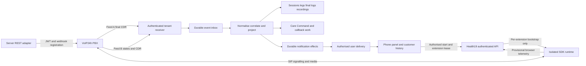

# Health19 VoIP24h Integration Design and Implementation Handover

Date: 17 September 2026

Repository: `/Users/adity/Documents/GitHub/health19`

Branch and inspected baseline: `19.0`, `3d1760c3ecfb8e7269325d72f546f6901f5c920e`

Status: Design complete for implementation planning; provider validation gates are specified below. No application code, configuration, database or provider settings were changed in preparing this handover. No live calls were placed.

## 1 Purpose and architectural decision

Extend the existing Health19 integration to provide call notifications, durable call history, recordings, missed-call follow-up and actual browser calling inside the CRM and Care Command workflow. Use the supplied VoIP24h WebRTC SDK for browser audio and call controls. Use separately authenticated provider webhooks for server-side call events and final call records. Keep the existing Channel Center as the setup and operational control surface.

This is an implementation specification for the next development session. It distinguishes vendor-documented contracts, observations from existing code, proposed application interfaces, and remaining provider questions. A documented feature is not yet a tested deployment capability. In particular, receipt of a completed call log does not prove that a browser can receive or answer a call.

The design has three independently enabled operating modes:

| Mode | What the user receives | Dependencies |
|---|---|---|
| Call history | Completed inbound, outbound and internal call logs, recording availability, analytics and callback tasks | Authenticated final-record webhook; recording access validated separately |
| Live awareness | Ringing, answered and ended notifications; extension and team call visibility | Timely state webhook, or SDK events for the registered browser only |
| Browser phone | Dial, answer, reject, hang up, mute, hold, transfer and keypad tones | SDK, SIP extension credentials, browser permissions and working media connectivity |

Browser calling and call history must both be delivered as project outcomes. They can be rolled out independently while the corresponding provider questions are resolved. Historical API polling, server-originated click-to-dial to a desk phone, native mobile background calling, conference calls, attended transfer, supervisor listening and AI transcription are not established by these three documents. They are extension options, not baseline promises.

### 1.1 Read first in the implementation session

Read the current `docs/strategy/HANDOVER-CONVENTIONS.md` in full before coding, then this document and the three vendor files. Recheck the current branch and working tree before editing. The baseline above is a source snapshot, not an instruction to reset the repository.

This handover supersedes the unverified endpoint and event assumptions in `design/health-voip24h-implementation.md` and partially resolves `docs/strategy/voip24h-contract-capture.md`. It does not establish that the old implementation works. Preserve the older documents as historical context and add a supersession link during implementation.

Repository conventions identify Odoo 19 Community, OWL 2, PostgreSQL and a shared addons installation with separate tenant databases. They now identify the platform as `carejiox`, with `carejiox_template` and tenant databases. Old references to `vietuat` or `care.biztinct.com` must not be copied into new deployment commands. Discover the actual current targets at deployment time. The user's requirement to remove generated test PNGs and screenshots overrides older evidence-pack instructions to retain them; preserve text evidence instead.

## 2 Evidence and source register

The three supplied files are actually in `docs/voip24hdocs`, not a top-level `voip24hdocs` directory. All three were read, including their tables and hyperlinks.

| Reference | Source | Relevant content |
|---|---|---|
| V1 | [Authorization.docx](../../voip24hdocs/Authorization.docx) | Version 3 authentication, JWT response and token lifetime |
| V2 | [Webhook.docx](../../voip24hdocs/Webhook.docx) | Registration/deletion, final call-log GET payload, separate state-event GET payload |
| V3 | [Overview WebRTC.docx](../../voip24hdocs/Overview%20WebRTC.docx) | SDK libraries, SIP registration, browser call actions and callback names |
| R1 | `addons/health_voip24h/` | Existing call models, controllers, client, widgets, cron and security |
| R2 | `addons/health_care_command_voip/models/hooks.py` | Call log to Care Command conversation bridge |
| R3 | `addons/health_care_command_channels/` | Connection lifecycle, encrypted secrets, readiness, audit and setup UI |
| R4 | `addons/health_care_command/models/care_conversation.py` | Conversation signalling, missed-call state and call timeline |

Source fingerprints, SHA-256:

```text
Authorization.docx
643ef8fd43576686d7292af962705b8f99bb4d3ffe4a8b04ec66586bed13ed9f
Overview WebRTC.docx
c4274c615498e682e98e32ed0996dbe17a1f9f7e423cc8fbde91be6357ae0d8e
Webhook.docx
d47d9cf8dffc778992766e94500d80376a151763c1b98c3c0b8a5f7d613cea1d
```

### 2.1 Pancake reference and how it informs this design

Pancake's official [Calls documentation](https://docs.pancake.biz/pancake/st-f7/st-p10?lang=vi) describes making and receiving calls within its interface and centralising contact history. Its official [Call Center statistics](https://docs.pancake.biz/pancake/st-f6/st-p7?lang=vi) describes call counts, duration, processing status and staff performance. Its [calling guide](https://docs.pancake.biz/pancake/st-f10/st-p1?lang=vi) was reachable but yielded little implementation detail. Reviewed on 17 September 2026.

Adopt the product pattern of a persistent phone panel beside customer history, a callback work queue, and management reporting. These are design choices for Health19. The reviewed pages do not verify a particular Pancake-to-VoIP24h technical integration or expose its contracts. Do not copy a supposed Pancake API, or treat Messenger/WhatsApp calling as part of VoIP24h telephony.

The vendor developer links embedded in V2 are `https://developer.voip24h.vn/webhook-call-log/setup` and `https://developer.voip24h.vn/webhook-call-log/register`. They could not be retrieved in this review. The supplied documents therefore remain the primary contract source. Do not describe current accessibility as a confirmed geographical restriction.

## 3 Existing implementation and required corrections

| Area | Observed source behaviour | Required design change |
|---|---|---|
| REST client | `services/voip24h_api.py` uses `/auth/login`, snake-case credentials and generic call endpoints | Replace authentication with V1. Keep all still-undocumented endpoints disabled behind explicit capabilities |
| Public webhook | `controllers/webhook.py` accepts POST JSON with `account_id`, `event_type` and nested `call_data`; assumes HMAC headers | Add versioned, connection-bound receivers for V2's actual formats. Preserve old route only for identified legacy consumers |
| Event mapping | `services/call_handler.py` assumes `call.started`, `call.answered`, `call.ended`, `call.missed`, `recording.available` | Make these internal canonical events only, if retained; never require them from VoIP24h |
| Failure handling | Outer webhook exception returns HTTP 200 without durable receipt | Acknowledge only after durable ingestion or deliberate quarantine; retry temporary persistence failures |
| CDR parsing | `services/cdr_sync.py` defaults unknown types to answered, status to completed and missing dates to now | Preserve unknown values and flag quality issues. Never invent a successful outcome |
| Call log | `models/voip_call_log.py` has unique `(call_id, voip_config_id)` and required final outcome fields | Keep historical data; introduce live session/leg models and explicit provider identifiers |
| Popup | `static/src/js/call_popup_service.js` subscribes to global `voip_notifications`, shows one call and hides after 30 seconds | Use authorised recipient delivery, an extension-aware service and a persistent active-call panel |
| Actual calling | Click-to-dial invokes an unverified REST originate endpoint; no vendor WebRTC runtime is present in this module | Route browser actions through the SDK adapter, not the guessed endpoint |
| Contact matching | Simple number stripping and first-match searches; caller fallback in some paths | Company/catchment-scoped normalisation and ambiguity handling; never select an arbitrary patient |
| Care bridge | `health_care_command_voip` runs on create only, before later auto-matching; all outgoing logs set waiting and clear missed-call state | Project after finalisation and matching; update corrections too; unsuccessful callbacks remain outstanding |
| Call timeline | `care_conversation.py` searches with `sudo`; phone-only fallback checks caller number only | Add explicit company/record visibility filtering and direction-aware peer matching, with grouped call sessions |
| Access | Manager call-log group rule is unconditional; user rule grants company-wide access despite its name; recordings/extensions lack matching scope rules in that XML | Add global company boundaries and role/catchment rules across all related models and playback |
| Secrets | Channel secrets have encrypted storage, but legacy API credential fields remain and extension model has no SIP credential design | Centralise provider credentials and separately encrypt per-extension SIP credentials |
| Cron | CDR polling and recording download cron definitions are active; Center-created configs intentionally block them | A newly valid API token must not inadvertently activate guessed endpoints |

These are repository observations, not findings from a live security assessment. No production database was queried in this design exercise; the old capture document's zero-record counts are historical only.

## 4 Vendor contracts

### 4.1 Authentication

V1 documents `POST https://api.voip24h.vn/v3/authentication`, JSON fields `apiKey`, `apiSecret`, and optional `isLonglive`. The declared type of `isLonglive` is Boolean: false means one day and true means seven days. Examples instead use the string `"true"`. Initially use a JSON Boolean in the adapter and confirm it against the tenant's actual service before approval.

Expected body structure on success:

```json
{
  "message": "Success",
  "status": 1000,
  "data": {
    "token": "<redacted>",
    "createAt": "2024-09-27 16:35:36",
    "expried": "2024-10-04 16:35:36",
    "isLonglive": true
  }
}
```

Preserve the vendor spelling `expried` in the parser. Do not expect `access_token`, `expires_in` or a refresh token. V1's header prose mentions Bearer authentication for the token request, but its working-style cURL sample includes only Content-Type and credentials. This is contradictory. Design bootstrap without an existing Bearer token, then confirm this in the controlled contract test. Never invent a bootstrap token.

Separate HTTP status from JSON `status`; authentication expects the documented body success value 1000. Store the token encrypted on the server. Default to the shorter lifetime. Reauthenticate shortly before validated expiry with a per-connection single-flight lock; do not invent a refresh endpoint. Resolve the timezone of `expried` with the vendor. If a JWT `exp` is present, use it only as a scheduling hint, not as proof of identity without signature verification. A malformed or missing expiry must produce a visible degraded state, not an assumed seven-day lifetime.

Use bounded connect/read timeouts, TLS certificate verification and an allowlisted base host. On authentication failure, report a sanitised error. On a protected request's 401, reauthenticate once and retry only a safe/idempotent operation. Token generation may invalidate older tokens; confirm this before using credentials shared with another application.

### 4.2 Registering and removing the completed-call webhook

V2 documents the following exact path, including trailing slash:

| Operation | Request | Documented body success |
|---|---|---|
| Create or update subscription | `POST https://api.voip24h.vn/v3/webhook-call-log/` | `status: 200` |
| Remove subscription | `DELETE https://api.voip24h.vn/v3/webhook-call-log/` with JSON `url` | `status: 200` |

Both operations use `Authorization: Bearer <token>`. Registration has `url`, `method` (`GET` or `POST`), `active` Boolean, and `param`. The field table calls `param` an array but samples show an object. Its documented filters are `type` (`inbound`, `outbound`, `local`) and `disposition` (`ANSWERED`, `NO ANSWER`, `MISSED`, `FAILED`, `BUSY`). The examples use empty strings for these filters. The `auth` member is described as a customer token, but its delivery location is not specified.

Proposed request shape, subject to the filter and auth contract test:

```json
{
  "url": "https://<tenant-host>/voip24h/v3/cdr/<receiver-id>/<receiver-token>",
  "method": "POST",
  "active": true,
  "param": {
    "auth": "<customer-receiver-token-if-supported>",
    "type": "",
    "disposition": ""
  }
}
```

POST is preferred to reduce data exposure in request URLs, but V2 only demonstrates actual deliveries using GET. A configured POST may carry form data rather than JSON. Capture the real Content-Type/body before selecting a parser. Support a validated legacy GET profile when necessary; do not assert that the vendor emits POST JSON.

The API appears to update a subscription. The number of allowed callback URLs is unknown. Before a live registration change, capture the existing URL/method/settings and identify any existing CRM consumer. Never replace another consumer silently. If only one destination is supported, obtain a routing decision or use an approved authenticated fan-out receiver. A staging system must not steal the production webhook.

The state-event feed below is described as support-configured. The supplied registration endpoint is only proven for call logs; it must not be assumed to enable state events.

### 4.3 Feed A completed call records

V2 describes delivery after the call ends. Its sample is a GET query string, not a `call.ended` JSON envelope.

| Provider field | Application interpretation | Handling |
|---|---|---|
| `msgid` | Delivery/message identifier | Preserve as a string; uniqueness scope and retry reuse need confirmation |
| `id` | Provider CDR identifier | Primary exact identity for final record within the connection |
| `callid` | Provider call identifier | Preserve literally; never parse as float |
| `calldate` | Start/call timestamp | Parse provider timezone and store UTC; retain raw value |
| `src`, `dst` | Calling and receiving number/extension | Direction determines external peer; extension lookup is connection-scoped |
| `did` | Hotline/DID | Preserve and map to the approved branch/team |
| `type` | `inbound`, `outbound`, `local` | Map to `incoming`, `outgoing`, `internal` |
| `disposition` | Final outcome | Primary outcome source; keep `status` independently |
| `status`, `note` | Additional vendor status/note | Do not execute or render HTML from these fields |
| `billsec` | Talk duration in seconds | Nonnegative integer; preserve unknown versus zero |
| `duration` | Total duration in seconds | Nonnegative integer; not a billing amount |
| `play`, `eplay`, `download` | Recording-related URLs | Distinct original fields; access and media type must be checked |
| `recording` | Extra URL in the sample, absent from main field table | Preserve as another candidate, not a guaranteed direct audio file |

Ignore unknown fields for normal processing while retaining a redacted, size-bounded source copy. V2's sample also contains `lastapp`, `duration_minutes` and `duration_seconds`; do not depend on them. It contains an apparent `status=ANSWERED¬e=` formatting corruption. Do not implement that corruption as a parameter name. The field descriptions contain direction spelling errors; use the observed sample's standard values and quarantine unexpected values until confirmed.

Derived `wait_duration_seconds = duration - billsec` is allowed only when both are valid and `duration >= billsec`. Mark it as derived and do not equate it to verified queue waiting time. Never replace missing values with zero in analytics denominators.

Final disposition mapping is explicit:

| Provider disposition | Existing `call_type` | Existing `call_status` | Callback interpretation |
|---|---|---|---|
| `ANSWERED` | `answered` | `completed` | Answered evidence; successful callback resolution also checks talk time or human resolution |
| `NO ANSWER` | `missed` | `no_answer` | Incoming session may need callback; outgoing is an unsuccessful attempt |
| `MISSED` | `missed` | `no_answer` | Same direction-aware rule; not every missed leg means a missed interaction |
| `BUSY` | `busy` | `busy` | Incoming aggregate may need callback; outgoing does not resolve one |
| `FAILED` | `failed` | `failed` | Same direction-aware rule with operational failure reason preserved |
| Missing or unrecognised | New `unknown` selection | New `unknown` selection | Visible unresolved record; no inferred success or automatic closure |

Treat `disposition` as authoritative within this profile. A conflicting `status` generates a quality flag. Only use `status` as a fallback if that specific provider contract has been captured and enabled. Do not infer `abandoned`, `voicemail` or `cancelled` from these five values; existing legacy selections remain available for independently evidenced sources. Internal calls still retain their actual disposition but never create a customer callback.

### 4.4 Feed B state events and nested CDR

The second V2 setup describes GET deliveries with `uniqueid`, `linkedid`, `callid`, `channel`, `extend`, `state`, `cdr`, `phone` and `type`. Its state list names `Ring`, `Up`, `Hangup`, and `cdr`, with a sample `Cdr`. Nested CDR fields are `source`, `destination`, `starttime`, `answertime`, `endtime`, `duration`, `billsec`, `disposition`.

Two important ambiguities remain: this setup paragraph also says data is sent when calls end, despite listing live states; and the sample does not show how a nested object is encoded in GET. Capture actual requests to establish whether Ring/Up arrive during the call and whether `cdr` is JSON text or bracketed parameters. Do not advertise real-time server awareness until this is measured.

Proposed normalisation after validation:

| Vendor state | Canonical meaning | Behaviour |
|---|---|---|
| `Ring` | `ringing` | Update identified leg and notify eligible recipients only if timely |
| `Up` | `answered` | Mark leg answered; the prose incorrectly labels several states as Ring, so confirm with an actual call |
| `Hangup` | `ended_pending_cdr` | Stop that leg's alert; do not yet manufacture final outcome or durations |
| `Cdr` or `cdr` | `final_cdr` | Parse nested record and reconcile final result |
| Other | `unknown` | Persist, quarantine or display pending; never map to answered |

Use case-insensitive matching for these known state tokens only and retain the raw token. `uniqueid` identifies a leg candidate; `linkedid` groups related legs if the tenant's observed semantics confirm that; `callid` is an additional alias. `extend` is an extension candidate and `channel` is diagnostic data. Never use either as a company selector. The supplied example timestamps differ from the supplied duration numbers; retain both and flag the inconsistency rather than silently rewriting one from the other.

### 4.5 Browser SDK

V3 names these installation sources:

```text
https://sipgetway.voip24h.vn/public/js/voip24hlibrary.min.js
https://sipgetway.voip24h.vn/public/js/voip24hgateway.min.js
https://cdnjs.cloudflare.com/ajax/libs/jquery/1.9.1/jquery.min.js
https://cdnjs.cloudflare.com/ajax/libs/adapterjs/0.15.5/adapter.min.js
https://www.npmjs.com/package/voip24h-sip-gateway
```

`sipgetway` is the spelling in the supplied URLs. The example SIP IP and credentials are documentation examples, not the customer's configuration. Resolve version, licence, source provenance, supported dependencies and browser compatibility before shipping. Pin a reviewed SDK artifact and its hash. Do not inject floating remote scripts or globally replace Odoo's JavaScript dependencies. If legacy globals are required, isolate them in a dedicated module-owned host/iframe with explicit origin-checked messages, CSP and microphone permissions. Confirm vendor support for that host before adopting it.

| Capability | Documented SDK surface | UI rule |
|---|---|---|
| Initialise | `initGateWay(callback)` | Called once for the owning phone runtime |
| Register | `registerSip(ipAddressSIP, numberSIP, password)`; `isRegistered()` | Show Ready only after registration succeeds |
| SDK callbacks | `init`, `register`, `incomingcall`, `progress`, `accepted` | Payload schemas and error/end callbacks still need capture |
| Dial | `call(phoneNumber)` | One intentional dial per authorised attempt |
| Answer | `answer()` | Only the owning browser with a local ringing SDK session |
| Reject | `reject()` | Declines the local incoming call; not a UI dismiss action |
| Hang up | `hangUp()` | Explicit confirmation of end from SDK/provider; request is not proof |
| Caller lookup | Prose says `incomingCall`; example says `incomingcall()` | Resolve exact runtime casing; do not assume both exist |
| Mute | `toggleMute()`, `isMute()` | Display confirmed local mute state |
| Hold | `toggleHold()`, `isHold()` | Display confirmed hold state; do not confuse mute and hold |
| Transfer | `transfer(phoneNumberToTransfer)` | Transfer type/completion/failure semantics require verification |
| Keypad | `sendDtmf(dataSend)` | Only 0–9, `*`, `#`; document says it can only be called once, which needs clarification |

There is no documented unregister/destroy method, remote hangup callback, SIP call-ID accessor, STUN/TURN configuration, session handle, multi-call API, error taxonomy or ephemeral credential API. These omissions are production calling gates. Do not fabricate SDK method names. An answered callback proves signalling progress, not successful two-way audio.

## 5 Component design



Odoo handles identity, policy, call records, audit, user notifications and setup. It is not an audio relay. The vendor gateway/PBX handles signalling/media and telephone routing. Provider callbacks establish durable server facts. Browser telemetry is provisional and must never independently establish billable duration or close a callback task as successfully answered.

### 5.1 Module boundaries

Retain `health_voip24h` as the core telephony module. Extend its models, receivers, adapter, workers and backend phone UI. Retain `health_care_command_voip` as the conversation bridge; add the Care Command shell integration there. Extend the existing `call` adapter in `health_care_command_channels` for provisioning and readiness.

Keep dependencies acyclic: core VoIP must not acquire a hard dependency on Care Command Channels merely to read secrets. Put the Channels-specific secret-store implementation and setup overrides in `health_care_command_voip`, which may depend on all three existing modules after checking the current graph. Core defines narrow overridable secret access methods that fail closed when a secure store is unavailable. The bridge uses existing `channel_crypto` for its encrypted fields. A standalone installation with no secure adapter keeps credential-dependent features disabled; no plaintext fallback.

### 5.2 Capability flags

Use independent explicit capabilities: `cdr_ingest_enabled`, `state_ingest_enabled`, `live_notifications_enabled`, `webrtc_enabled`, `outbound_enabled`, `recording_access_enabled`, `history_sync_verified`, `rest_originate_verified`, `extension_sync_verified`.

Keep the legacy calling master switch as a compatibility facade over browser/outgoing controls, not as a switch that disables historical ingestion. Migrate existing values conservatively; default all new provider actions off. A valid JWT must not set history or originate capabilities. Backend checks enforce flags, user permissions and company scope; hiding a button is insufficient.

## 6 Data model specification

All new models have a required indexed company/config relationship. Explicit unique indexes and migrations must follow the repository's Odoo 19 conventions. Do not depend on Python search-before-create for concurrency safety.

### 6.1 Existing models to extend

| Model | Fields or responsibility to add |
|---|---|
| `voip.config` | Contract profile; provider timezone; receiver public IDs and credential references; capability flags; confirmed subscription settings; readiness timestamps; retention policy; allowed recording hosts; optional Channel connection link supplied by bridge |
| `voip.extension` | SIP host, SIP username, encrypted password reference, user assignment, browser enablement, allowed destination policy, allowed transfer targets, hotline/team mapping; assignment unique within config as policy requires |
| `voip.call.log` | `session_id`, `leg_id`, `provider_cdr_id`, provider call aliases, `source_profile`, raw disposition/status, `is_final`, `finalised_at`, `data_quality_state`, timestamp provenance, import source; final factual fields protected from normal RPC writes |
| `voip.call.recording` | Company via call; separate source URLs; URL secret protection; access mode; observed MIME/codec; availability/expiry; retention deadline; download policy; checksum and playback audit linkage |

Preserve `voip.call.log.state` as the existing review workflow (`new`, `reviewed`, `processed`), not a live telephony state. Add explicit `unknown` outcomes as needed. Existing required call type/status fields must no longer force an invented answer. Final records arrive here; provisional ringing data belongs in the models below.

### 6.2 New core models

| Proposed model | Key fields | Purpose and uniqueness |
|---|---|---|
| `voip.call.event` | config/company, feed, received time, provider time, delivery ID, semantic fingerprint, canonical type, redacted payload, protected source payload if enabled, auth method, processing status, attempts, next retry, error code | Durable inbox. Unique `(config, feed, fingerprint)`; delivery IDs retained separately until their guarantees are known |
| `voip.call.session` | internal UUID, config, root/linked ID, direction, external peer, partner/lead, match state, live state, finality, outcome, callback state/owner/due date, latest projection version | One customer interaction, possibly several legs and final records |
| `voip.call.leg` | session/config, provider unique ID, extension, channel, ringing/answered/ended times, state, disposition, source event | One PBX leg; unique provider leg ID within config when present |
| `voip.call.identity` | config, namespace, value, session and optional leg/log | Exact provider aliases. Unique `(config, namespace, value)` only for namespaces verified unique; do not collapse distinct CDR IDs |
| `voip.call.action` | client action UUID, session/attempt, extension, user, action, requested destination if appropriate, authorised time, observed result, evidence class | User intent and audit. Unique `(config, user, client_action_uuid)`; never queue replayable dial commands |
| `voip.client.lease` | config/extension, user, browser instance UUID, lease token digest, fence/version, heartbeat, expiry | One owning browser runtime per extension; DB-enforced active ownership |
| `voip.call.effect` | session, effect type, recipient, projection version, business dedupe key, state, attempts, next retry | Transactional outbox for bus delivery, Care projection and activity creation |

Use `voip.call.session` as the callback work queue record; do not add a second callback model. Link a single `mail.activity` where an authorised partner/lead exists. Unknown or anonymous callers remain visible in an assigned session work queue or the existing Unrouted capture surface. Avoid duplicate activities created independently by both the old cron and the bridge.

### 6.3 Identifiers and migration compatibility

The legacy `call_id` field cannot safely mean all of final-record `id`, `callid`, `uniqueid` and `linkedid`. Retain old values. For new final records use a namespaced internal key, for example `cdr:<provider-id>`, with original IDs stored separately. Create a partial unique index on `(voip_config_id, provider_cdr_id)` where a provider CDR ID exists. A state-feed CDR without a final-record ID receives its own stable source identity and is reconciled through confirmed call/leg aliases.

When feeds refer to the same exact final record, enrich it rather than creating a second visible log. When identity is ambiguous, retain both source records as unresolved and exclude them from confirmed aggregate counts until resolved. Never merge calls solely because the phone number is the same. An interaction can contain several legitimate final CDRs after transfers; do not discard them to make the dashboard count look right.

## 7 Ingestion and reconciliation algorithms

### 7.1 Receiver routing and authentication

Proposed routes are application interfaces, not vendor endpoints:

```text
/voip24h/v3/cdr/<receiver-id>/<receiver-token>
/voip24h/v3/events/<receiver-id>/<receiver-token>
```

Resolve database through the approved tenant hostname and configured dbfilter, then resolve one receiver/config/company within that database. Never accept a query `db`, `company_id`, `account_id` or extension as authority to select a tenant. Receiver IDs are random public identifiers. Receiver tokens have at least 256 bits of random entropy, are compared in constant time and can be rotated. Store a digest for verification; if re-registration needs the original value, store that separately encrypted and administrator-only.

The vendor files do not document HMAC signatures. Do not silently require the old invented HMAC headers, and do not accept unsigned anonymous traffic. Preferred profile is a confirmed provider signature or correctly delivered `param.auth` bearer token. The fallback is a high-entropy callback URL token, verified to survive provider delivery, plus TLS and optionally confirmed source-IP restrictions. A URL token authenticates possession, not signed body integrity or request freshness; label it accurately. If the tenant requires signed callbacks and the vendor cannot provide them, that remains an explicit activation blocker.

Configure edge/application error logging to redact the full token-bearing route and query parameters. Disable caching, tracing payload capture and analytics on these routes. Use separate receiver tokens per feed/environment and a limited rotation overlap. Reject before processing if no approved authentication profile is configured. Do not forward REST JWTs to webhook callers.

### 7.2 Receive and acknowledge

1. Enforce method/profile, content-length, query-length and rate limits before expensive work. Proposed limits: 256 KiB body and 32 KiB URL, tuned after capturing real vendor data.
2. Authenticate and resolve the connection. Check its ingest lifecycle. Authenticated traffic for a disabled connection receives a generic acknowledgement plus a bounded ignored-event audit; it does not change business records or readiness.
3. Decode exactly the selected transport. Reject duplicate critical query keys to prevent parameter pollution. URL-decode once. Parse nested CDR only with the documented/captured encoding. Never evaluate source strings.
4. Validate minimal identifiers, direction, numbers, states and numeric bounds. Unknown but authenticated shapes go into quarantine with a reason, not a default answered call.
5. Insert the event inbox record with its dedupe constraint. Commit under the normal request transaction before successful acknowledgement. The framework transaction must actually succeed; do not catch database errors and return a false 200.
6. Return a small response with no patient data. Proposed default: 200 for accepted/duplicate/durably quarantined, 400 malformed transport, 403 invalid credentials, 413 oversize, 429 rate-limited and 503 transient persistence failure. Confirm provider acknowledgement body, timeout and retry semantics during contract capture.

Use a low-latency post-receipt worker for state events. A one-minute cron is not adequate for ringing notifications. Implement short projection inline after durable insertion in a savepoint when fast, with retryable event status on projection failure; keep all external I/O and recording downloads outside the receiver. A separately scheduled worker drains failed/pending events. Bus messages are published only after the transaction commits.

### 7.3 Event identity and processing

Fingerprint the normalised semantic payload with config and feed identity. Exclude callback authentication, HTTP ordering/encoding differences, receipt time and volatile recording URL tokens. Include call/leg IDs, state, meaningful provider timestamps and outcome/duration fields when present. Store URL changes as recording metadata updates, not as a new customer call.

If `msgid` is confirmed stable and unique per delivery, use it as an additional replay key. Do not assume its epoch-looking example proves uniqueness. If an event with the same ID has changed business values, retain a correction/version record. Minimal feeds without sequence/timestamp cannot establish the order of repeated identical events; preserve this limitation and do not infer extra legs from them.

Workers claim rows with database locking, process one event transactionally, and create effects in the same transaction. Proposed transient retries: 5 seconds, 30 seconds, 2 minutes, 10 minutes, 30 minutes, then operator review. Permanent schema failures quarantine immediately. Replay uses the original immutable event and normal reducer; it must not duplicate calls, activities or notifications. Record processed time, parser version and projection version.

### 7.4 Correlation and state reduction

Use this priority order:

1. Exact config plus provider CDR identity for final-record updates.
2. Exact verified call/leg alias, with `linkedid` joining related legs into the session where its semantics are confirmed.
3. Browser-provided SIP call ID matched to provider alias, only after vendor confirmation of correspondence.
4. A candidate match using config, extension, direction, normalised peer and a narrow timestamp window. A proposed 15-second window is configurable, never authoritative. If there is not exactly one plausible candidate, keep it unresolved for review.

Final CDR evidence outranks state estimates, which outrank browser telemetry. A late Ring cannot reopen a finalised leg. Up received before Ring can establish an answered leg without inventing the ringing time. Hangup ends its leg only; another transferred leg may remain active. Keep a session open until all known legs have ended and apply a configurable finalisation grace period, initially 30 seconds pending vendor testing. Missing terminal evidence produces `stale_unconfirmed`, not `missed` or `completed`.

Timestamp mapping: Feed A `calldate` maps to `call_date` and `start_time`; Feed B CDR `starttime`, `answertime`, `endtime` map to the corresponding fields. A timezone-less timestamp is local to the confirmed provider timezone, provisionally `Asia/Ho_Chi_Minh` for the Vietnamese pilot, never silently UTC. Store the timezone/profile used. `received_at` is independent of call time. Missing call time must not become the current time; leave the event unresolved until valid evidence is available. Sparse updates only change fields actually supplied and validated; they do not zero durations, remove recordings, overwrite notes or reset review state.

Keep the browser and provider state machines distinct. Browser states are `off → initialising → registering → ready`, then `dialling` or `ringing → active → ending → wrap_up → ready`, with explicit failure/disconnected states. Hold and mute are orthogonal flags on an active call. Provider leg states are `unknown → ringing → answered → ended_pending_cdr → final`; terminal evidence can arrive first. The arrows describe allowed progress, not a requirement to receive every intermediate event.

Feed A and Feed B final CDRs may conflict. Maintain field provenance and flag conflicts; final-record Feed A is the proposed preferred final source only after vendor agreement. Corrective later evidence can update the aggregate and reverse a callback flag or analytic projection with an audit entry. It must not erase staff notes, owners, completed activities or explicit human dispositions.

## 8 Phone numbers and customer identity

Reuse `health_base.models.phone_utils.normalize_vn_phone` where appropriate, with exceptions handled. Store raw dial strings, canonical external numbers and extension identifiers separately. Vietnamese national numbers such as `0912345678` and international `+84912345678` should resolve consistently; short extension `531` must remain an extension. Preserve unsupported international numbers as unresolved rather than removing the caller. Do not invent a leading zero for an ambiguous number such as V2's `916635328` without tenant country context and validation.

The existing helper returns the national `0...` form and accepts a nine-digit Vietnamese number by adding zero. Preserve that representation for existing Care Command/partner matching. Add a separate external-peer E.164 field for cross-system correlation, derived only after country validation; do not change the shared helper or existing stored keys. Thus the fixture in section 17 has E.164 `+84912345678` and existing matching key `0912345678`. Keep a separate vendor dial string because the SDK/PBX may require national format; confirm the accepted format before dialling. New international matching must not force non-Vietnamese numbers through the Vietnamese-only helper.

For inbound calls the external peer is normally source; for outbound calls destination; for internal calls neither side creates a patient conversation. Validate against configured DID and extension data. Withheld callers receive an anonymous session, never one shared universal anonymous customer record.

Resolve partners/leads inside the connection's company and the recipient's permitted healthcare/catchment scope. Unique valid match may be automatic; several matching patients sharing a family number require selection. Do not expose candidate identities to an unauthorised agent. Inbound caller-ID is not proof of patient identity; clinical details require the normal identity checks. Contact creation remains an explicit user action.

## 9 User journeys and actual call handling

### 9.1 Setup journey

Channel Center → Calls → configure provider credentials → test authentication → select callback profiles → register final-record callback → request/configure state callback if supported → assign extensions and SIP credentials → test authorised receipt → test a browser's registration and two-way audio → enable selected capabilities.

Show separate readiness indicators: API authenticated; final records received; state feed live; recordings accessible; extension registered; inbound browser call passed; outbound browser call passed. Account-level and per-user/per-browser checks are distinct. A quiet telephone line must not mark a previously proven webhook broken. A successful subscription response proves registration accepted, not event delivery.

The `CallAdapter` must stop using a blanket receive-only description once the appropriate capabilities are verified. Conversely, it must not claim full readiness from an API token alone. Calling setup belongs in the existing Calls surface; do not add an unrelated social-platform app approval flow to the Go Live Studio.

### 9.2 Agent phone panel

Mount a persistent service once per supported application shell; components render its state. Backend OWL navigation must not destroy an active call. Care Command uses its own shell wrapper over the same adapter contract, not another independent registration. The panel includes extension readiness, caller/recipient, permitted contact summary, state, talk timer, mute, hold, keypad, transfer, hangup, notes and outcome.

A live notification generated only by a server state event is an awareness card. It offers View record and, where applicable, “Answer on your phone”. Show browser Answer/Reject only when the owning SDK runtime actually has the incoming session. Closing an awareness card must not reject a call. Never auto-answer a patient call.

### 9.3 Start a browser phone session

1. User explicitly selects Enable phone. Check company, roles, assigned extension and active configuration on the server.
2. Acquire an extension lease. Proposed heartbeat every 10 seconds and expiry after 30 seconds; tune using background-tab tests. Lease takeover requires the previous runtime to be idle or an explicit conflict-resolution flow.
3. Return only that user's extension bootstrap over an authenticated no-store endpoint. SIP credentials necessarily become accessible to the owning browser with the documented SDK. Never claim they stay server-only. Keep them in runtime memory, out of local/session storage, service-worker caches, error telemetry and HTML source.
4. Initialise SDK, register SIP and obtain user-initiated microphone/audio permissions. Show microphone denied, device unavailable and registration failure as different recovery paths.
5. Display Ready only after registration confirms. Do not equate a lease or HTTP 200 to registration.

A server lease stops cooperative application instances from double-registering; it cannot revoke an exposed SIP password or force an unresponsive browser off the PBX. Confirm vendor single-registration behaviour and unregister/disconnect support. PBX credentials and destination restrictions are the final protection against calls made outside the application. If reliable revocation is unavailable, document that limitation and use per-user credentials and controlled password rotation.

### 9.4 Outbound call

Contact/lead/callback → user selects a number → application checks extension readiness and destination policy → server creates an idempotent call intent → browser invokes `call(normalisedDialString)` once → SDK reports progress/accepted → provider feeds reconcile the result → agent completes notes/outcome.

Store an action UUID before dial. Repeated clicks with the same UUID return the same intent; do not issue another dial. If the response or SDK result is uncertain, show “Call status unknown—check the current call” and reconcile. Never automatically retry `call()` after a timeout, reconnect, navigation or offline replay. A user may start a clearly separate retry only after the previous attempt is resolved or explicitly abandoned.

PBX caller-ID must be an approved DID. Configure international/premium destinations and transfer restrictions at both application policy and PBX where available. The UI must not imply that a browser-side check alone enforces billing limits.

### 9.5 Inbound call

SDK `incomingcall` produces the actionable phone panel. Correlate the matching provider Ring when available. Apply a single audible alert in the owning tab and optionally a desktop notification with masked identity. After Answer invoke `answer()` and await `accepted`. After Reject invoke `reject()` and await a terminal signal. If another extension answers, end awareness alerts on other recipients; do not classify their individual unhandled ringing legs as a missed customer interaction.

The PBX owns ring groups, routing, opening hours and unavailable-agent fallback. The application does not answer a call by updating a record. Browser registration does not guarantee delivery while the browser is closed or the operating system suspends it. Provide an approved external SIP phone fallback where the customer needs continuous availability; validate registration coexistence before enabling both.

### 9.6 During a call

Mute and hold use documented SDK toggles and query functions. Disable repeated toggles while a command is pending; confirm final state. DTMF requires an active supported session, valid tones and confirmation of V3's “only once” restriction. If only a single sequence is supported, collect a sequence and send once; do not ship a misleading interactive keypad.

Transfer is initiated only after target validation and user confirmation. Establish whether the vendor function is blind transfer, whether it permits external numbers, what success means and what happens when the target fails. Do not label it attended transfer. Preserve original and new legs and the customer session. Keep transfer unavailable until its failure and correlation tests pass.

Hangup remains available to end a current call even if new outbound calls have just been disabled. Disabling the UI must not remove the user's ability to terminate an active call. Logout/company switching must offer a clear active-call decision, then release media and registration using verified SDK lifecycle support. On connection loss, show degraded media/signalling; do not automatically originate a replacement call.

### 9.7 End and wrap-up

SDK end event closes local controls when its real contract is known. The provider final record settles duration/outcome. If it is delayed, display “Call ended—awaiting provider record”. Staff can save notes against the session immediately. Their business outcome (service booked, follow-up required, information provided, complaint, no action) stays separate from telephony disposition.

A full browser refresh may end media. Warn before unload when the browser permits, but do not promise call persistence across refresh. After reopening, recover server history and pending wrap-up; do not claim to restore an old media session without vendor support.

## 10 Notification and log catalogue

| Type | Trigger and source | Recipient and presentation | Persistence and action |
|---|---|---|---|
| Incoming call | SDK incoming session; optionally confirmed live Ring | Assigned agent; authorised team awareness | Live session and event; Answer only in owning SDK runtime |
| Outgoing progress | Local intent and SDK progress | Initiating agent | Action audit; no success toast implying answer |
| Answered | SDK accepted or provider Up | Owning agent; dismiss other authorised ring cards | Provisional state; final CDR settles outcome |
| Held or muted | Confirmed local SDK state | Owning agent | Local control status; optional action audit without audio content |
| Transferred | Verified SDK/provider evidence | Original and receiving eligible agent | Related legs and outcome; no new customer conversation |
| Ended | SDK terminal callback / provider Hangup | Active participants | Stop alert and show wrap-up; CDR still pending if absent |
| Missed inbound | Final aggregate has no answered customer leg | Assigned callback owner/team | Durable callback queue and one activity; escalation if overdue |
| Outbound busy/no answer/failed | Final CDR | Initiating agent/callback owner | Attempt history; callback remains due |
| Recording ready/unavailable | Validated URL/media metadata | Users with recording permission | Recording state, not a duplicate customer call |
| Unmatched caller | Final log with no unique authorised match | Reception/triage queue | Match/create contact manually; masked data by role |
| Phone unavailable | SDK registration/media/permission failure | Affected user | Recovery banner; operational diagnostic, not patient outcome |
| Integration degraded | Auth expiry, ingest backlog, repeated parse failures | Integration operators | Deduplicated alert, redacted diagnostic and retry controls |
| Callback overdue | Configured SLA on open callback session | Owner then supervisor | Durable escalation marker; no repetitive task creation |

Keep four distinct records: customer-facing call history, provider event inbox, user-action audit and operational integration logs. The inbox is not a customer timeline. An audit record is not a final call record. Analytics must not count raw deliveries.

Replace the global bus topic with recipient-authorised delivery using the installed Odoo 19 bus convention. Enforce permission on subscription/delivery and on the record fetch; an obscure topic name is not access control. Prefer small payloads carrying session ID, event ID, projection version and state; load permitted caller details through an authenticated scoped API. No SIP passwords, provider JWTs or recording URL tokens on the bus.

Deduplicate by session, notification type, recipient and meaningful state version. On browser reconnect, fetch active sessions and pending work because bus delivery is not durable. Desktop notifications are opt-in and omit medical details and full numbers by default. Multiple tabs may render passive status, but only the lease owner rings and operates the SDK.

## 11 Care Command and callback rules

Replace create-only call projection with an idempotent projection after finalisation, matching and meaningful corrections. Dispatch it through `voip.call.effect` so a bridge error cannot drop the provider event or permanently lose the conversation update. Preserve savepoint isolation and retry failures visibly.

| Final aggregate | Care Command effect |
|---|---|
| Inbound answered by any valid customer leg | Add one interaction to timeline; no missed-call activity |
| Inbound missed/no answer/busy/failed with no answered leg | `needs_reply`, callback due; queue unknown callers too |
| Outbound answered callback with confirmed positive talk time, or explicit authorised resolution | Resolve the linked callback; retain resolution reason/time/user |
| Outbound failed/busy/no answer or browser-only success | Record attempt; keep callback due and next action |
| Internal call | Internal telephony history only; no patient callback or patient conversation |
| Delayed correction shows another agent answered | Remove erroneous missed classification with audit; do not undo unrelated human work |

A configurable business rule may resolve an answered callback with zero reported talk time only through explicit review, because provider rounding can occur. Do not equate dial initiation with successful contact.

Use a dedicated bridge method that changes call-related state narrowly. The current conversation `_apply_signal` can clear watch flags and zero unread when status becomes waiting. A completed callback must not erase unread WhatsApp/Zalo/email work or newer inbound contact. Compare causal event times and pending channel work, and update only the callback obligation the call actually resolves. Late old CDRs must not reopen closed work or clear newer callbacks. Store a projection watermark and the resolved source session IDs.

A repeated inbound attempt can join an existing open callback obligation by an explicit configurable policy, but each call session remains in history. Initial proposed callback target is 15 business minutes, disabled until the clinic chooses hours, team ownership and escalation routing. Do not hardcode that as a contractual SLA.

## 12 Recording handling

Create recording metadata from valid advertised fields without calling a guessed `/calls/{id}/recording` endpoint. Determine which vendor URL yields audio and which yields HTML or a playback wrapper. The supplied sample references `.gsm`; the existing model's default MP3 type must not be assumed correct.

Proposed default is controlled streaming through a server endpoint; optional encrypted-at-rest retention can be enabled by tenant policy. The playback endpoint authorises the call, company, healthcare scope and recording permission on every request, including HTTP Range requests. It references a stored recording ID, never an arbitrary client-supplied URL.

Validate HTTPS, exact allowed hosts, ports, DNS addresses and every redirect against SSRF policy. Reject private/link-local/loopback destinations even when a provider URL embeds an internal-looking query value; query text alone is not a network target. Do not send provider JWTs to a recording host unless the vendor explicitly requires them. Do not forward user cookies. Enforce timeouts, maximum file size and actual MIME/codec validation. Range support and seeking must be tested. Expired links show unavailable/pending refresh; do not fabricate a refresh API.

If playback requires browser-incompatible GSM, use a reviewed server conversion workflow as a separate implementation dependency or provide controlled download until approved. Never relabel GSM bytes as MP3. Recording failure must not prevent call logs, callback work or live calling.

Record playback/download audits without logging signed URLs. Source URLs and attachments need the same confidentiality controls as call recordings. Set approved retention independently for event payloads, call metadata, recordings and action audits; cleanup must include backups according to the deployment policy. Proposed operational defaults for review are 14 days for protected raw events and 90 days for diagnostics; do not impose deletion on existing data until the clinic approves its retention settings. Recording notice/consent and access policy must be configured by the organisation before enabling recording-dependent workflows; this design does not make a jurisdictional legal determination.

## 13 Internal interfaces

The following are proposed Health19 interfaces. They are not statements about vendor REST APIs. Prefer existing Odoo JSON-RPC conventions for the backend and the repository's authenticated HTTP envelope for a separate Care shell wrapper.

| Proposed interface | Input | Output and checks |
|---|---|---|
| `/voip24h/get_config` extension | Current user/company, optional config | Safe capabilities and readiness; no credentials or arbitrary cross-company selection |
| `phone/bootstrap` | Assigned extension, browser UUID | Lease, SDK profile and own SIP credentials only; role/assignment/origin check, no-store |
| `phone/heartbeat` | Lease credential and fence | Renew current owner only; reject replaced lease |
| `phone/release` | Lease credential | Release ownership; SDK disconnect is separate and must be observed |
| `calls/intent` | Action UUID, number, related authorised record, extension lease | Approved normalised destination and attempt/session IDs; no vendor dial yet |
| `calls/client-event` | Action/session reference, SDK event, minimal diagnostic | Accepted provisional telemetry; cannot set trusted CDR facts |
| `calls/active` | Current user/company | Only visible active sessions and pending wrap-up |
| `calls/disposition` | Session, notes, outcome, callback action, version | Version-checked staff update; cannot overwrite provider evidence |
| `recordings/<id>/stream` | Stored record ID; optional Range | Authorised media; no raw token-bearing URLs returned |
| `admin/webhook-register` | Config and approved profile | Persisted subscription attempt/result; administrative permission |
| `admin/events/replay` | Event IDs and reason | Queue safe replay; operator role; audited |

Resolve exact route prefixes while implementing the appropriate shell; keep the semantics above. All mutation endpoints require authenticated sessions and the shell's CSRF/origin protections. Do not expose arbitrary model/record writes. Cross-company and stale-lease requests fail even for a client that fabricates a valid-looking UI payload.

Browser service contract: `startPhone`, `stopPhone`, `dial`, `answer`, `reject`, `hangup`, `setMuted`, `setHeld`, `transfer`, `sendDigits`, `getState`, `subscribe`. These are application wrapper methods, not vendor method names. Map them only to documented and tested SDK functionality. `setMuted`/`setHeld` inspect current state before toggling, making repeated UI requests safe.

## 14 Security and operational boundaries

Use global company rules on logs, sessions, legs, recordings, events, actions, leases and effects; group rules can broaden within but cannot bypass that boundary. Apply the current healthcare/catchment policy where patient-linked records require it. VoIP users can operate their assigned extension and update notes/outcome through guarded methods; they cannot forge provider call facts by direct ORM RPC. Supervisors can view permitted team calls. Recording access is a separate permission. Integration operators manage subscriptions and replay; secret administration remains explicitly restricted.

Enforce ownership server-side when `extension_id` is supplied. The current route only validates that it belongs to the chosen config; that is not enough. Prevent retrieving another agent's SIP credential via record reads, exports, generic RPC, bootstrap or debug endpoints. Do not track secrets in chatter. Encrypt before persistence and test key rotation/restoration through the existing channel crypto facilities.

No secrets, recording URLs, patient names or complete call payloads in logs, browser console, traces or error reports. Use internal IDs and sanitised diagnostic codes. Keep tenant host routing and receiver tokens unique across clones. Golden templates and cloned staging databases must have subscriptions, SIP registration, cron side effects and outbound calling disabled until explicitly provisioned with separate credentials.

Calls require connectivity. Do not put dial/answer/transfer into the PWA offline mutation queue. Do not cache bootstrap, call-action, recording-stream or callback traffic. Microphone use requires a secure browser context; confirm WSS, ICE/STUN/TURN endpoints, codecs, proxy/firewall rules and supported browser versions with the vendor and captured runtime traffic. Open only validated media/signalling paths; do not invent port ranges from generic SIP assumptions.

Operational counters: authenticated accepted/duplicate/rejected/quarantined events, oldest pending-event age, projection errors, callback age, provider auth failures, registration failures, reconnect count, missing final CDRs and recording failures. Proposed targets are webhook acknowledgement p95 below 1 second, authenticated live-event-to-visible-alert p95 below 2 seconds, and final-record projection p95 below 5 seconds after receipt. These are implementation targets measured with controlled calls, not vendor delivery guarantees.

## 15 Implementation work packages and sanctioned files

This section authorises future implementation scope only when an implementation session is requested. This design session makes none of these changes.

### V24 A Capture and fixtures

Read all current conventions and compare this baseline. Capture sanitised successful/error authentication responses, callback headers and complete GET/POST payloads, SDK callback payloads and recording content metadata in an approved test environment. Establish ownership of existing subscriptions first. Use test phone numbers only. Add fixtures and a completed contract matrix under `addons/health_voip24h/tests/fixtures/` and `docs/voip24hdocs/contract-capture.md`.

Deliverable: exact enabled profiles and remaining disabled capabilities. No credentials, patient recordings or raw tokens in committed fixtures. Unit design work can proceed before live access; production activation cannot bypass capture gates.

### V24 B Secure configuration and authentic REST operations

Sanctioned: `health_voip24h/models/voip_config.py`, `models/voip_extension.py`, `services/voip24h_api.py`, `controllers/api.py`, config/extension views, tests; bridge credential fields and overrides; `health_care_command_channels/services/adapters.py`, `models/channel_center.py`, `models/care_channel_connection.py`, readiness and Calls setup presentation assets only.

Implement authentication and webhook registration/deletion with exact V1/V2 contracts, secret access adapter, explicit flags and extension assignment. Retire accidental reachability of all unverified REST paths. Keep `history_sync_verified`, `rest_originate_verified` and `extension_sync_verified` false. Test with mocked HTTP plus approved live contract checks.

### V24 C Durable feeds and final records

Sanctioned: core `controllers/webhook.py`; new models in section 6; new `services/event_normalizer.py`, `services/event_reducer.py`, `services/event_worker.py`; existing `call_handler.py`, `cdr_sync.py`, call-log views/model, cron, security, tests and migrations.

Implement receiver authentication, both actual callback shapes, correlation, UTC conversion, outcome mapping, durable retry/quarantine, finalisation and replay. Keep still-unknown profiles inactive. Do not simply change the old POST route to accept anonymous GET. Add fixture-driven HTTP tests including duplicate query parameters and cross-tenant routing.

### V24 D Care workflow and notifications

Sanctioned: `health_care_command_voip/models/hooks.py`, new projection/effect helpers, its tests; core popup service/templates; call-activity cron; narrowly scoped call timeline and call-signal helpers in `health_care_command/models/care_conversation.py` and corresponding tests. No unrelated channel state changes.

Project final sessions and corrections after matching; use per-recipient bus delivery; support awareness-only mode; create one callback obligation/activity and preserve other channel unread/watch state. Correct timeline scope and outbound number matching. Add missed, failed callback, transfer and late correction tests.

### V24 E Browser phone

Sanctioned: new core SDK wrapper/runtime assets, persistent OWL service/component, calling controllers/models, click-to-dial widget, templates/styles, and tests. Add Care Command shell wrapper assets/views inside `health_care_command_voip`; inspect the current shell extension seam instead of introducing a competing app shell. Dependency/asset manifest changes in affected modules are allowed. PWA cache/version changes and associated version-pin tests are allowed only where required by the actual shell integration.

Implement lease/credential bootstrap, registration, dial, answer/reject, hangup, mute, hold, guarded transfer/DTMF, media diagnostics and wrap-up. Basic calling must pass remote hangup and two-way audio tests before release. Advanced controls may remain explicitly unavailable until their vendor tests pass; do not advertise disabled controls as complete.

### V24 F Recordings reporting and rollout

Sanctioned: `voip_call_recording.py`, recording controller/service, call/session analytics views, appropriate tests, migrations, affected `i18n/vi.po`, module manifests, and implementation report. Update the old design/capture documents with links and new evidence status. Do not rewrite unrelated conventions or application modules.

Add controlled playback and optional retention, session-based dashboards, export permission checks, failure monitoring and migration rollback procedure. Finish the production proof for both notifications and calling. Keep vendor-sourced event records and clinical data out of screenshots.

Every work package adds/updates its own tests and Vietnamese strings. Shared-file changes must stay within the named purpose. If an additional file is necessary, document the narrow dependency and reason in the implementation report; do not make unrelated improvements.

## 16 Migration deployment and rollback plan

1. Inventory installed modules, current configs, calls, extensions, activities, existing subscription URLs, secrets and scheduled jobs per database. Capture a backup and the current working version. Do not assume old zero-record counts still apply.
2. Add nullable fields/new tables and indexes first. Preserve legacy IDs, notes and review states. Label historical rows as legacy; never imply newly verified provider provenance. Detect duplicate source identifiers before enabling unique indexes and resolve without deleting call history.
3. Migrate plaintext credentials through the encrypted store, verify decryption in a restricted process, then remove obsolete plaintext values. Test this idempotently. Log only record IDs/counts. Template/cloned environments receive no active provider credentials or subscriptions.
4. Install new provider profiles disabled. Old HMAC route remains active only for explicitly identified legacy producers; if none exist, retire it with a controlled response. Do not auto-interpret its payload as vendor v3.
5. Configure a separate test subscription/phone account, verify logs and recipients, then enable state awareness and browser registration for a small pilot team. Subscription changes require known ownership and restoration settings. Do not register a provider URL from a normal module install/migration hook.
6. Recheck branch HEAD and preserve other sessions' changes. Commit scoped changes and deploy the latest combined state using the current `carejiox-deploy` workflow to every environment/database in scope. The shared addons path affects all databases; dependency/schema changes require the corresponding database upgrades. Keep template jobs inactive.
7. Test the deployed build with real non-superuser roles and Chrome through the normal entry path. Validate tenant hostname/dbfilter, application login, real inbound/outbound two-way audio, notifications, records and callback state. Record exact deployment targets and test evidence; remove every screenshot/PNG generated by that run after recording text results.
8. Rollback by disabling new calling/notifications independently, draining durable events, restoring the known previous subscription only if this release changed it, and keeping PBX fallback routing. Avoid schema-destructive rollback. If old code cannot read migrated secrets, keep the new secure storage and disabled features rather than restoring plaintext. Replay stored events after repair.

Feature rollback must preserve call evidence and ongoing PBX calls. Stop new actions; keep available hangup controls for existing browser sessions until they end. Do not delete all provider subscriptions as a generic disconnect operation.

## 17 Acceptance matrix

| ID | Test | Required outcome |
|---|---|---|
| A01 | V1 success body and misspelled expiry | Token parsed/encrypted; exact status checked; timezone handled |
| A02 | HTTP 200 with provider error, bad JSON, expired token | No false Connected state; bounded recovery and sanitised error |
| A03 | Concurrent token renewal | Single-flight behaviour; no uncontrolled token invalidation |
| A04 | Register/delete subscription, existing third-party destination | Correct V2 path/body; explicit ownership; no silent replacement |
| W01 | Feed A GET and captured POST form/JSON | Correct transport and field mapping; no guessed envelope |
| W02 | Feed B Ring/Up/Hangup/Cdr | Captured encoding parsed; correct leg transitions; measured timing |
| W03 | Duplicate deliveries and simultaneous workers | One durable event/effect per semantic transition; no duplicate callback |
| W04 | Up before Ring; CDR before Hangup; duplicate final correction | No regression; provenance and stable aggregate |
| W05 | Same IDs in two tenant/company configs | Independent records; no cross-tenant access or notification |
| W06 | Missing/invalid auth, token rotation, polluted query | Fail closed; rotation window works; logs disclose no token |
| W07 | Persistence error before acknowledgement | Retryable non-success; never lose event behind HTTP 200 |
| W08 | Worker/projection failure after durable receipt | Event retained, retried and replayable without duplicate effects |
| W09 | Unknown state/type, bad dates, negative duration | Quarantine/data-quality warning; never default answered |
| W10 | Both feeds describe same call; transfer creates several legs | Exact alias reconciliation; one interaction, preserved leg evidence |
| C01 | Vietnamese/international/extension/withheld numbers | Correct peer handling; no arbitrary patient link |
| C02 | Family-shared number and catchment restriction | Authorised ambiguity choice; no identity disclosure |
| C03 | Inbound missed then outbound busy/no answer | Callback remains outstanding |
| C04 | Answered callback then newer inbound work | Resolve only original obligation; preserve newer and other-channel work |
| C05 | Another ring-group agent answers | No missed customer callback from losing legs |
| C06 | Final record correction and bridge transient failure | Idempotent re-projection and audit; no dropped work |
| P01 | Two tabs/two devices on one extension | One owning runtime or explicit conflict; passive panels do not ring twice |
| P02 | Request another agent's extension/credentials | Server denies even with crafted RPC payload |
| P03 | Real outbound browser call | Correct destination, two-way audio, progress, answer, local/remote end |
| P04 | Real inbound browser call | Caller popup, answer/reject, two-way audio, final matching record |
| P05 | Permission denied, no mic, autoplay blocked, ICE failure | Distinct actionable status; no false active/success state |
| P06 | Double-click, lost response, refresh, offline/reconnect | No auto-redial or replayed call action; unresolved status visible |
| P07 | Mute/hold/resume, DTMF and transfer | Actual remote effect confirmed; unsupported controls unavailable |
| P08 | Remote hangup, busy, cancelled dial, failed transfer | Runtime returns to safe idle; final disposition accurate |
| P09 | Navigation, logout, company switch during call | No accidental duplicate registration; safe exit and media cleanup |
| P10 | Closed/suspended browser and PBX fallback | Limitations visible; configured external endpoint behaviour tested |
| N01 | Agent, supervisor, unrelated user, other tenant | Correct recipient sets; no global caller disclosure |
| N02 | Browser reconnect after missing bus event | Active state and callback queue recovered from server |
| R01 | Actual GSM/audio/HTML URL and expiry | Correct media handling; no content-type fiction |
| R02 | SSRF URL/redirect, forbidden company, guessed recording ID | Denied; no credential forwarding or recording leakage |
| R03 | Recording unavailable, range/seek and interrupted download | Calls still usable; bounded retry and accurate recording state |
| S01 | Non-admin direct ORM writes/exports and secret fields | Provider facts protected; least-privilege scope enforced |
| M01 | Upgrade legacy data and repeat migration | Existing history/notes retained; no duplicate identities or active template jobs |
| M02 | Rollback with active calls and queued events | Safe feature disable, preserved evidence, replay after recovery |
| U01 | Backend and Care shell navigation in English/Vietnamese | Readable phone controls, accessible keyboard flow, no console errors introduced |

Unit tests prove parsing and reducers; mocked SDK tests prove UI transitions; HTTP tests prove routes and authentication; only real controlled phone calls prove audio and vendor behaviour. Report these categories separately. A screenshot or mocked successful dial is not proof of calling.

### 17.1 Deterministic mapping fixture

Use an invented parser-only example, never a number to dial:

```json
{
  "msgid": "fixture-delivery-01",
  "id": "fixture-cdr-01",
  "callid": "fixture-call-01",
  "calldate": "2026-09-17 09:00:00",
  "src": "531",
  "dst": "0912345678",
  "type": "outbound",
  "disposition": "NO ANSWER",
  "status": "NO ANSWER",
  "duration": "20",
  "billsec": "0"
}
```

With a test profile explicitly set to `Asia/Ho_Chi_Minh`, expected UTC start is `2026-09-17 02:00:00`; direction is outgoing; external peer canonicalises to `+84912345678`; extension is `531`; total duration is 20; talk duration is 0; existing type/status are `missed`/`no_answer`. The linked callback remains due. Replaying URL-encoded equivalents creates no second visible call or activity. If the same IDs arrive under a different config, they remain separate. This fixture tests application mapping only; it is not a captured vendor message or authentication fixture.

Test fixtures must include all documented final dispositions, both webhook profiles, duplicate and out-of-order events, malformed values, transfers, anonymous callers and mismatched companies. Never use sample credentials or dial the real example phone numbers from vendor documents.

## 18 Provider questions and release gates

| Gate | Exact evidence needed | Feature blocked if unresolved |
|---|---|---|
| G01 | Bootstrap auth header requirement; Boolean/string `isLonglive`; expiry timezone; token invalidation and error codes | Production credential automation |
| G02 | Actual POST Content-Type and body; GET encoding; delivered `param.auth`; signature support; IP sources | Public callback activation until an authenticated profile is proven |
| G03 | Retry schedule, acknowledgement contract, timeout, delivery ordering and `msgid` uniqueness | Reliability sign-off; receiver/fixtures can still be built |
| G04 | Whether multiple subscriptions are allowed; current existing callback ownership; state-feed setup procedure | Changing live subscriptions |
| G05 | Timed captures proving Ring/Up delivery during a call; nested CDR encoding; exact state semantics | PBX-wide real-time notifications; final logs/browser-local alerts may proceed |
| G06 | Meaning/scope of `id`, `callid`, `uniqueid`, `linkedid`; transfer and ring-group examples | Reliable cross-feed grouping and advanced call reporting |
| G07 | SDK version/licence, init/register errors, terminal events, session identifiers and disconnect/unregister lifecycle | Production browser calling |
| G08 | Assigned SIP host/user/password; supported WSS/ICE/TURN/media paths, codecs, browsers and domain requirements | Successful registration and two-way audio |
| G09 | Exact transfer semantics and DTMF “only once” meaning; multiple device/registration policy | Transfer/keypad/coexistence capabilities as applicable |
| G10 | Recording URLs, auth, redirects, codec, retention and expiry/refresh mechanism | Secure recording playback/retention |
| G11 | Exact historical CDR, extension listing and server originate contracts if offered | Optional history polling, extension sync and desk-phone click-to-dial |

Owner split: VoIP24h supplies protocol/runtime evidence; platform engineer validates tenant routing, secret storage and deployment; application engineer implements contracts and tests; clinic operations chooses extension assignment, callback ownership, retention and recording policy. Keep unresolved items in the report with affected capability, owner and next concrete action. Do not turn one optional provider gap into a reason to stop unrelated implementation work.

## 19 Reporting and scope expansion

Baseline reports: inbound/outbound/internal interactions, answered versus unresolved missed interactions, callback backlog/age, talk duration, attempts per callback, recording availability and extension activity. Filter by tenant/company, team, date, direction and authorised agent. Display final versus provisional data separately and exclude quarantined/ambiguous duplicate groups from confirmed totals with a visible unresolved count.

Count customer interactions using sessions; expose a separate leg-level operational view. For transferred calls, do not sum overlapping leg durations as elapsed customer time. Without trustworthy interval data, report per-leg talk duration separately and mark interaction duration unavailable. No answer-rate denominator should include duplicate events or internal legs.

| Option | Design support | Additional work and dependencies |
|---|---|---|
| Advanced dashboards and scheduled exports | Session/event provenance and role scopes support it | Define metrics, export destinations, permissions and schedule; audit exports |
| Callback campaigns or power dialling | Intent/action/session model can support it | Vendor limits, consent policy, PBX limits and explicit operator workflow; no automatic retries from baseline |
| Desk phones and external softphones | Webhook logs can coexist with these endpoints | Confirm registration/routing; get server originate contract for CRM-triggered desk-phone calls |
| Queue/IVR and business-hours routing | DID/team mappings and leg model support visibility | Configure PBX; obtain queue metadata/API for administration and SLA metrics |
| Native mobile/background incoming calls | Server logs and account mapping reusable | Vendor native SDK/push and mobile app work; browser PWA alone is insufficient |
| Recording transcription and AI summaries | Controlled recording pipeline and sessions provide integration points | Separate approval, provider/model selection, language testing, data handling, retention and human review; no medical advice automation |
| Quality review and supervisor tools | Recording permission and audit can support review | Scorecards are application work; listen/whisper/barge require separate vendor capabilities |
| Historical reconciliation/backfill | Canonical reducer can ingest another verified source | Obtain actual CDR API or approved export schema; no guessed REST paths |

These options widen scope without changing the core separation between live audio, provider facts and CRM work. Price, licensing, vendor capacity and operational commitments require a separate agreement; the supplied documents do not establish them.

## 20 Next session kickoff

Use the following prompt when authorising implementation:

> Implement the VoIP24h integration described in `docs/strategy/handovers/voip24h-notifications-and-calling-design.md`. First read the current `docs/strategy/HANDOVER-CONVENTIONS.md` fully, then this handover and all three files in `docs/voip24hdocs`. Preserve concurrent changes. Start with the contract/fixture work, then complete the authorised work packages in dependency order. Deliver both notifications/logs and actual browser calling; do not substitute a fake dial button or REST endpoint guess. Keep unresolved provider capabilities disabled and documented while completing independent work. Use the existing module and Channel Center/Care Command extension points, enforce tenant and extension ownership, and preserve call history. Follow the latest user deployment and completion requirements, including commits, all in-scope databases, deployed tests and Chrome end-to-end checks. Never dial real customer numbers during testing. Remove all screenshots and PNGs generated by testing. Report exact test results, deployment targets, remaining vendor gates and any deviation from this design.

The implementation report must include completed work packages, changed files, source/capture versions, migrations, test counts and results, real audio-call evidence, provider gaps, rollback evidence, commit and deployed revisions. Do not label the integration complete while either required logging/notification behaviour or actual inbound/outbound calling remains unverified.
