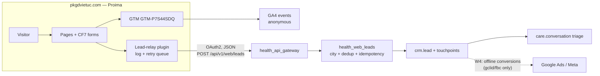
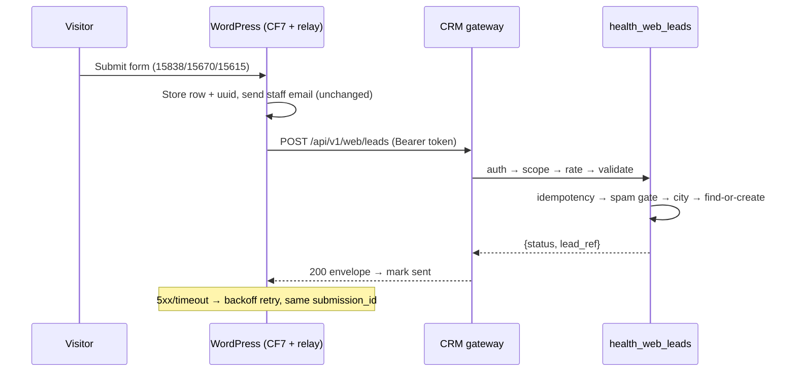
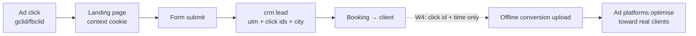
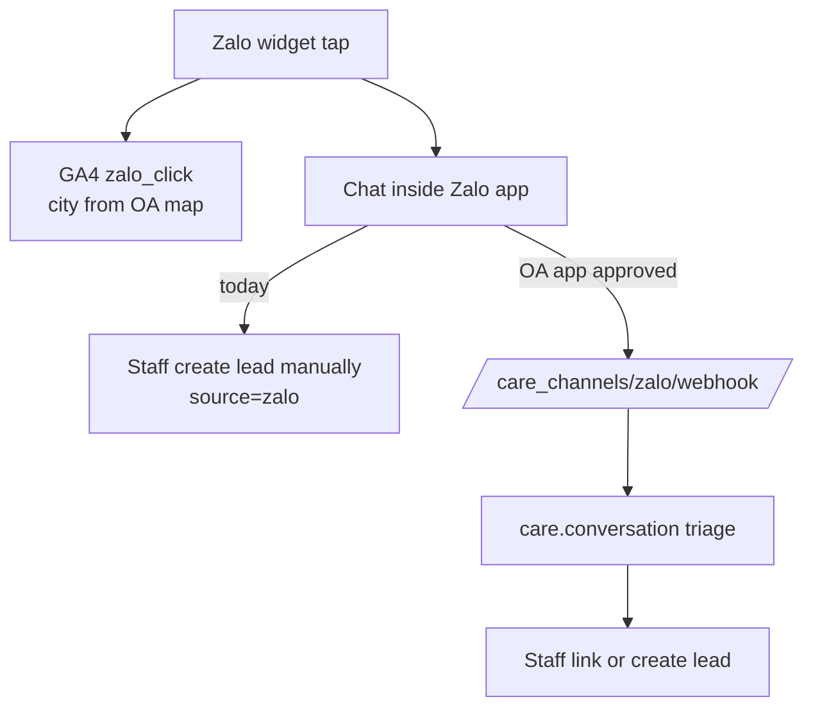

# Website → CRM Lead Integration — Design (pkgdvietuc.com → health19)

**Status:** Design approved 2026-07-28. Implementation phases W1–W3 are Opus handovers; W0 is business/Proima/marketing work; W4 is deferred.
**Scope note:** this is an implementation design, not a formal SDD. It contains what the WordPress team (Proima), the CRM implementer (Opus), and marketing need to build and operate the pipeline — nothing more.
**Companion:** `handovers/web-leads-phaseW1.md` (first CRM implementation phase, ready for kickoff).

---

## 1. What this design does, channel by channel (plain-language summary)

The goal: every enquiry from the website and digital channels becomes **one lead record in the CRM**, tagged with **which city** (Hanoi / HCMC) and **which marketing source** produced it — so the business can see "Google Ads in HCMC produced 31 leads and 9 clients this month" without hand-counting emails.

**Website contact forms.** Today a form submission is stored in WordPress and emailed to city staff; someone re-types it into the CRM (or doesn't). We build: a small WordPress plugin (Proima, to our spec) that, the moment a form is submitted, also sends the submission securely server-to-server into the CRM, which creates or updates a lead automatically — carrying the visitor's city choice, the page they were on, and the ad campaign that brought them (UTM parameters and Google/Meta click IDs captured from the URL). Email keeps working unchanged; it becomes the human backup, not the system of record.

**Google Ads.** When someone clicks an ad, Google appends a click ID (`gclid`) to the landing-page URL. Our tracking keeps it while the visitor browses; the form submission delivers it into the CRM on the lead. That's how a lead is tied to the exact campaign/ad. Later (Phase W4), when a lead becomes a paying client, we export those click IDs back into Google Ads as "offline conversions" so Google optimises toward ads that produce *clients*, not just clicks. Note: having Google Ads dashboard access shows spend and click counts — it does **not** create CRM leads; only the form pipeline (or call tracking) does that.

**Organic Google search.** No click ID exists. The CRM records source = google / medium = organic, derived from the referrer URL when no paid parameters are present. Aggregate detail (which queries) lives in Search Console only — it can never be attached to an individual person, and we don't pretend otherwise.

**Phone (1800 6896 Hanoi / 1800 6894 HCMC).** We track **taps on the call buttons** (which number, which page, which campaign) in Google Analytics. A tap is *not* a confirmed call — someone may hang up before connecting — so tap counts are reported as "call intent", never as leads. Actual completed-call attribution requires call infrastructure: the CRM already contains a VoIP24h integration (webhook + call-log model, currently inactive because no PBX contract is connected). When that activates, real call records (CDR) arrive in the CRM with the caller's number and the dialled number — the dialled hotline then gives the city deterministically, and staff convert real enquiries to leads with one button that already exists. Until then, phone leads are created by reception staff as today, with a "phone" source.

**Zalo.** We track **taps on the Zalo widgets** (which OA, which page) in Analytics — again as intent, not identity. Zalo does not tell the website who the person is; when they open the chat, their identity exists only inside the Zalo OA console. The CRM already has a complete Zalo Official Account integration (webhook, message store, triage inbox) that is built but dark — it activates when the business registers a Zalo platform app and connects the OAs. Once live, each inbound Zalo chat appears in the CRM's Care Command triage wall, and staff link or create the lead from the conversation (one existing button). Until then, staff manually create leads from Zalo chats, choosing source = zalo. **We do not claim any automatic Zalo-click → person linkage; it is technically impossible without the OA connection and user consent.**

**Facebook (Messenger, "Call Now", ads, organic).** Messenger taps and page-driven visits are tracked like Zalo taps (per-city page is known, so city is known). The CRM's Messenger webhook integration is likewise built-but-dark pending a Meta platform app and app review. Paid Meta traffic to the website carries `fbclid`/`_fbp`/`_fbc` identifiers, which flow into the lead exactly like `gclid` (subject to visitor consent). Meta Lead Ads (in-Facebook forms) are **not currently used**; if adopted later, they need their own connector — noted as an extension point, not built now. Facebook "Call Now" happens entirely inside Facebook; we only ever see it if call tracking activates.

**Email.** The city mailboxes keep receiving form emails as backup. We deliberately do **not** parse emails into leads while the webhook is available (parsing is fragile: formatting changes silently break it, replies/forwards create duplicates, and there's no delivery guarantee). Controlled email ingestion remains the documented fallback if the webhook path is ever blocked (§3, Option D).

**What prevents double-counting.** Every submission carries a unique ID (safe to retry — the CRM ignores repeats). A person who submits twice, or taps a phone button and then submits a form, matches an existing open lead by normalised phone/email and becomes a **touchpoint on that lead**, not a second lead. Clicks alone (anonymous) are never counted as leads at all.

**What stays out of marketing systems.** No name, phone, email, health condition, or any clinical detail is ever sent to Google Analytics, Google Ads, or Meta. Those platforms receive only anonymous event counts and (for W4 conversion uploads) the click IDs they themselves issued. Clinical data lives only in the CRM, behind its existing consent and encryption rails.

---

## 2. Verified current state

### 2.1 Website (raw-HTML inspection, 2026-07-28)

| Fact | Value |
|---|---|
| Platform | WordPress, Flatsome child theme, Vietnamese-only |
| Forms | Contact Form 7 v6.1.5 |
| CF7 form IDs | Hanoi contact `15838` (`/lien-he-hanoi/`), HCMC contact `15670` (`/lien-he-tphcm/`), **shared form `15615` rendered on BOTH contact pages** |
| Form fields | Tên (name), Email, **Địa điểm (location — user-selected)**, Số điện thoại (phone), Nội dung (message). **No consent checkbox.** |
| Tag management | GTM container **`GTM-P7S44SDQ`** on all inspected pages. No GA4 `G-`, `AW-`, or `fbq` IDs visible in raw HTML → they are either inside GTM or absent; **requires GTM container audit (W0)** |
| Hotlines | Hanoi `1800 6896`, HCMC `1800 6894` — **both appear on the same pages** (homepage, HCMC contact page) → city must derive from the *clicked number*, never from the page alone |
| Zalo | `sp.zalo.me/plugins/sdk.js` chat widget; **two OA IDs `1485357202584688773` and `2552455471315152826`, both rendered on both contact pages** — OA↔city mapping unknown (W0 question) |
| Facebook | Per-city pages: `facebook.com/chamsoctainhavietuc` (HCMC), `facebook.com/phongkhamgiadinhvietuchanoi` (Hanoi). No Messenger plugin observed |
| Emails | HN `contact@pkgdvietuc.com`, HCM `om@cstnvusaigon.com` |
| Legal entities | Two (HCM: CÔNG TY TNHH CHĂM SÓC TẠI NHÀ VIỆT ÚC - SÀI GÒN, MST 0316119724) — data-controller nuance for legal review |
| Branches | 3 addresses per city — city is the required grain; branch-level assignment is a later refinement |
| Cookie consent | No banner observed |

### 2.2 CRM (codebase, file:line verified)

- Lead model = stock `crm.lead` extended by `health_crm` (`addons/health_crm/models/crm_lead.py`, ~90 custom fields). Already present and **reused, not duplicated**: `utm.mixin` (`campaign_id/source_id/medium_id`), `mode_of_contact` (has `website`), `contact_source` + `healthcare_lead_source` (both have `website_form`), `vietnamese_channel`, `catchment_province_id` ("City"), `facility_id`, `contact_status` workflow, spam machinery (`is_spam_caller` + phone propagation), duplicate surfacing (`check_contact_duplicates`, crm_lead.py:2926).
- **Missing everywhere:** gclid/fbclid/fbp/fbc, utm_content/utm_term, landing/referrer URLs, GA client id, external submission id, any touchpoint/interaction model, any HTTP endpoint that creates a lead. `website_crm` is not installed.
- `crm.lead.create()` (crm_lead.py:883-924) normalizes VN phone and **raises on invalid** (ledger §5.15); city-prefixed `unique_contact_code` reads `catchment_province_id` **from create vals** (crm_lead.py:1227) — city must be resolved before create.
- Every lead create auto-upserts a `care.conversation` triage item (`health_care_command/models/hooks.py:82-109`) — website leads get triage visibility for free.
- Reusable rails: `health_api_gateway` (`@api_route` = OAuth2 client-credentials auth → scope → rate-limit → validation → append-only audit log, `controllers/gateway.py:255-360`); idempotency precedents (partial unique indexes on external ids + search-first); `_safe_phone` wrapper idiom (7 precedents); `health_consent` has a `marketing` consent type + `res.partner.can_send_marketing()` (no production caller yet); Channel Center Zalo/Meta webhooks **implemented but dark** (no platform apps); VoIP24h webhook adopted, **zero `voip.config` rows** (no PBX contract).

### 2.3 Live database (vietuat, read-only)

- Single operating company (VIET UC, id 1; two demo remnants). 476 leads: **472 phone / 4 zalo `mode_of_contact`; 350 have no city** — confirming the manual-entry gap this design closes.
- **Gotcha:** live `health.catchment.province` codes are `01` (Hanoi, id 2) and `02` (HCMC, id 1) — **not** the `HN`/`HCM` codes in the current seed XML (noupdate=1; DB predates the file). Catchment resolution must go via xmlid with a code-fallback search (`code in ('HN','01')` / `('HCM','02')`); W1 verifies the xmlid↔row mapping on vietuat.

---

## 3. Architecture decision

| Option | What it is | Lead-level attribution | Verdict |
|---|---|---|---|
| A — Analytics only | GA4/GTM/Ads dashboards; leads keyed in by hand | None (aggregate only) | Rejected as the system of record. **Dashboard access does not create CRM leads** — it reports anonymous aggregates. Kept as the behavioural layer. |
| B — Direct WP→CRM | CF7 server-side webhook → CRM lead API | Full (UTM + click IDs on the lead) | **Chosen.** The CRM already has the gateway rails; the WP side is a small plugin. |
| C — Middleware/event layer | A relay service between WP, channels, CRM | Full, plus channel fan-in | Rejected now: a third deployable to host/secure/monitor with no current payload it uniquely enables. The CRM's Channel Center *is* the channel event layer when apps go live. |
| D — Email parsing | Parse the city mailbox emails into leads | Partial (no UTMs unless embedded; fragile) | Fallback only. Limitations: silent breakage on template changes, duplicates from replies/forwards, no idempotency key, no delivery guarantee, PII sitting in mailboxes. Use only if the webhook path is administratively blocked. |

**Recommendation: hybrid, phased.** GA4/GTM (Option A) for anonymous behaviour + campaign reporting; Option B on the existing `health_api_gateway` rails for identifiable lead capture; the existing Channel Center adapters take over Zalo/Messenger identity capture when platform apps are approved; VoIP24h CDR takes over call attribution when a PBX contract activates. No new infrastructure between WordPress and the CRM.



---

## 4. CRM data model (module `health_web_leads`)

Persistent lead attributes live on `crm.lead`; interaction history lives in a new child model. **The lead's own attribution fields are the first touch, frozen at creation; every touch (including the creating one) is a `health.lead.touchpoint` row; last touch = newest touchpoint.** No duplicated first_*/last_* field pairs.

### 4.1 `crm.lead` extension

| Field | Type | Purpose |
|---|---|---|
| `utm_content`, `utm_term` | Char | Raw values; stock utm.mixin only models source/medium/campaign |
| `gclid`, `fbclid`, `fbc`, `fbp`, `ga_client_id` | Char | Click/browser IDs for later conversion export; stored subject to consent; never displayed to ad platforms except in W4 uploads |
| `web_landing_url`, `web_submit_page_url`, `web_referrer_url` | Char | First page of the session, the page carrying the form, the external referrer |
| `web_form_id` | Char | CF7 form id, e.g. `15838` |
| `external_submission_id` | Char, copy=False, **partial unique index** | WP-generated UUID; the idempotency key |
| `city_source` | Selection: `form_location / form_id / page_url / campaign_prefix / clicked_phone / zalo_oa / facebook_page / manual / unknown` | How the city was derived (last four reserved for later channel phases) |
| `city_conflict` | Boolean | A later touchpoint disagreed with the stored city |
| `web_needs_review` | Boolean | Ops review flag (invalid phone / unknown city / conflict / possible-existing-client) |
| `web_consent_marketing` | Boolean | Consent checkbox claim from the form payload |
| `web_consent_text_version` | Char | Which consent wording version was displayed |
| `web_touchpoint_ids` | One2many | → touchpoints |

Reused existing fields (never recreated): `campaign_id/source_id/medium_id`, `mode_of_contact='website'`, `contact_source='website_form'`, `healthcare_lead_source='website_form'`, `vietnamese_channel='website'`, `catchment_province_id`, `contact_status`, `is_spam_caller`, `description` (form message).

### 4.2 New model `health.lead.touchpoint`

| Field | Type | Notes |
|---|---|---|
| `lead_id` | M2o `crm.lead`, required, indexed, ondelete=cascade | |
| `occurred_at` | Datetime, required, indexed | **From WP `submitted_at`, not server receive time** — the retry queue delivers late |
| `received_at` | Datetime, default now | Skew visibility for reconciliation |
| `touchpoint_type` | Selection: `form_submit`, `manual` (now); `click_to_call`, `zalo_click`, `messenger_click`, `call_cdr` (reserved, nothing writes them yet) | |
| `source_system` | Selection: `wordpress`, `manual` | |
| `catchment_province_id`, `city_source` | M2o / Selection | This touch's own city verdict |
| `utm_source/medium/campaign/content/term` | Char | Raw snapshot (governed m2o lives on the lead) |
| `gclid`, `fbclid` | Char | Later touches carry fresher click ids; W4 export takes the latest within the click window |
| `page_url`, `referrer_url` | Char | |
| `external_event_id` | Char, **partial unique with `touchpoint_type`** | |
| `raw_payload` | Text, 8 KB cap | Traceability to the original submission |

Indexes (all in `init()`, ledger §5.1): partial unique `crm_lead(external_submission_id)`, partial unique `health_lead_touchpoint(touchpoint_type, external_event_id)`, btree `crm_lead(phone)`, `crm_lead(email_from)` (dedup queries use exact `=` on normalized values).

Attribution model: **first-touch = lead fields, last-touch = newest touchpoint**; both reportable from the same data. Multi-touch beyond that is out of scope by design.

---

## 5. API specification

Both routes mount on the existing gateway decorator (`@api_route`), which supplies OAuth2 client-credentials auth, scope check, rate limiting (default 120/min), JSON validation, the response envelope, and an append-only audit row per call.

### 5.1 `POST /api/v1/web/leads` — scope `web_lead.write`

Request (WP relay plugin → CRM; fields absent when not captured):

```json
{
  "submission_id": "3f6c1f2e-…",          // REQUIRED. WP-generated UUIDv4, the idempotency key
  "form_id": "15838",                      // REQUIRED
  "submitted_at": "2026-07-28T09:30:00+07:00",
  "name": "Nguyễn Thị A",
  "email": "a@example.com",
  "phone": "0912 345 678",
  "message": "Cần tư vấn chăm sóc…",
  "location": "Hà Nội",                    // raw Địa điểm value, unmapped
  "page_url": "https://pkgdvietuc.com/lien-he-hanoi/",
  "landing_url": "https://pkgdvietuc.com/dich-vu-tai-hn/?utm_source=google&…",
  "referrer_url": "https://www.google.com/",
  "utm": {"source": "google", "medium": "cpc", "campaign": "hn_homecare_leads_202607",
           "content": "ad-variant-b", "term": "cham soc tai nha"},
  "click_ids": {"gclid": "EAIaIQ…", "fbclid": null, "fbc": null, "fbp": null},
  "ga_client_id": "1660915166.1753672800",
  "consent": {"marketing": true, "text_version": "v1"},
  "anti_spam": {"honeypot_filled": false, "token_ok": true}
}
```

Response — always the gateway envelope; `data`:

```json
{ "status": "created", "lead_ref": "01 000422026", "submission_id": "3f6c1f2e-…" }
```

- `status ∈ created | merged | duplicate | rejected_spam`. `lead_ref` is the human `unique_contact_code`, never a DB id (absent on `rejected_spam`).
- At least one of phone/email present, else **422**. Body > 64 KB → 400. 401/403 auth, 429 rate; on 5xx/timeouts WP re-queues and retries **with the same `submission_id`** — replays are no-ops returning the original result.
- **Spam (honeypot/token failure) returns 200 `rejected_spam`** — a 4xx would make the relay retry forever and teach bots which submissions were detected. No lead row is created; the attempt is audit-logged.
- No HMAC signature and no timestamp replay-window: transport auth is OAuth2 bearer over TLS, and a replay window would reject exactly the late deliveries the retry queue exists to produce. The idempotency key is the replay defence.

### 5.2 `POST /api/v1/web/leads/reconcile` — scope `web_lead.read` (Phase W2)

WP-driven daily reconciliation (WP owns the source-of-truth submission log):
request `{"date": "2026-07-27", "submission_ids": ["…", "…"]}` → response `{"known": [...], "missing": [...], "counts": {"created": n, "merged": n, "duplicate": n, "rejected_spam": n}}`. Any `missing` entry means a submission never reached the CRM → WP re-posts it (idempotent) and flags the day in its log.

### 5.3 Credentials

One `gateway.oauth.client` ("WordPress pkgdvietuc") bound to a dedicated internal service user `svc_web_leads` whose group grants only: create `crm.lead`/touchpoint, read `utm.*`, `health.catchment.province`, `crm.team`. Token endpoint: existing `POST /oauth/token` (client credentials, Basic auth). Proima's PHP cost: fetch token, cache in a WP transient, retry once on 401 (~30 lines).

---

## 6. WordPress-side specification (Proima deliverable)

A small must-use plugin (or Proima's preferred packaging), hooked on CF7 `wpcf7_mail_sent` (fires only after successful validation + mail):

1. **Capture** the submission fields plus hidden context fields (see below); generate `submission_id` (UUIDv4).
2. **Persist first** to a local table (`wp_crm_relay`: submission_id, form_id, payload JSON, status, attempts, last_error, created/sent timestamps). The email to city staff continues unchanged.
3. **Send** server-to-server to `POST /api/v1/web/leads` (OAuth2 token from a WP transient). Success (200 with any `status`) → mark sent, store `lead_ref`.
4. **Retry** on failure via WP-Cron: exponential backoff (1 min, 5, 30, 2 h, 12 h, 24 h), same `submission_id`, max ~7 attempts, then status `failed` (surfaced in a WP admin list + daily reconcile).
5. **Reconcile** daily (W2): POST yesterday's submission_ids to the reconcile endpoint; re-post anything `missing`.
6. **Context capture (GTM-cooperating):** a first-party cookie/sessionStorage written on landing (utm_*, gclid, fbclid, landing_url, referrer) with ~90-day expiry, read at submit time into hidden CF7 fields; `_fbp`/`_fbc` read from Meta's cookies and `ga_client_id` from the GA cookie **only if the visitor consented** (see §10); honeypot field + CF7's token check feed `anti_spam`.
7. **Consent checkbox** added to all three forms (visible, unticked by default, versioned text — wording from legal review, W0). The relay sends the claim; the CRM stores it.
8. **Never** include health details in hidden fields, URLs, or the GA payload; the message body goes only to the CRM and email, never to GTM/GA4.

Credentials handling: client_id/secret in `wp-config.php` constants (not the DB), never in the repo Proima shares.



---

## 7. GTM / GA4 events and UTM standard (marketing + Proima)

### 7.1 Event catalogue (lean by design)

All events are **anonymous**; none creates a CRM lead; parameters never contain names, phones, emails, message text, or health terms. `city` param values: `hanoi | hcmc | unknown`.

| Event | Trigger | Params | GA4 key event | Notes |
|---|---|---|---|---|
| `form_start` | First interaction with a CF7 form | `form_id`, `city`, `page_path` | no | Funnel diagnostics |
| `generate_lead` | CF7 `wpcf7mailsent` DOM event | `form_id`, `city`, `page_path` | **yes** | The conversion GA4/Ads optimise on; count will not equal CRM leads (dedup/spam) — CRM is the system of record |
| `click_to_call` | Click on a `tel:` link | `phone_number` (the hotline, not a person's number), `city` (from the number: 18006896→hanoi, 18006894→hcmc), `page_path` | optional | **Intent, not a call.** Reported separately from leads, always |
| `zalo_click` | Click on Zalo widget/link | `oa_id`, `city` (from OA↔city map, W0), `page_path` | no | Intent only; identity impossible without OA connection |
| `messenger_click` | Click on Messenger/FB link | `fb_page`, `city` (page → city), `page_path` | no | Intent only |

Deferred (documented, not built): `location_selected`, service-page grouping (use GA4 content groups), CRM-side `lead_qualified`/`lead_converted` echo to GA4 via Measurement Protocol — W4 candidate only if offline-conversion uploads prove insufficient.

**Lead counting policy (binding):** a *lead* is a CRM `crm.lead` row created/merged by this pipeline or by staff. GA4 `generate_lead` is a marketing signal; click events are intent signals. The three are reported in separate columns, never summed.

### 7.2 UTM standard

- Format: lowercase ascii, digits, underscore/hyphen only. **Never** PII or health-condition terms in any URL or UTM value (they leak into analytics logs).
- `utm_source`: `google | facebook | zalo | email | <partner-slug>`. `utm_medium`: `cpc | social | organic_social | email | referral`. Google Ads uses auto-tagging (gclid) *plus* explicit UTMs; Meta ads set UTMs in the tracking template.
- `utm_campaign` (required on all paid + owned links): `{city}_{service}_{objective}_{yyyymm}` — e.g. `hn_homecare_leads_202608`, `hcm_physio_awareness_202609`. The `hn_`/`hcm_` prefix doubles as a city-derivation signal (§8). `utm_content` = ad/creative variant; `utm_term` = paid keyword (Google only, where available).
- Governance: marketing owns the register (a shared sheet); new campaign names are seeded as `utm.campaign` records in the CRM **before launch** (the CRM only auto-creates source/medium values, never campaigns — §9.3); the weekly "unmatched campaign strings" view (W3) catches drift. Pre-launch check: click the ad preview, confirm the landing URL carries the params and the GTM preview shows them captured.
- Missing/malformed UTMs: lead still captured; source derived from referrer (`google`+`organic`, `facebook`+`organic_social`, else `direct`); raw junk preserved on the touchpoint, never written into the governed m2o fields.

---

## 8. City (Hanoi/HCMC) assignment rules

Derivation precedence for a form submission — first hit wins, recorded in `city_source`:

| # | Signal | Rule |
|---|---|---|
| 1 | `location` (Địa điểm) field | Diacritic-insensitive match: hà nội/ha noi/hn → HN; hồ chí minh/hcm/tp.hcm/sài gòn → HCMC |
| 2 | `form_id` | `15838` → HN, `15670` → HCMC. Shared `15615` yields nothing |
| 3 | `page_url` / `landing_url` path | `/lien-he-hanoi/`, `/dich-vu-tai-hn/`, `/doi-ngu-tai-ha-noi/` → HN; `/lien-he-tphcm/`, `/dich-vu-tai-tphcm/`, `/doi-ngu-tai-tphcm/` → HCMC |
| 4 | `utm_campaign` prefix | `hn_*` → HN, `hcm_*` → HCMC |
| — | No signal | `catchment_province_id` empty, `city_source='unknown'`, `web_needs_review=True` — triage assigns city before conversion |

Reserved for later phases (values exist, no logic yet): `clicked_phone` (CDR dialled number), `zalo_oa`, `facebook_page`.

- **IP geolocation is never used** — a Hanoi resident booking care for a parent in HCMC is a normal case.
- Conflict rule: if a later touchpoint's verdict disagrees with the lead's stored city, the stored city is **never auto-changed**; `city_conflict=True` + `web_needs_review=True`, and the conflict is visible in the touchpoint list. Humans decide.
- Maps (form_id→city, URL-prefix→city) live in `ir.config_parameter` JSON (`web_leads.form_city_map`, `web_leads.url_city_map`), so Proima renumbering a form is a config edit, not a deploy.
- Live-DB note: catchment records resolved by xmlid with code fallback (`'HN','01'` / `'HCM','02'`) — vietuat's codes predate the current seed XML.

---

## 9. Lead creation, deduplication, identity

### 9.1 Algorithm (endpoint handler, runs as `svc_web_leads`)

```
1. Idempotency (search-first; unique indexes are the concurrency backstop):
   lead by external_submission_id? → duplicate. touchpoint by (form_submit, submission_id)? → duplicate.
2. Normalize identity: phone via _safe_phone (invalid → None, raw preserved);
   email lower/strip (invalid format → None). Neither → 422.
3. Spam gate: honeypot/token failure → audit log only, return rejected_spam (no row).
   Phone on the spam list → lead IS created with contact_status='spam' (audit trail).
4. City resolution (§8) — BEFORE create: the contact-code prefix reads city from create vals.
5. Dedup, lead-to-lead only:
   candidate = newest open lead (type=opportunity, contact_status in active|lead|booking)
               matching exact normalized phone, else exact email.
   merge iff: (booking → no time window; active|lead → write_date within 60 days)
              AND names match (casefold, diacritic-stripped) or exact email match.
6a. MERGE: append touchpoint; update city_conflict/web_needs_review if verdicts differ;
    chatter note "repeat web enquiry"; explicitly upsert care.conversation
    (needs_reply, unread) — the merge path bypasses the lead-create hook, and without
    this the repeat enquiry is invisible to triage. → merged.
6b. CREATE: type=opportunity, mode_of_contact=website, contact_source=website_form,
    healthcare_lead_source=website_form, vietnamese_channel=website, catchment in vals,
    all attribution fields, consent claim; then the creating touchpoint.
    care.conversation arrives via the existing create hook. → created.
7. Race safety: create wrapped in a savepoint; IntegrityError on the unique index
   → re-search by submission_id → duplicate.
```

### 9.2 Identity resolution boundaries (binding)

- **A typed phone/email never auto-links a lead to `res.partner`/patient identity** (codified anti-pattern: an anonymous visitor claiming a patient's number must not merge onto that patient — `care_channel_message.py:175-185`). When the phone/email matches an existing client, the lead gets a chatter note "possible existing client: <code>" + `web_needs_review`; a human links via the existing relationship machinery (`contact_relationship_type`, on-behalf-of flow).
- Shared family phone, different name → **new lead**, reciprocal chatter cross-references on both leads, review flag. Family-member-enquiring-for-patient resolves through the existing representative flow at qualification, not by the pipeline guessing.
- Same person, both cities → merges onto the open lead; city never auto-changed; conflict flagged (§8).
- Repeat client / existing patient enquiring again → new lead with the "possible existing client" note (this is the CRM's existing doctrine for repeat contacts: `contact_type='repeat'` is set by staff at qualification).
- Merged-lead history: merging here *appends touchpoints to the surviving lead* — nothing is deleted. If staff later use Odoo's stock lead-merge, touchpoints follow via `lead_id` reassignment (stock merge moves one2many children).
- False-positive bias: the name-match requirement means we prefer an occasional extra lead (human-mergeable) over silently gluing two people together (unrecoverable).

### 9.3 UTM record policy

Raw strings are always stored (lead + touchpoint). Governed m2o: `utm.source`/`utm.medium` find-or-create after sanitization (≤64 chars, printable, no URLs); `utm.campaign` **find-only** — campaign params are attacker-controllable URL input and blanket auto-create is a record-explosion vector; unmatched strings surface in the W3 review view and marketing seeds the registry (§7.2).

---

## 10. Security, privacy, consent

- **Transport/auth:** TLS everywhere; OAuth2 client-credentials (existing gateway); secrets: WP side in `wp-config.php`, CRM side hashed at rest (existing `gateway.oauth.client`). No secrets in the WP database, repo, or GTM.
- **Least privilege:** `svc_web_leads` can create leads/touchpoints and read lookup tables — nothing else; no clinical model access. Endpoint calls are audit-logged (append-only `api.audit.log`, bodies never logged).
- **Data minimisation:** the pipeline carries only what the visitor typed plus marketing context. No clinical fields exist in the payload schema. `raw_payload` on the touchpoint is capped and ACL-protected.
- **Marketing/clinical separation:** attribution lives on `crm.lead`/touchpoints (marketing zone). Clinical data enters only after conversion, in PHI-encrypted models, and **never flows back** to GA4/Ads/Meta. W4 uploads contain click IDs + conversion timestamps only — no names, no numbers, no conditions.
- **Ad-platform hygiene (binding):** no PII or health-sensitive terms in URLs, UTM values, GA4 params, or pixel events (§7). GTM container changes require the publishing controls in §11.
- **Consent:** visible unticked checkbox + short notice on all forms (wording: legal review, W0; versioned via `web_consent_text_version`). The claim is stored on the lead; on lead→patient conversion W3 materialises it as a `health.consent` `marketing` record (source tag `web_form`) — plugging into the existing `check_consent`/`can_send_marketing()` rails that ZNS/marketing sends already respect. Cookie/pixel consent for `_fbp`/`_fbc`/GA cookies: the site currently has **no consent banner**; adding one is a Proima W0/W1 item, and click-ID capture is gated on it.
- **Legal review required (no compliance claims made here):** Vietnam PDPL 2025 (effective 2026) / Decree 13/2023 obligations — consent wording, retention periods for lead + touchpoint data (proposal: define in W3; touchpoint raw payloads pruned by autovacuum after a set horizon), cross-entity data controllership (two legal entities, one CRM), and any health-sector-specific marketing restrictions. Reviewers: Vietnamese privacy/healthcare counsel.
- **WP hardening (Proima):** CF7 honeypot + token, rate limiting at the web layer, plugin/core patch cadence, admin 2FA. The CRM treats every payload as untrusted regardless (validation, `_safe_phone`, sanitization, size caps).

---

## 11. Operations

| Concern | Mechanism |
|---|---|
| Real-time | Relay posts immediately on submission; CRM lead appears within seconds; triage via the existing care.conversation wall |
| Idempotency / duplicate webhooks | `submission_id` unique index + search-first; replays return the original result |
| Retry / backoff | WP-side queue (1m→24h, ~7 attempts) — the sender owns retry because it owns the source log |
| Dead-letter | WP `failed` status + admin list; daily reconcile re-drives anything missing |
| Reconciliation | Daily WP-driven reconcile call (§5.2); CRM answers from `external_submission_id`; discrepancies re-posted idempotently |
| Monitoring | CRM heartbeat cron (W2): no `wordpress` touchpoint in 24 h → `mail.activity` to a configured user (pipe-broken canary, catches silent WP-side failure). Gateway audit log for per-call forensics |
| Missing attribution | Lead still created; `web_needs_review` + `city_source='unknown'` route it to the triage filter |
| Platform outages / expired tokens | Ads/GA4 outages don't affect lead capture (decoupled). OAuth token expiry is self-healing (relay re-fetches). Gateway down → WP queue holds and retries; email backup unaffected |
| Website agency changes | Form-ID/URL maps are config parameters (no deploy); the heartbeat + reconcile catch silent breakage; GTM changes go through: versioned workspace, preview-tested, publish rights limited, change note per publish |
| Test vs production | Staging WP posts to a staging gateway client (separate credentials); `anti_spam.token_ok=false` test submissions are visible in audit but create no leads; never point staging at production credentials |
| Support ownership | Proima: WP plugin, GTM container, forms. CRM team: module, gateway, credentials. Marketing: UTM registry, campaign seeds. Incidents: whoever's layer fails per this table; the reconcile report is the shared truth |

---

## 12. Phases

| Phase | Owner | Scope | Exit criteria |
|---|---|---|---|
| **W0 — Access & audit** | Business / Proima / marketing | GTM container audit (GA4/Ads/pixel presence, `GTM-P7S44SDQ`); GA4+Ads+Meta+GSC access; **Zalo OA↔city mapping** (the two OA ids); consent wording (legal); UTM register kickoff; confirm VoIP24h contract intent | Facts on the open-questions table answered; accesses granted |
| **W1 — Schema + capture endpoint** | CRM (Opus) — `handovers/web-leads-phaseW1.md` | `health_web_leads` module: fields, touchpoint model, indexes, scopes, service group, `POST /api/v1/web/leads`, city rules, find-or-create, tests | All numbered tests green; curl smoke on vietuat creates/merges/replays correctly; every valid submission → exactly one lead; replays create nothing |
| **W1-WP (parallel)** | Proima | Relay plugin (§6), context capture, consent checkbox, GTM events (§7.1) | Staging E2E: form → lead in CRM with UTMs + city; GA4 events visible in DebugView |
| **W2 — Ops loop + triage UX** | CRM (Opus) | Reconcile endpoint, heartbeat cron, lead-form "Web Attribution" tab + touchpoint list, `web_needs_review` filters, merge-path conversation upsert | Reconcile round-trip proven (kill the relay, watch recovery); review queue usable by ops |
| **W3 — Reporting + consent bridge** | CRM (Opus) | City×source×outcome pivots, unmatched-campaign view, consent→`health.consent` materialisation on conversion, utm source/medium seeds, retention decision | Marketing reads funnel (lead→booking→client) by city and source from the CRM; consent records verified |
| **W4 — Offline conversions** *(deferred until ad spend justifies)* | CRM + marketing | Export wizard: converted leads' latest gclid/fbclid/fbc within the click window, conversion time = booking confirmation; Google Ads offline-conversion upload (CSV/API), Meta CAPI evaluated | Uploaded conversions accepted by Google Ads; documented consent basis |

Channel upgrades ride existing rails when unblocked, outside these phases: Zalo OA app approved → Channel Center Zalo goes live (chats in triage, staff link leads — touchpoint type `zalo_click`→`zalo` conversation association is manual/semi-automatic by design); Meta app approved → Messenger same; VoIP24h contract → CDR-based call attribution (`call_cdr` touchpoints, `clicked_phone` city rule).





---

## 13. Illustrative payloads

*All examples are illustrative. Fields marked ⚑ depend on platform access, visitor consent, or API availability.*

**Form lead (WP→CRM):** see §5.1. ⚑ `click_ids.*`, `ga_client_id` (consent-gated), `utm.term` (Google only).

**Click-to-call (GTM dataLayer, stays in GA4 — never sent to the CRM):**
```json
{"event": "click_to_call", "phone_number": "18006896", "city": "hanoi",
 "page_path": "/lien-he-hanoi/"}
```

**Zalo click (GTM dataLayer):**
```json
{"event": "zalo_click", "oa_id": "1485357202584688773", "city": "unknown",
 "page_path": "/lien-he-hanoi/"}
```
⚑ `city` becomes real once the OA↔city mapping (W0) is configured.

**Meta/Messenger inbound (Channel Center webhook, only after app approval ⚑):**
```json
{"object": "page", "entry": [{"id": "<page-id>", "messaging": [
  {"sender": {"id": "<psid>"}, "message": {"mid": "m_…", "text": "…"}}]}]}
```
The CRM verifies the signature, stores the message, upserts a triage conversation; a lead is created only by staff action.

**CRM conversion outcome (internal, source for W4):**
```json
{"lead_ref": "01 000422026", "status": "won", "converted_at": "2026-08-14T03:20:00Z",
 "city": "hanoi", "utm": {"source": "google", "medium": "cpc",
 "campaign": "hn_homecare_leads_202607"}, "gclid": "EAIaIQ…"}
```

**Offline conversion upload prep (Google Ads Click Conversions CSV ⚑ W4):**
```csv
Google Click ID,Conversion Name,Conversion Time,Conversion Value,Conversion Currency
EAIaIQ…,web_lead_converted,2026-08-14 10:20:00+07:00,,VND
```
⚑ Requires Google Ads access + a conversion action configured + click within the attribution window + documented consent basis.

---

## 14. Open questions

| # | Question | Owner | Blocks |
|---|---|---|---|
| 1 | Which Zalo OA id is Hanoi, which HCMC (1485357202584688773 / 2552455471315152826)? Who owns them? | Business | `zalo_click` city param; future OA connection |
| 2 | GTM `GTM-P7S44SDQ` contents — GA4 property? Ads/pixel tags? Who publishes? | Proima/marketing (W0) | §7 wiring |
| 3 | Consent wording + retention periods (PDPL/Decree 13) | Legal counsel | Form checkbox text; W3 retention config |
| 4 | VoIP24h (or other PBX) contract for the 1800 lines? | Business | Real call attribution; until then taps-only |
| 5 | Catchment xmlid↔live-row mapping on vietuat (codes are 01/02, seed says HN/HCM) | Opus W1 report-back | City resolution correctness |
| 6 | 13 legacy leads with NULL company — clean or ignore? | CRM team | Cosmetic |
| 7 | Meta Lead Ads planned? (Not used today; would need its own connector) | Marketing | **Resolved 2026-07-29 → §15.3**: Lead Ads connector phase planned, conditional on campaigns |

---

## 15. Addendum — decisions of 2026-07-29 (post-W1, user-approved)

1. **The WP relay is a product, not per-client work.** One reusable plugin ("Health19 Leads for WordPress") owned by us. Per-tenant setup = install plugin + paste client_id/secret from the connector card. Proima is the integrator for pkgdvietuc.com only; §6 remains the plugin's behavioural spec.
2. **W2.5 Website connector ships two modes.** Mode A = plugin/webhook (recommended; full attribution, idempotency, reconciliation). Mode B = controlled email ingestion (light tier for tenants who cannot modify their site): a Channel-Center-connected mailbox (Email channel — currently dark, needs a google/microsoft platform app) feeds parsed notification emails through the **same `web.lead.service`** so city/dedup/spam logic applies. Hard prerequisites: the W2 submission-id email stamp + ingestion suppression guard; the connector UI must label Mode B "no campaign attribution". This supersedes Option D's "fallback only" status — D becomes a productised tier, not a rejected path.
3. **New phase: Lead Ads connector** (after W2; build only when marketing commits to lead-form campaigns). Meta Lead Ads via the `leadgen` webhook on the existing Meta platform-app rails (extends the CC-E app-review scope), Google Ads Lead Form Assets via Google's native webhook delivery to a sibling endpoint. Both feed `web.lead.service` with new `source_system` values (`meta_lead_ad`, `google_lead_form`) and platform campaign/ad ids — no new lead logic, better-than-website attribution (structured ids, no URL scraping).
4. **Boundary restated (user question answered):** an ad click that never becomes a submission/message/call is **not capturable as a lead through any Meta/Google API** — click ids identify clicks, not people; Ads/Insights APIs are aggregate-only by policy. The tools for that population are retargeting audiences and GA4 funnel reporting — marketing-side configuration, no CRM build. GA4/Ads APIs remain reporting enrichment (W3/W4: cost-per-lead joins), never lead sources.
